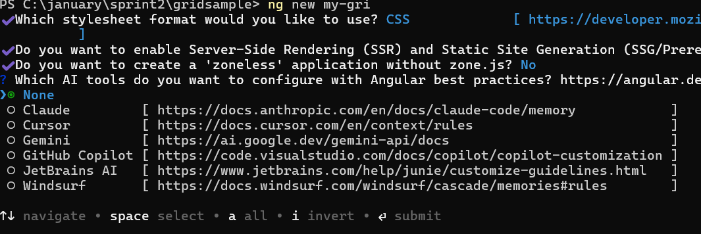

# Getting Started with Angular 3D Chart Component

This section explains the steps required to create a simple [Angular 3D Chart](https://www.syncfusion.com/angular-components/angular-3d-chart) and demonstrates the basic usage of the Angular 3D Chart component.

> **Note:** This guide supports **Angular 21** and other recent Angular versions. For detailed compatibility with other Angular versions, please refer to the [Angular version support matrix](https://ej2.syncfusion.com/angular/documentation/system-requirement#angular-version-compatibility). Starting from Angular 19, standalone components are the default, and this guide reflects that architecture.

> **Ready to streamline your Syncfusion<sup style="font-size:70%">&reg;</sup> Angular development?** Discover the full potential of Syncfusion<sup style="font-size:70%">&reg;</sup> Angular components with Syncfusion<sup style="font-size:70%">&reg;</sup> AI Coding Assistant. Effortlessly integrate, configure, and enhance your projects with intelligent, context-aware code suggestions, streamlined setups, and real-time insights—all seamlessly integrated into your preferred AI-powered IDEs like VS Code, Cursor, Syncfusion<sup style="font-size:70%">&reg;</sup> CodeStudio and more. [Explore Syncfusion<sup style="font-size:70%">&reg;</sup> AI Coding Assistant](https://ej2.syncfusion.com/angular/documentation/ai-coding-assistant/overview)

## Prerequisites

Before getting started, ensure that your environment meets the [system requirements for Syncfusion® Angular UI components](https://ej2.syncfusion.com/angular/documentation/system-requirement), which covers supported Node.js, Angular, and `@syncfusion/ej2-angular-charts` versions.

## Setup Angular environment

A straightforward approach to begin with Angular is to create a new application using the [Angular CLI](https://github.com/angular/angular-cli). Install Angular CLI globally with the following command:

```bash
npm install -g @angular/cli
```

Verify the installation:

```bash
ng version
```

> **Angular 21 Standalone Architecture:** Standalone components are the default in Angular 21. This guide uses the modern standalone architecture. If you need more information about the standalone architecture, refer to the [Standalone Guide](https://ej2.syncfusion.com/angular/documentation/getting-started/angular-standalone).

### Installing a specific version

To install a particular version of Angular CLI, use:

```bash
npm install -g @angular/cli@21.0.0
```

## Create an Angular application

With Angular CLI installed, execute this command to generate a new application:

```bash
ng new syncfusion-angular-app
```

* This command will prompt you to configure settings like enabling Angular routing and choosing a stylesheet format.

```bash

? Which stylesheet format would you like to use? (Use arrow keys)
> CSS             [ https://developer.mozilla.org/docs/Web/CSS                     ]
  Sass (SCSS)     [ https://sass-lang.com/documentation/syntax#scss                ]
  Sass (Indented) [ https://sass-lang.com/documentation/syntax#the-indented-syntax ]
  Less            [ http://lesscss.org                                             ]

```

* By default, a CSS-based application is created. Use SCSS if required:

```bash
ng new syncfusion-angular-app --style=scss
```

* During project setup, when prompted for the Server-side rendering (SSR) option, choose the appropriate configuration.


* Select the required AI tool or 'none' if you do not need any AI tool.



* Navigate to your newly created application directory:

```bash
cd syncfusion-angular-app
```

> **Note:** In Angular 19 and below, the CLI generates files like `app.component.ts`, `app.component.html`, `app.component.css`, etc. In Angular 20+, the CLI generates a simpler structure with `src/app/app.ts`, `app.html`, and `app.css` (no `.component.` suffixes).

## Installing Syncfusion<sup style="font-size:70%">&reg;</sup> 3D Chart package

Syncfusion<sup style="font-size:70%">&reg;</sup>'s Angular component packages are available on [npmjs.com](https://www.npmjs.com/search?q=ej2-angular). To use Syncfusion<sup style="font-size:70%">&reg;</sup> Angular components, install the necessary package.

This guide uses the [Angular 3D Chart component](https://www.syncfusion.com/angular-components/angular-3d-chart) for demonstration. Add the [Angular Chart package](https://www.npmjs.com/package/@syncfusion/ej2-angular-charts) with:

```bash
ng add @syncfusion/ej2-angular-charts
```

The above command will perform the following configurations:

- Add the `@syncfusion/ej2-angular-charts` package and peer dependencies to your `package.json`.
- Import the 3D Chart component in your application.

For more details on version compatibility, refer to the [Version Compatibility](https://ej2.syncfusion.com/angular/documentation/upgrade/version-compatibility) section.

Syncfusion<sup style="font-size:70%">&reg;</sup> offers two package structures for Angular components:		
1. Ivy library distribution package [format](https://angular.dev/tools/libraries/angular-package-format)		
2. Angular compatibility compiler (ngcc), which is Angular's legacy compilation pipeline.

### Ivy library distribution package

Syncfusion<sup style="font-size:70%">&reg;</sup>'s latest Angular packages are provided as Ivy-compatible and suited for Angular 12 and above. To install the package, execute:	
	
```bash		
ng add @syncfusion/ej2-angular-charts		
```	

### Angular compatibility compiled package(ngcc)

For applications not compiled with Ivy, use the `ngcc` tagged packages:		

> The ngcc packages are still compatible with Angular CLI versions 15 and below. However, they may generate warnings suggesting the use of Ivy compiled packages. Starting from Angular 16, support for the ngcc package has been completely removed. If you have further questions regarding ngcc compatibility, please refer to the following [FAQ](https://ej2.syncfusion.com/angular/documentation/common/troubleshooting/ngcc-compatibility).	

```bash		
npm add @syncfusion/ej2-angular-charts@32.1.19-ngcc		
```

## Add 3D Chart component

Modify the template in `src/app/app.component.ts` (or `src/app/app.ts` in Angular 20+) to render the 3D Chart component:

```typescript
import { Component } from '@angular/core';
import { Chart3DModule } from '@syncfusion/ej2-angular-charts';

@Component({
    imports: [Chart3DModule],
    standalone: true,
    selector: 'app-root',
    // specifies the template string for the 3D Chart component
    template: `<ejs-chart3d id='chart-container'></ejs-chart3d>`,
})
export class AppComponent { }
```

Use the `ng serve` command to run the application in the browser:

```bash
ng serve
```

Verify that an empty 3D Chart renders before proceeding to the next step.

The following example shows a basic 3D Chart.










  


## Module injection

3D Chart components are segregated into individual feature-wise modules. To use a particular feature, you need to inject its corresponding feature service in `app.component.ts`.

There are two ways to register 3D Chart services:

- **`Chart3DAllModule`** — Registers every available feature service at once. Use this for quick setup or when you need most features.
- **`Chart3DModule`** — Registers only the services you explicitly add to the `providers` array. This granular form is recommended for production applications to keep bundle size small.

For this application, column series, tooltip, data label, category axis, and legend features of the 3D Chart are used. The relevant feature service names and descriptions are:

| Service | Description |
| --- | --- |
| `ColumnSeries3DService` | Required to render the column series. |
| `Legend3DService` | Required to render the legend. |
| `Tooltip3DService` | Required to render the tooltip. |
| `DataLabel3DService` | Required to render data labels. |
| `Category3DService` | Required to render the category axis. |

Update `src/app/app.component.ts` to import the services and add them to the `providers` array of the component:

```typescript
import { Component } from '@angular/core';
import { Chart3DModule, ColumnSeries3DService, Legend3DService, Tooltip3DService, DataLabel3DService, Category3DService } from '@syncfusion/ej2-angular-charts';

@Component({
    imports: [Chart3DModule],
    standalone: true,
    selector: 'app-root',
    providers: [ColumnSeries3DService, Legend3DService, Tooltip3DService, DataLabel3DService, Category3DService],
})
export class AppComponent { }
```

## Populate chart with data and add a series

This section explains how to plot JSON data in the 3D Chart. The following example uses `Chart3DAllModule` to register every feature service, defines the sales data, configures the axes, and binds the series to the chart.

Add [`series`](https://ej2.syncfusion.com/angular/documentation/api/chart3d/chart3dseriesdirective) to the 3D Chart in the component template using the `<e-chart3d-series-collection>` and `<e-chart3d-series>` child directives. Map the JSON fields `x` and `y` to the series [`xName`](https://ej2.syncfusion.com/angular/documentation/api/chart3d/chart3dseriesdirective#xname) and [`yName`](https://ej2.syncfusion.com/angular/documentation/api/chart3d/chart3dseriesdirective#yname) properties, and set the JSON array as the [`dataSource`](https://ej2.syncfusion.com/angular/documentation/api/chart3d/chart3dseriesdirective#datasource) property.

Since the JSON contains category data, set the [`valueType`](https://ej2.syncfusion.com/angular/documentation/api/chart3d/chart3daxismodel#valuetype) for the horizontal axis (`primaryXAxis`) to `Category`. By default, the axis `valueType` is `Numeric`.

The 3D Chart renders a 3D column series with the brand names (Tesla, Aion, Wuling, etc.) on the horizontal axis and the sales values on the vertical axis. The columns appear as 3D bars in the rendered scene.










  


## Troubleshooting

If the 3D Chart does not render as expected, check for these common issues:

* **"No provider for ColumnSeries3DService" error**: Confirm that the relevant `*3DService` is added to the component's `providers` array. Each feature requires its corresponding service.
* **Chart not visible**: Verify that the `<ejs-chart3d>` element has a unique `id` and that the component's `selector` matches the root element used in `src/index.html` (commonly `<app-root>`).
* **3D scene looks flat** (no depth or lighting): Check that `<e-chart3d-series>` is wrapped in `<e-chart3d-series-collection>` and that `enableRotation` / `enablePerspective` are set on the chart if rotation is desired.
* **Data not displayed**: Verify that the `xName` and `yName` values match the field names in the data source exactly, and that the `valueType` is set to `Category` for category data.
* **Build errors**: Run `ng version` to confirm that Node.js, Angular CLI, and `@syncfusion/ej2-angular-charts` are on supported versions.
* **Port already in use**: If `ng serve` fails because port `4200` is in use, run `ng serve --port 4201` (or another free port) instead.

## See also

* [Customize the 3D chart axes](axis-customization)
* [Configure the 3D chart legend](legend)
* [Customize the 3D chart tooltip](tool-tip)