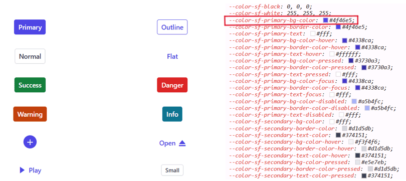
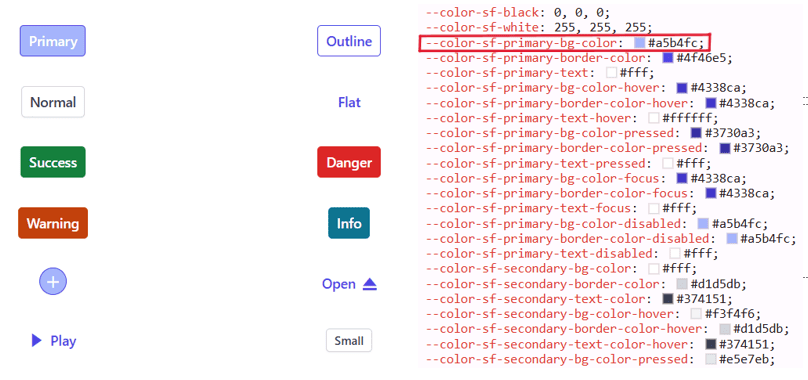
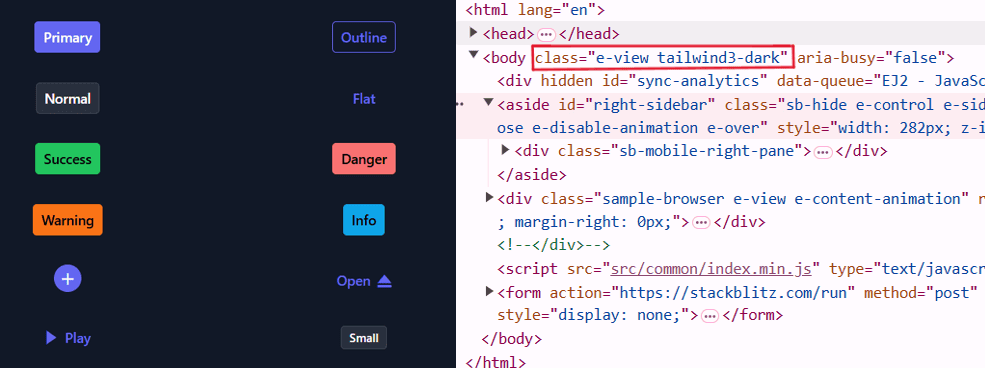

# About CSS Variables in Themes

[CSS variables](https://developer.mozilla.org/en-US/docs/Web/CSS/Using_CSS_custom_properties), or custom properties, are entities defined by CSS authors that hold specific values applicable throughout a CSS file. They are named with two hyphens (--) followed by an identifier. These variables can take any valid CSS value including colors, lengths, or fonts. To access the value of a CSS variable, use the var() function.

Syncfusion provides modern, highly customizable themes using CSS variables. These themes deliver a consistent, visually appealing appearance across Syncfusion components. Available themes include:

* Material 3 Theme
* Fluent 2 Theme
* Bootstrap 5.3 Theme
* Tailwind 3.4 Theme

## CSS Themes - Syncfusion Angular Controls

The [Material 3](https://m3.material.io/), [Fluent 2](https://fluent2.microsoft.design/get-started/whatisnew), [Bootstrap 5.3](https://getbootstrap.com/docs/5.3/getting-started/introduction/), and [Tailwind 3.4](https://tailwindcss.com/docs/installation) themes have been integrated into all EJ2 Controls, featuring `light` and `dark` variants. These themes use `CSS variables`, simplifying control color customization within CSS. You can effortlessly switch between light and dark modes, accommodating user preferences and application necessities.

> Note: In the Material 3 theme, color CSS variables are defined with rgb() values. Using hex values might cause improper functionality. For instance, earlier versions of Material used $primary: #6200ee;. Now in Material 3, it's --color-sf-primary: 98, 0, 238;.

### Using CSS Variables in Modern Themes

Modern themes enable easy control color changes using CSS variables. Each theme has unique variable settings, so it's crucial to follow specific instructions per theme to maintain consistent, efficient styling across your application.

Below are examples of defining CSS variables in these themes:



















### Obtaining these Themes

Syncfusion offers themes via two main methods:

* Package
* CDN links

|    |  Light  |  Dark  |
|-----------|---------|--------|
|Package  | [Material 3 Light](https://www.npmjs.com/package/@syncfusion/ej2-material3-theme) | [Material 3 Dark](https://www.npmjs.com/package/@syncfusion/ej2-material3-dark-theme) |
|  | [Fluent 2 Light](https://www.npmjs.com/package/@syncfusion/ej2-fluent2-theme) | [Fluent 2 Dark](https://www.npmjs.com/package/@syncfusion/ej2-fluent2-dark-theme) |
|  | [Bootstrap 5.3 Light](https://www.npmjs.com/package/@syncfusion/ej2-bootstrap5.3-theme) | [Bootstrap 5.3 Dark](https://www.npmjs.com/package/@syncfusion/ej2-bootstrap5.3-dark-theme) |
|  | [Tailwind 3.4 Light](https://www.npmjs.com/package/@syncfusion/ej2-tailwind3-theme) | [Tailwind 3.4 Dark](https://www.npmjs.com/package/@syncfusion/ej2-tailwind3-dark-theme) |
| CDN  | [Material 3 Light](https://cdn.syncfusion.com/ej2/27.1.48/material3.css)  |  [Material 3 Dark](https://cdn.syncfusion.com/ej2/27.1.48/material3-dark.css)  |
|  |  [Fluent 2 light](https://cdn.syncfusion.com/ej2/27.1.48/fluent2.css)  |  [Fluent 2 Dark](https://cdn.syncfusion.com/ej2/27.1.48/fluent2-dark.css)  |
|  |  [Bootstrap5.3 light](https://cdn.syncfusion.com/ej2/27.1.48/bootstrap5.3.css)  |  [Bootstrap 5.3 Dark](https://cdn.syncfusion.com/ej2/27.1.48/bootstrap5.3-dark.css)  |
|  | [Tailwind 3.4 Light](https://cdn.syncfusion.com/ej2/28.1.33/tailwind3.css) | [Tailwind 3.4 Dark](https://cdn.syncfusion.com/ej2/28.1.33/tailwind3-dark.css) |

### Theme Color Customization

CSS variables enable real-time dynamic color changes using JavaScript, supporting interactive designs that respond to user actions or dynamic factors.

#### CSS-Based Customization

Below is an example of `Material 3` customization using CSS classes.













**Default Material 3 Primary Value**

**Customized Material 3 Primary Value**

Example of `Fluent 2` customization using CSS classes.













**Default Fluent 2 Primary Value**

**Customized Fluent 2 Primary Value**

Example of `Bootstrap 5.3` customization using CSS classes.













**Default Bootstrap 5.3 Primary Value**

**Customized Bootstrap 5.3 Primary Value**

Example of `Tailwind 3.4` customization using CSS classes.













**Default Tailwind 3.4 Primary Value**

**Customized Tailwind 3.4 Primary Value**

Easily customize color variable values for Syncfusion Angular Components with CSS variables.

### Light and Dark Mode Switching with CSS Variables

The modern themes support effortless light/dark mode switching. All themes include separate class variables for light and dark modes within a `single file`, allowing seamless mode transitions within your application.













### Mode Switching in Fluent 2 Theme

Fluent 2 also supports both Light and Dark variants. It contains separate class variables for each mode, exemplified in the preview below.













### Mode Switching in Bootstrap 5.3 Theme

Bootstrap 5.3 supports both Light and Dark variants through distinct class variables for each mode, as displayed below.













### Mode Switching in Tailwind 3.4 Theme

Tailwind 3.4 supports Light and Dark variants with distinct class variables per mode, illustrated in the preview below.













### Activating Dark Mode

To enable dark mode, simply add the `e-dark-mode` class to your application's body for `Material 3`, `Fluent 2`, `Bootstrap 5.3`, and `Tailwind 3.4` themes. This enables seamless dark mode activation. Refer to the example images for guidance.

`Material 3` Dark Mode

`Fluent 2` Dark Mode

`Bootstrap 5.3` Dark Mode

`Tailwind 3.4` Dark Mode

### ThemeStudio Application

The ThemeStudio application now offers integration with the Material 3, Fluent 2, and Bootstrap 5.3 themes, creating a comprehensive solution for theme customization. This enhancement enables effortless theme customization and personalization.

Access the Syncfusion ThemeStudio application with our themes via this link: [Link to Syncfusion ThemeStudio](https://ej2.syncfusion.com/themestudio/?theme=material3)