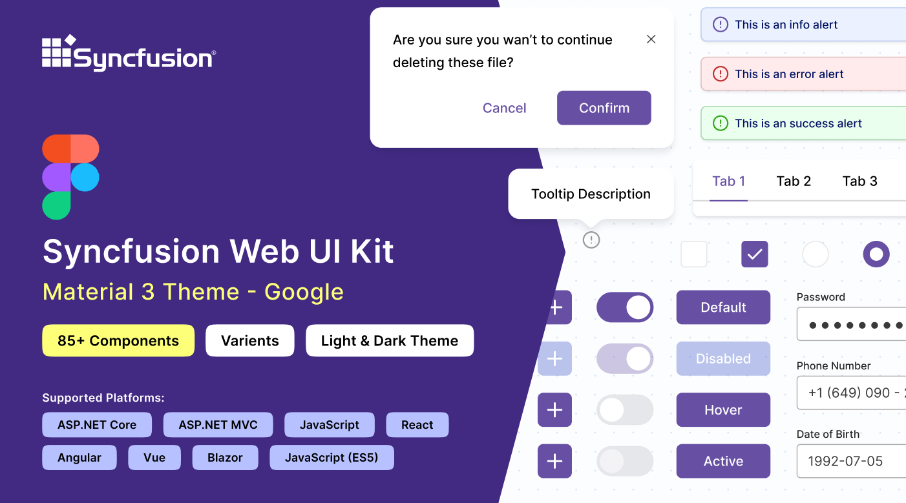
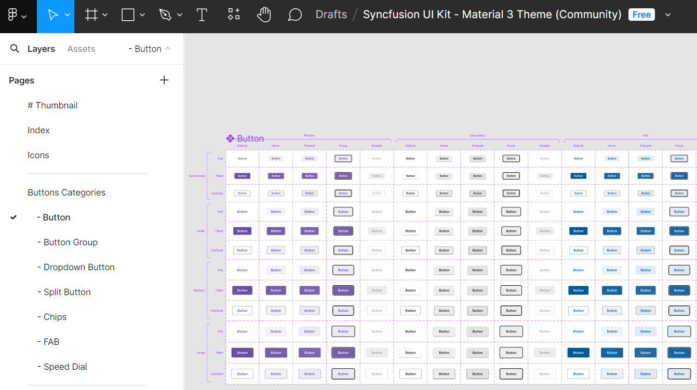
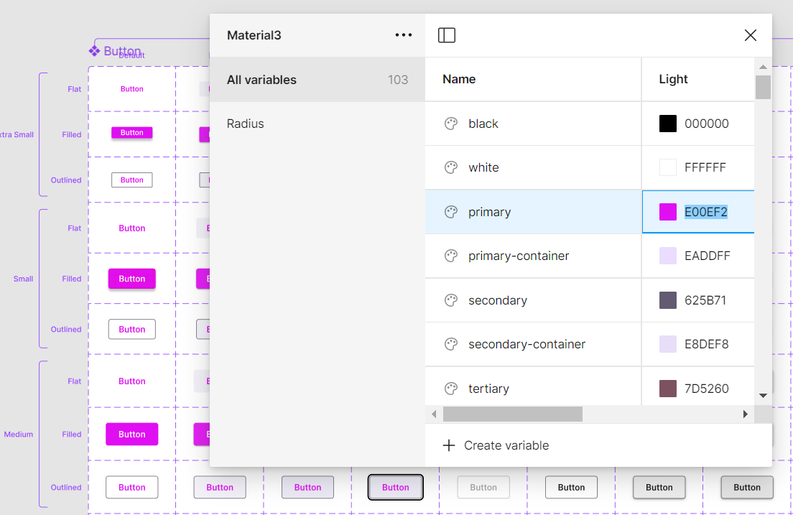
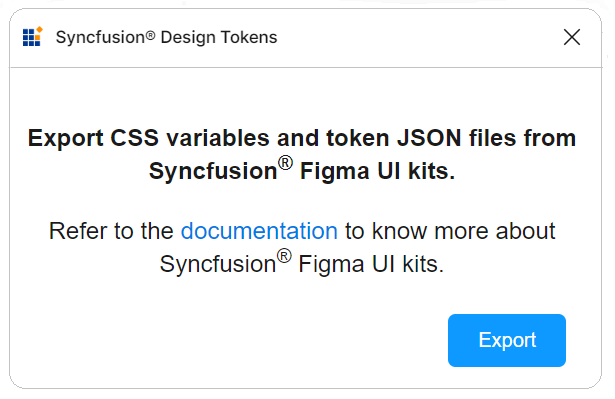

# Figma UI Kits for Syncfusion&reg; Angular Components

Syncfusion&reg; provides official [Figma UI kits](https://www.figma.com/@syncfusion) to help designers and developers collaborate more effectively. These kits contain reusable, production-ready Figma components that mirror Syncfusion&reg; Angular components—including all states, variants, interactions, and specifications.

The kits support four modern themes:

- [Material 3](https://www.figma.com/community/file/1454123774600129202)
- [Fluent](https://www.figma.com/community/file/1385969120047188707)
- [Tailwind](https://www.figma.com/community/file/1385969065626384098)
- [Bootstrap 5](https://www.figma.com/community/file/1385968977953858272)

Each kit includes detailed design tokens, measurements, icons, and documentation to achieve near-perfect fidelity between design and implementation.

## Advantages of Using the UI Kits

- Comprehensive overview of Syncfusion&reg; Angular components, including controls, states, and variants
- Built using [atomic design principles](https://atomicdesign.bradfrost.com/chapter-2/) for scalable and maintainable customization
- Enables developers to implement components that match designs exactly
- Promotes visual consistency across the entire application
- Significantly speeds up the design phase by providing ready-to-use elements

## Downloading the UI Kits

All kits are freely available in the [Figma Community](https://www.figma.com/@syncfusion). Access them directly via these links:

- [Material 3 UI Kit](https://www.figma.com/community/file/1454123774600129202)
- [Fluent UI Kit](https://www.figma.com/community/file/1385969120047188707)
- [Tailwind UI Kit](https://www.figma.com/community/file/1385969065626384098)
- [Bootstrap 5 UI Kit](https://www.figma.com/community/file/1385968977953858272)

Material 3 and Fluent kits include both light and dark mode variants.

## Structure of the UI Kits

Each kit follows a consistent, intuitive layout with the following main pages:

- **Thumbnail** — Cover page displaying the theme branding
- **Index** — Complete list of included controls with direct navigation links
- **Icons** — All icons used across components
- **UI Components** — Core section containing categorized components (inputs, navigation, data visualization, layouts, etc.), each with states, variants, specs, and measurements

Components are grouped  by category(inputs, navigation, data visualization, etc.) for quick access.

## Customizing the UI Kits

The kits support full customization to match brand guidelines while preserving component integrity. Thanks to atomic design and local variables, changes to core tokens propagate automatically.

**Example: Changing the primary button color in Material 3**

1. Visit our [UI kits](#downloading-the-ui-kits) section and select a preferred theme, such as Material 3.
2. Open the chosen theme in Figma by clicking the **Open in Figma** button.
3. For the desktop app, click **Import**, select the downloaded Syncfusion&reg; fig file, and then click **Open**.
4. Locate the button needing customization within your layout.
5. On the Figma interface's right, review the color variable options. For buttons, this might be `$primary-bg-color`, originating from the primary color variable.
6. Click outside the button to access the **Local variables** feature, containing design tokens for color variables, then click the **Local variables** option.
7. A popup with the design token list will appear, allowing primary variable color changes via a palette.
8. Upon choosing a new color (e.g., pink), the button's color will update instantly in the design.

## Exporting Customized Design Tokens

Use the official **Syncfusion Design Tokens** plugin to export your custom variables for direct use in Angular applications.

### Exporting design tokens

Follow these steps to download the customized styles from the Figma UI Kit:

- First, open a [Syncfusion&reg; Figma UI Kit](https://www.figma.com/@syncfusion).
- Navigate to the `Plugins & widgets` section in Figma and search for the `Syncfusion&reg; Design Tokens`.
- Once found, run the plugin. A popup will appear with an `Export` button.
- Click the `Export` button. This action will generate a zip file containing your design tokens.
- Select a directory to save the exported files.
- Extract the downloaded zip file to access its contents.

### Utilizing design tokens

The exported zip file includes the following files:
  - `css-variables.css`: The css-variables.css file contains CSS variables for both light and dark themes, directly derived from your Figma designs. You can easily import this file into your application alongside the component styles to reflect your custom designs. For more detailed usage instructions, consult the [CSS variables](./css-variables) documentation.
  - `<theme-name>-tokens.json`: This file (e.g., material3-tokens.json) contains style variables and values in a JSON format compatible with [Theme Studio](./theme-studio). This file, prefixed with the corresponding theme name, can be [imported](./theme-studio#import-previously-changed-settings-into-the-theme-studio) into [Theme Studio](./theme-studio) for further customization. After processing in [Theme Studio](./theme-studio), you can [download](./theme-studio#download-the-customized-theme) the updated styles file and integrate it into your application, bringing your custom themes to life.

This workflow ensures your application precisely matches your Figma designs, maintaining visual consistency from design to implementation.

## Upgrading the UI Kits

To upgrade your UI kits, download the latest version from the provided links. Follow these tips for a seamless transition:

- Stay informed about Syncfusion&reg;'s UI kit updates or new releases.
- Backup ongoing projects before upgrading to avoid data loss or compatibility issues.
- Share feedback with Syncfusion&reg; about the updated UI kits, including encountered issues or improvement suggestions.

## See Also

- [Syncfusion Themes Overview](https://ej2.syncfusion.com/documentation/appearance/theme)
- [Customizing Themes with Theme Studio](https://ej2.syncfusion.com/documentation/appearance/theme-studio#customizing-theme-color-from-theme-studio)
- [Syncfusion Figma Community Profile](https://www.figma.com/@syncfusion)