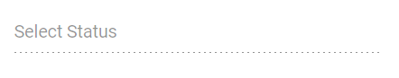

# Disabled Items in Angular AutoComplete

The AutoComplete provides options for individual items to be either in an enabled or disabled state for specific scenarios. The category of each list item can be mapped through the [`disabled`](https://ej2.syncfusion.com/angular/documentation/api/auto-complete/index-default#fields) field. Once an item is disabled, it cannot be selected as a value for the component. To configure the disabled item columns, use the `fields.disabled` property.

In the following sample, list items are configured with a disabled status using the `disabled` field.










  


## Disable Item Method

The [`disableItem`](https://ej2.syncfusion.com/angular/documentation/api/auto-complete/index-default#disableItem) method can be used to handle dynamic changes in the disabled state of a specific item. Only one item can be disabled with each call. To disable multiple items, iterate this method over the items list or array. The disabled field state is updated in the [`dataSource`](https://ej2.syncfusion.com/angular/documentation/api/auto-complete/index-default#datasource) when the item is disabled using this method. If the selected item is disabled dynamically, the selection will be cleared.

| Parameter | Type | Description |
|------|------|------|
| itemHTMLLIElement |  <code>HTMLLIElement</code> |  It accepts the HTML LI element of the item to be disabled.  |
| itemValue | <code>string</code> \| <code>number</code> \| <code>boolean</code> \| <code>object</code> | It accepts the string, number, boolean, and object type values of the item to be disabled. |
| itemIndex | <code>number</code> | It accepts the index of the item to be disabled. |

## Disable component

To disable the overall component, set the [`enabled`](https://ej2.syncfusion.com/angular/documentation/api/auto-complete/index-default#enabled) property to `false`.

