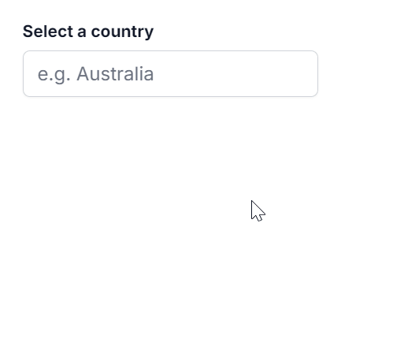

# Resizing in Angular AutoComplete component

You can dynamically adjust the size of the popup in the Autocomplete component by using the [AllowResize](https://ej2.syncfusion.com/angular/documentation/api/auto-complete/#allowresize) property. When enabled, users can resize the popup, improving visibility and control, with the resized dimensions being retained across sessions for a consistent user experience.

The following sample illustrates the implementation of the Popup Resize feature.










  

