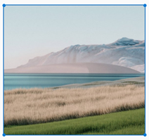

# Embed Blocks in Angular Block Editor component

The Block Editor supports the addition of embeds to help you organize and showcase visual content effectively.

## Adding an image block

You can use the [Image](https://ej2.syncfusion.com/angular/documentation/api/blockeditor/blocktype) block to showcase an image content within your editor.

### Configure image block

You can render an `Image` block by setting the [blockType](https://ej2.syncfusion.com/angular/documentation/api/blockeditor/blockmodel#blocktype) property to `Image` in the block model. The [properties](https://ej2.syncfusion.com/angular/documentation/api/blockeditor/blockmodel#properties) property allows you to configure the image source, allowed file types, display dimensions, and more.

#### Global image settings

You can configure global settings for image blocks using the [imageBlockSettings](https://ej2.syncfusion.com/angular/documentation/api/blockeditor/iimageblocksettings) property in the Block Editor root configuration. This ensures consistent behavior for image uploads, resizing, and display.

The `imageBlockSettings` property supports the following options:

| Property | Description | Default Value |
|----------|-------------|---------------|
| saveUrl | Specifies the server endpoint URL for uploading images. | `''` |
| maxFileSize | Specifies the maximum file size allowed for image uploads in bytes. | `30000000` |
| path | Specifies the base path for storing and displaying images on the server. | `''` |
| saveFormat | Specifies the format to save the image. | `Base64` |
| allowedTypes | Specifies allowed image file types for upload. | `['.jpg', '.jpeg', '.png']` |
| width | Specifies the default display width of the image. | `auto` |
| height | Specifies the default display height of the image. | `auto` |
| enableResize | Enables or disables image resizing. | `true` |
| minWidth | Minimum width allowed for resizing. | `''` |
| maxWidth | Maximum width allowed for resizing. | `''` |
| minHeight | Minimum height allowed for resizing. | `''` |
| maxHeight | Maximum height allowed for resizing. | `''` |

#### Maximum file size restriction

You can restrict the image uploaded from the local machine when the uploaded image file size is greater than the allowed size by using the [maxFileSize](https://ej2.syncfusion.com/angular/documentation/api/blockeditor/imageBlockSettings#maxFileSize) property. By default, the maximum file size is 30000000 bytes. You can configure this size as follows.

```ts

    imageBlockSettings: {
      maxFileSize: 10000000
    }

```

#### Configuring allowed image types

You can allow the specific images alone to be uploaded using the the allowedTypes property. By default, the Block Editor allows the JPG, JPEG, and PNG formats. You can configure this formats as follows.

```ts

    imageBlockSettings: {
      allowedTypes: ['.jpg', '.jpeg', '.png']
    }

```

#### Configure Image Block Properties

The `Image` block [properties](https://ej2.syncfusion.com/angular/documentation/api/blockeditor/blockmodel#properties) property supports the following options:

| Property | Description | Default Value |
|----------|-------------|---------------|
| src | Specifies the image path. | `''` |
| width | Specifies the display width of the image. | `''` |
| height | Specifies the display height of the image. | `''` |
| altText | Specifies the alternative text to display when the image cannot be loaded. | `''` |

### Block type & properties

The following example demonstrates how to pre-configure an `Image` block in the editor.

```typescript
// Adding an Image block
 {
    blockType: 'Image',
    properties: {
        src: '',
        width: '200px',
        height: '100px',
        altText: '',
    }
}
```

This sample demonstrates the configuration of the `Image` block in the Block Editor.













        


## Uploading images from local machine

To insert an image from your local machine, render the `Image` block. It opens a popup where you can browse and select an image to insert from your local machine.

## Saving images to server

Upload the selected image to a specified destination using the controller action specified in [imageBlockSettings.saveUrl](https://ej2.syncfusion.com/angular/documentation/api/blockeditor/imageBlockSettings#saveUrl). Ensure to map this method name appropriately and provide the required destination path through the [imageBlockSettings.path](https://ej2.syncfusion.com/angular/documentation/api/blockeditor/imageBlockSettings#path) properties.

Set the [imageBlockSettings.saveFormat](https://ej2.syncfusion.com/angular/documentation/api/blockeditor/imageBlockSettings#saveformat) property to determine whether the image should be saved as Blob or Base64, aligning with your application's requirements.














```csharp

public class HomeController : Controller
    {
        private IHostingEnvironment hostingEnv;

        public HomeController(IHostingEnvironment env)
        {
            hostingEnv = env;
        }

        public IActionResult Index()
        {
            return View();
        }

        [AcceptVerbs("Post")]
        public void SaveImage(IList<IFormFile> UploadFiles)
        {
            try
            {
                foreach (IFormFile file in UploadFiles)
                {
                    if (UploadFiles != null)
                    {
                        string filename = ContentDispositionHeaderValue.Parse(file.ContentDisposition).FileName.Trim('"');
                        filename = hostingEnv.WebRootPath + "\\Uploads" + $@"\{filename}";

                        // Create a new directory, if it does not exists
                        if (!Directory.Exists(hostingEnv.WebRootPath + "\\Uploads"))
                        {
                            Directory.CreateDirectory(hostingEnv.WebRootPath + "\\Uploads");
                        }

                        if (!System.IO.File.Exists(filename))
                        {
                            using (FileStream fs = System.IO.File.Create(filename))
                            {
                                file.CopyTo(fs);
                                fs.Flush();
                            }
                            Response.StatusCode = 200;
                        }
                    }
                }
            }
            catch (Exception)
            {
                Response.StatusCode = 204;
            }
        }

        [ResponseCache(Duration = 0, Location = ResponseCacheLocation.None, NoStore = true)]
        public IActionResult Error()
        {
            return View(new ErrorViewModel { RequestId = Activity.Current?.Id ?? HttpContext.TraceIdentifier });
        }
    }

```

### Secure image upload with authentication

You can add additional data with the image uploaded from the Block Editor on the client side, which can even be received on the server side. By using the [fileUploading](https://ej2.syncfusion.com/angular/documentation/api/blockeditor#fileUploading) event and it's arguments you can access the current request and set the request header within these event. On the server side, you can fetch the custom headers by accessing the form collection from the current request, which retrieves the values sent using the POST method.














```csharp

public void SaveFiles(IList<IFormFile> UploadFiles)
{
    string currentPath = Request.Form["Authorization"].ToString();
}

```

## Inserting images from web URLs

To insert an image from an online source, render the `Image` block. Switch to the `Embed Link` tab containing an input field where you can provide the image URL from the web to insert the image.

## Image resizing

Block Editor has a built-in image inserting support.  The resize points will be appearing on each corner of image when focus. So, users can resize the image using mouse points or thumb through the resize points easily. Also, the resize calculation will be done based on aspect ratio.

