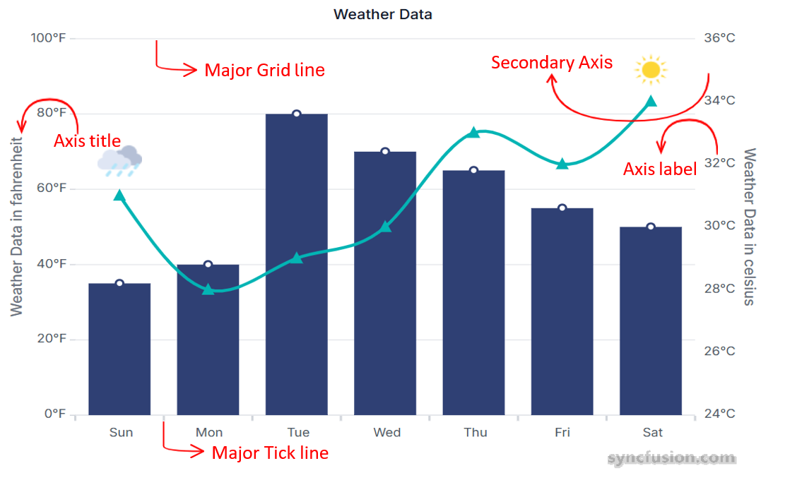

# What is axis in chart?

In a chart, an axis refers to the lines that define the boundaries of the chart and provide a scale for measuring data. Chart have two axes: the horizontal axis (x-axis) and the vertical axis (y-axis). Here is the quick overview of axis elements.

* **Grid lines** : Gridlines in charts are horizontal and vertical lines that extend from the axes across the plot area. For more details see [Grid Line Customization](../axis/axis-customization#grid-lines-customization).
* **Tick lines** : Tick marks are the lines placed along an axis to show the units of measurement. For more details see [Tick Line Customization](../axis/axis-customization#tick-lines-customization).

* **Secondary Axis**: Charts can have multiple axes to show different scales or units. For more details see [Secondary Axis](../axis/axis-customization#multiple-axis).

* **Axis Label**: Axis labels are descriptive texts that appear along the axes of a chart, providing essential context about the data being presented. For more details see [Axis Label](../axis/axis-customization/axis-labels.md)

* **Axis Title**: An axis title in a chart is a descriptive label that indicates the purpose of the chart's axis. It helps to quickly understand what each axis represents and provides context to the data points. For more details see [Title](../axis/axis-customization#title).

* **Axis Types**: The `valueType` (or equivalent) determines how axis values are interpreted and rendered. For more details see [Category Axis](../axis/axis-types/category-axis), [Numeric Axis](../axis/axis-types/numeric-axis.md), [DateTime Axis](../axis/axis-types/date-time-axis.md), [Logarithmic Axis](../axis/axis-types/logarithmic-axis.md).