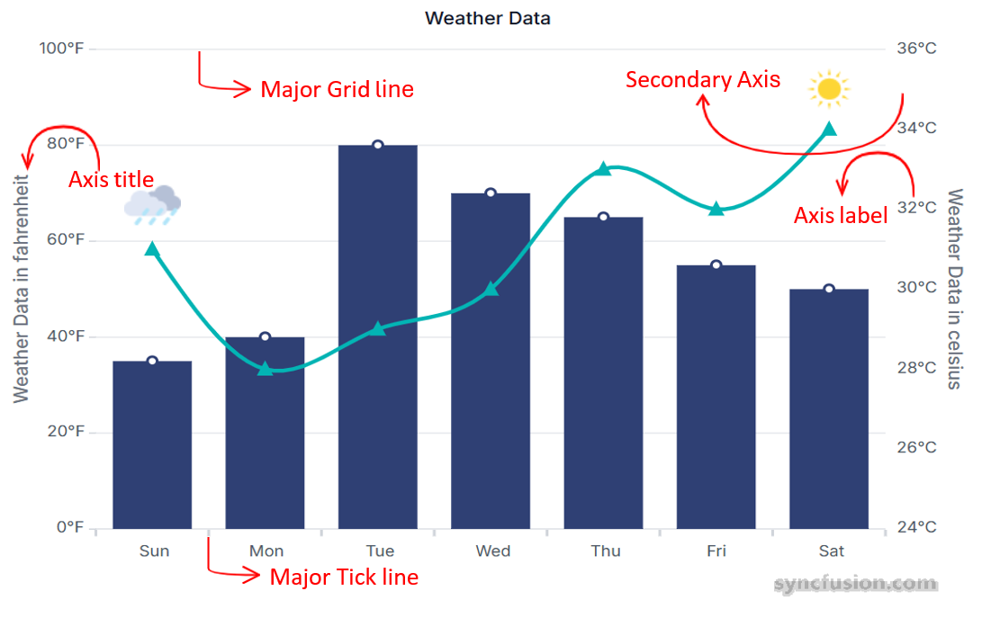

# Axis Overview in Angular Chart

In a chart, an axis refers to the line that defines the boundary of the chart and provides a scale for measuring data. Charts have two axes: the horizontal axis (x-axis) and the vertical axis (y-axis). The following is a quick overview of the axis elements.

* **Axis Types**: The [`valueType`](https://ej2.syncfusion.com/angular/documentation/api/chart/axisModel#valuetype) property determines how axis values are interpreted and rendered. For most types (such as `Logarithmic` or `DateTime`), you must inject the matching feature service, for example `LogarithmicService` or `DateTimeService`. For more details see [Category Axis](./axis-types/category-axis), [Numeric Axis](./axis-types/numeric-axis), [DateTime Axis](./axis-types/date-time-axis), [Logarithmic Axis](./axis-types/logarithmic-axis).
* **Grid Lines**: Grid lines in charts are horizontal and vertical lines that extend from the axis across the plot area. For more details see [Grid Line Customization](./axis-customization#grid-lines-customization).
* **Tick Lines**: Tick marks are short lines placed along an axis at regular intervals to indicate the scale. For more details see [Tick Line Customization](./axis-customization#tick-lines-customization).
* **Multiple Axes**: Charts can include multiple axes to display different scales or units, often shown as a primary and secondary axis. For more details see [Multiple Axis](./axis-customization#multiple-axis).

* **Axis Label**: Axis labels are descriptive texts that appear along the axes of a chart and provide context about the data being presented. For more details see [Labels Customization](./axis-labels#labels-customization).
* **Axis Title**: An axis title is a descriptive label that indicates the purpose of the chart's axis, helping viewers understand what each axis represents. For more details see [Title](./axis-customization#title).

## See Also

For setup and installation, see [Getting Started with Angular Chart](../getting-started).

* [Axis Customization](./axis-customization)
* [Multiple Panes](./multiple-panes)
* [Chart Accessibility](../accessibility)
