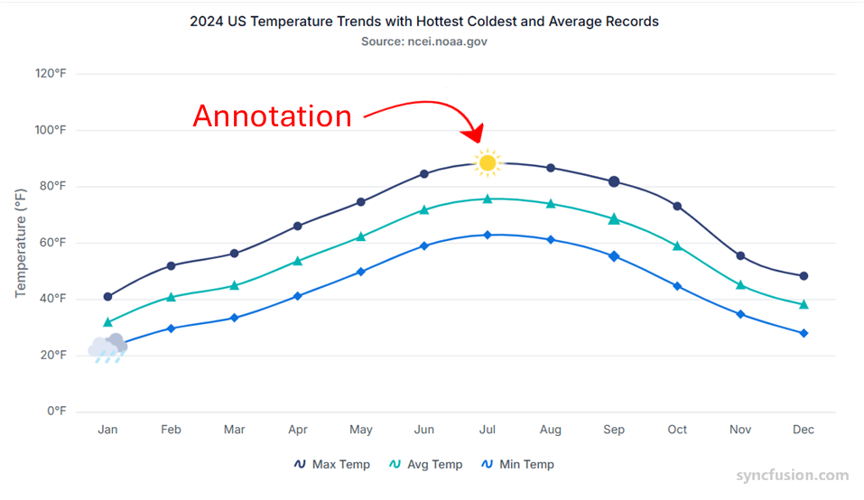

# Chart annotations in Angular Chart component

Annotations are used to mark the specific area of interest in the chart area with texts, shapes or images.



<!-- markdownlint-disable MD033 -->

You can add annotations to the chart by using the <code>annotations</code> option. By using the
[`content`](https://ej2.syncfusion.com/angular/documentation/api/chart/annotationDirective#content) option of annotation object, you can specify
the id of the element that needs to be displayed in the chart area.

To known more about annotations, you can check on this video:












  


>Note: To use annotation feature in chart, we need to inject `ChartAnnotationService` into the `@NgModule.providers`.

## Region

Annotations can be placed either with respect to `Series` or `Chart`. by default, it will placed with respect to `Chart`.










  


## Co-ordinate Units

Specified the coordinates units of the annotation either `Pixel` or `Point`.










  


## Alignment

Annotation provides `verticalAlignment` and `horizontalAlignment`. The `verticalAlignment` can be customized via `Top`, `Bottom` or `Middle` and the `horizontalAlignment` can be customized via `Near`, `Far` or `Center`.










  


## Adding y-axis sub title through on annotation

By setting text div in the `content` option of annotation object you can add sub title to chart y-axis. Specified the `coordinate` value as `pixel` and customize x and y location of the text.










  


## Annotation customization

### Dotted line in Angular Chart component

Set the annotation `coordinateUnits` to `Point` to place dotted lines at specific data point positions using their x and y values.










  


### Footer in Angular Chart component

Use annotations to add both a watermark and a footer to the chart. Initialize custom elements with the `annotation` property and provide the HTML to render via the `content` option. For a watermark, supply the text "syncfusion" and position it using the desired coordinate unit.

```bash
    #  watermark for chart
       <e-annotations>
            <e-annotation  content='<div id="chart_cloud" style="font-size:450%; opacity: 0.3;" >syncfusion</div>'
            x='Wed' y= 20 coordinateUnits= 'Point' horizontalAlignment='Center'>
            </e-annotation>
        </e-annotations>
```

Use the `x` and `y` option of the annotation object to create footer for chart.

```bash
<e-annotations>
   #  footer for chart
        <e-annotation  content='<div id="chart" > <a href="https://www.syncfusion.com" target="_blank">www.syncfusion.com</a></div>'
            x=400 y=440 coordinateUnits='Pixel' horizontalAlignment='Center'>
            </e-annotation>
        </e-annotations>
```










  


### Stacking total in Angular Chart component

To show the total at each stacked data point, handle the [`annotationRender`](https://ej2.syncfusion.com/angular/documentation/api/chart/chartModel/#annotationrender) event to compute the series' stacked value and update the annotation content before it renders.










  



## See Also

* [Dynamically Update X-Axis Annotation Content](https://support.syncfusion.com/kb/article/21478/how-to-dynamically-update-x-axis-annotation-content-on-point-click-in-angular-chart)
* [Add Clickable Annotation Text](https://support.syncfusion.com/kb/article/21318/how-to-add-clickable-annotation-text-in-angular-accumulation-chart)