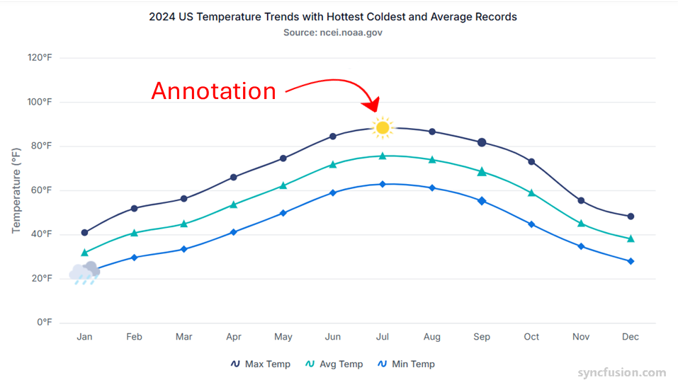

# Annotations in Angular Chart

In this guide, you'll learn how to add, position, and customize annotations in the Syncfusion Angular Chart component to highlight trends, thresholds, and other details directly inside the chart area.

Chart annotations allow highlighting specific areas of the chart using text, shapes, images, or custom HTML elements. Annotations can be used to emphasize trends, mark thresholds, show custom notes, or surface extra details inline within the chart area.



## Prerequisites

Before adding annotations, make sure the package below is installed:

* [`@syncfusion/ej2-angular-charts`](https://www.npmjs.com/package/@syncfusion/ej2-angular-charts) — see the [Syncfusion Angular compatibility matrix](https://ej2.syncfusion.com/angular/documentation/system-requirement) for the supported Angular version range.

For a step-by-step setup, see [Getting Started with Angular Chart](../getting-started).

>**Note**: To use the annotation feature in Chart, add `ChartAnnotationService` to the standalone component's `providers` (or to `@NgModule.providers` for non-standalone apps). See the snippet below for an example.

Annotations are added using the [`annotations`](https://ej2.syncfusion.com/angular/documentation/api/chart/chartModel#annotations) option. Set the [`content`](https://ej2.syncfusion.com/angular/documentation/api/chart/annotationDirective#content) property to specify the HTML or template string that should be rendered within the chart.

To know more about annotations, you can check on this video:















## Region

Annotations can be positioned relative to either the overall `Chart` area or a specific `Series` using the [`region`](https://ej2.syncfusion.com/angular/documentation/api/chart/chartAnnotationSettingsModel#region) property. When placed relative to the chart, the annotation uses the chart's coordinate system. When placed relative to a series, the annotation aligns with that series' data points, so the annotation's `x` value must match the category/name defined by the series' `xName`. By default, annotations are placed with respect to the `Chart`.










  


## Coordinate Units

Use the [`coordinateUnits`](https://ej2.syncfusion.com/angular/documentation/api/chart/chartAnnotationSettingsModel#coordinateunits) property to define how annotation coordinates are interpreted. The default value is `Pixel`. Choose between:
- `Pixel` – The annotation is positioned using fixed pixel values within the chart area.  
- `Point` – The annotation is positioned based on chart data points ([`x`](https://ej2.syncfusion.com/angular/documentation/api/chart/chartAnnotationSettingsModel#x) and [`y`](https://ej2.syncfusion.com/angular/documentation/api/chart/chartAnnotationSettingsModel#y) values).

When using `Point`, the `x` value must match a value your x-axis can resolve: a category label (e.g. `'Japan'`) for `valueType: 'Category'`; a `Date` or `DateOffset` value for `valueType: 'DateTime'`; or a numeric value for `valueType: 'Double'`. For `region='Chart'`, `x` must still resolve against the primary x-axis and `y` against the primary y-axis; for `region='Series'`, `x` must match the series' `xName` value.   










  


## Alignment

Annotation provides [`verticalAlignment`](https://ej2.syncfusion.com/angular/documentation/api/chart/chartAnnotationSettingsModel#verticalalignment) and [`horizontalAlignment`](https://ej2.syncfusion.com/angular/documentation/api/chart/chartAnnotationSettingsModel#horizontalalignment). The [`verticalAlignment`](https://ej2.syncfusion.com/angular/documentation/api/chart/chartAnnotationSettingsModel#verticalalignment) can be customized via `Top`, `Bottom`, or `Middle` (default: `Middle`); the [`horizontalAlignment`](https://ej2.syncfusion.com/angular/documentation/api/chart/chartAnnotationSettingsModel#horizontalalignment) can be customized via `Near`, `Far`, or `Center` (default: `Center`).










  


## Annotation Customization

Use annotations to enrich the chart with custom visuals such as dashed reference lines, watermarks, footers, y-axis subtitles, and stacked-column totals. The samples in this section cover each scenario.

### Y-Axis Subtitle

By setting a text `<div>` in the [`content`](https://ej2.syncfusion.com/angular/documentation/api/chart/annotationDirective#content) option of an annotation object, you can add a subtitle to the chart y-axis. Set [`coordinateUnits`](https://ej2.syncfusion.com/angular/documentation/api/chart/chartAnnotationSettingsModel#coordinateunits) to `Pixel`, adjust the [`x`](https://ej2.syncfusion.com/angular/documentation/api/chart/chartAnnotationSettingsModel#x) and [`y`](https://ej2.syncfusion.com/angular/documentation/api/chart/chartAnnotationSettingsModel#y) location of the text (the sample below positions the subtitle near the top-left of the y-axis), and apply `transform: rotate(-90deg)` to a `<div>` wrapper inside `content` so the subtitle orients vertically alongside the y-axis.













### Dotted Line

Set the annotation [`coordinateUnits`](https://ej2.syncfusion.com/angular/documentation/api/chart/chartAnnotationSettingsModel#coordinateunits) to `Point` to draw a horizontal dashed line anchored at a specific data point. Although the line is anchored at one `(x, y)` position, the wrapper `<div>` inside [`content`](https://ej2.syncfusion.com/angular/documentation/api/chart/annotationDirective#content) uses `width: 10000px` with `border-top: 3px dashed` so the dashed bar visually spans across the plot area from that data point.










  


### Watermark

Use an annotation to add a watermark to the chart. Initialize the element with the [`annotation`](https://ej2.syncfusion.com/angular/documentation/api/chart/chartAnnotationSettingsModel) property and provide the HTML for the watermark via the [`content`](https://ej2.syncfusion.com/angular/documentation/api/chart/annotationDirective#content) option. In the example below the watermark text is "syncfusion", positioned with `coordinateUnits='Point'` so it aligns with a category on the x-axis (matching a category label such as `'Wed'`).

```html
    <!-- watermark for chart -->
       <e-annotations>
            <e-annotation  content='<div id="chart_cloud" style="font-size:450%; opacity: 0.3;" >syncfusion</div>'
            x='Wed' y= 20 coordinateUnits= 'Point' horizontalAlignment='Center'>
            </e-annotation>
        </e-annotations>
```

### Footer

Use the [`x`](https://ej2.syncfusion.com/angular/documentation/api/chart/chartAnnotationSettingsModel#x) and [`y`](https://ej2.syncfusion.com/angular/documentation/api/chart/chartAnnotationSettingsModel#y) options of the annotation object to place a footer at the bottom of the chart. Use `coordinateUnits='Pixel'` with absolute coordinates (the values shown assume a chart of approximately 800 × 480 pixels; adjust `x` and `y` based on your chart's actual size, and note that pixel offsets may shift on responsive resize because Pixel units are tied to the chart's outer dimensions).

```html
<!-- footer for chart -->
<e-annotations>
        <e-annotation  content='<div id="chart" > <a href="https://www.syncfusion.com" target="_blank" aria-label="Visit Syncfusion website">www.syncfusion.com</a></div>'
            x=400 y=440 coordinateUnits='Pixel' horizontalAlignment='Center'>
            </e-annotation>
        </e-annotations>
```













### Stacking Total

To show the total at each stacked data point, handle the [`annotationRender`](https://ej2.syncfusion.com/angular/documentation/api/chart/chartModel#annotationrender) event (the binding `(annotationRender)='annotationRender($event)'` is shown in the snippet below) to compute the series' stacked value (`visibleSeries[lastIndex].stackedValues.endValues[index]` — see [`Series.stackedValues`](https://ej2.syncfusion.com/angular/documentation/api/chart/series#stackedvalues)) and update the annotation content's nested `<span>` (`args.content.children[0].children[0].innerHTML`) before each annotation is rendered.













### Binding to Multiple Axes

When the chart has more than one x-axis or y-axis, target a specific axis by setting the annotation's [`xAxisName`](https://ej2.syncfusion.com/angular/documentation/api/chart/chartAnnotationSettingsModel#xaxisname) and [`yAxisName`](https://ej2.syncfusion.com/angular/documentation/api/chart/chartAnnotationSettingsModel#yaxisname) properties to the corresponding axis names declared on the chart.

```html
<e-annotations>
    <e-annotation
        content='<div>Annotation on secondary y-axis</div>'
        xAxisName='secondaryX'
        yAxisName='secondaryY'
        coordinateUnits='Pixel'
        x=10 y=10>
    </e-annotation>
</e-annotations>
```

The full multi-axis chart setup (including `axes` array and axis naming) is documented under [Multi-Panes](../multi-panes).

## Troubleshooting

If the annotation does not render or behaves unexpectedly, check the following:

* **Service not provided** – Console shows `ChartAnnotationService` errors when an annotation is added without registering the service. Confirm `ChartAnnotationService` is listed in the component `providers` (or in `@NgModule.providers` for module-based apps).
* **Annotation not appearing** – When using `coordinateUnits='Point'`, verify that the `x`/`y` values resolve against the axis. With `region='Series'`, `x` must match the series' `xName` value; with `region='Chart'`, `x` must match the primary x-axis value.
* **Pixel offset mismatch** – Pixel units depend on the chart's outer width and height. If the chart is rendered inside a responsive container, recompute `x`/`y` after resize or switch to `Point` units.
* **Empty or broken HTML** – The `content` is parsed as HTML; quotes and entities must be escaped correctly inside the template.


## See Also

* [Dynamically Update Annotation Content on Point Click in Angular Chart](https://support.syncfusion.com/kb/article/21478/how-to-dynamically-update-x-axis-annotation-content-on-point-click-in-angular-chart)
* [Chart Events](../chart-events) — for a list of supported chart events, including `annotationRender`.