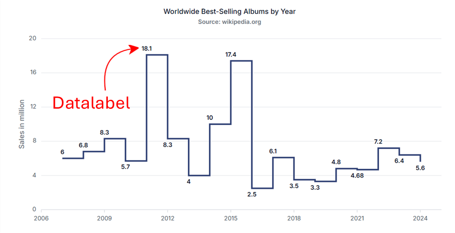

# Data labels in Angular Chart component

Data labels display the values of data points directly on the chart, reducing the need to reference axes for exact values. Enable data labels by setting the [`visible`](https://ej2.syncfusion.com/angular/documentation/api/chart/dataLabelSettings#visible) option to `true` in the `dataLabel` configuration. Labels automatically adjust to avoid overlapping and maintain readability.



Data labels can be added to a chart series by enabling the [`visible`](https://ej2.syncfusion.com/angular/documentation/api/chart/dataLabelSettings#visible) option in the [`dataLabel`](https://ej2.syncfusion.com/angular/documentation/api/chart/markersettingsmodel#datalabel). By default, the labels will arrange smartly without overlapping.










  


>**Note**: To use datalabel feature, inject `DataLabelService` into the `@NgModule.providers`.

## Position

Use the [`position`](https://ej2.syncfusion.com/angular/documentation/api/chart/dataLabelSettings#position) property to place data labels at `Top`, `Middle`, `Bottom`, or `Outer` (applicable only to column and bar series). Appropriate label positioning enhances clarity and preserves chart readability.










  


>Note: The `Outer` position applies only to column and bar series types.

## Data Label Template

Customize label content using templates. Use placeholders such as `${point.x}` and `${point.y}` to display data point values. The [`template`](https://ej2.syncfusion.com/angular/documentation/api/chart/dataLabelSettingsModel#template) property enables fully customizable and visually rich labels.

**Change color for the background in the datalabel template**

Initialize the datalabel template div as shown in the following html page,

```
    <script id="index" type="text/x-template">
    <div id='templateWrap' style="background-color: ${point.text}; border-radius: 3px;"><span>${point.y}</span></div>
    </script>
```











  


**To show that datalabel template, set the element id to the [template](https://ej2.syncfusion.com/angular/documentation/api/chart/dataLabelSettingsModel#template) property in datalabel.**










  


## Format

Apply number or date formatting using the  [`format`](https://ej2.syncfusion.com/angular/documentation/api/chart/dataLabelSettings#format)  property. Global formatting symbols include:
- `n` – number format  
- `p` – percentage format  
- `c` – currency format










  


<table>
  <tr>
    <th>Value</th>
    <th>Format</th>
    <th>Resultant Value</th>
    <th>Description</th>
  </tr>
  <tr>
    <td>1000</td>
    <td>n1</td>
    <td>1000.0</td>
    <td>The number is rounded to 1 decimal place.</td>
  </tr>
  <tr>
    <td>1000</td>
    <td>n2</td>
    <td>1000.00</td>
    <td>The number is rounded to 2 decimal places.</td>
  </tr>
   <tr>
    <td>1000</td>
    <td>n3</td>
    <td>1000.000</td>
    <td>The number is rounded to 3 decimal place.</td>
  </tr>
  <tr>
    <td>0.01</td>
    <td>p1</td>
    <td>1.0%</td>
    <td>The number is converted to percentage with 1 decimal place.</td>
  </tr>
  <tr>
    <td>0.01</td>
    <td>p2</td>
    <td>1.00%</td>
    <td>The number is converted to percentage with 2 decimal place.</td>
  </tr>
   <tr>
    <td>0.01</td>
    <td>p3</td>
    <td>1.000%</td>
    <td>The number is converted to percentage with 3 decimal place.</td>
  </tr>
  <tr>
    <td>1000</td>
    <td>c1</td>
    <td>$1000.0</td>
    <td>The currency symbol is appended to number and number is rounded to 1 decimal place.</td>
  </tr>
   <tr>
    <td>1000</td>
    <td>c2</td>
    <td>$1000.00</td>
    <td>The currency symbol is appended to number and number is rounded to 2 decimal place.</td>
  </tr>
</table>

## Text Mapping

Display custom text using the [`name`](https://ej2.syncfusion.com/angular/documentation/api/chart/dataLabelSettings#name) property, which maps label text from a specific field in the data source. This feature is useful for descriptive or category‑based labels.










  


## Margin

Adjust spacing around labels using the [`margin`](https://ej2.syncfusion.com/angular/documentation/api/chart/dataLabelSettings#margin) property, which includes [`left`](https://ej2.syncfusion.com/angular/documentation/api/chart/marginModel#left), [`right`](https://ej2.syncfusion.com/angular/documentation/api/chart/marginModel#right), [`bottom`](https://ej2.syncfusion.com/angular/documentation/api/chart/marginModel#bottom), and [`top`](https://ej2.syncfusion.com/angular/documentation/api/chart/marginModel#top) values. Margins help prevent labels from overlapping chart elements.










  


## Data label rotation

Rotate data labels using the [`angle`](https://ej2.syncfusion.com/angular/documentation/api/chart/dataLabelSettings#angle) property. Rotation improves readability when labels are long or when space is limited.










  


## Customization

Enhance label appearance using properties such as [`fill`](https://ej2.syncfusion.com/angular/documentation/api/chart/dataLabelSettings#fill) (background), [`border`](https://ej2.syncfusion.com/angular/documentation/api/chart/dataLabelSettings#border), and corner radius ([`rx`](https://ej2.syncfusion.com/angular/documentation/api/chart/dataLabelSettings#rx), [`ry`](https://ej2.syncfusion.com/angular/documentation/api/chart/dataLabelSettings#ry)). Refine text appearance using the [`font`](https://ej2.syncfusion.com/angular/documentation/api/chart/dataLabelSettings#font) settings, which support `color`, `fontFamily`, `fontWeight`, and `size`.










  


>Note: The [`rx`](https://ej2.syncfusion.com/angular/documentation/api/chart/dataLabelSettings#rx) and [`ry`](https://ej2.syncfusion.com/angular/documentation/api/chart/dataLabelSettings#ry) properties require non‑null [`border`](https://ej2.syncfusion.com/angular/documentation/api/chart/dataLabelSettings#border) values.

## Customizing specific point

Customize individual markers or labels using the [`pointRender`](https://ej2.syncfusion.com/angular/documentation/api/chart/iPointRenderEventArgs)and [`textRender`](https://ej2.syncfusion.com/angular/documentation/api/chart/iTextRenderEventArgs) events.  
- [`pointRender`](https://ej2.syncfusion.com/angular/documentation/api/chart/chartModel#pointrender) modifies shape, color, or border of a point.  
- [`textRender`](https://ej2.syncfusion.com/angular/documentation/api/chart/chartModel#textrender) customizes the label text for specific points.










  


## Show percentage based on each series points

Calculate and display percentage values based on each series' total using the [`seriesRender`](https://ej2.syncfusion.com/angular/documentation/api/chart/chartModel#seriesrender) and [`textRender`](https://ej2.syncfusion.com/angular/documentation/api/chart/chartModel#textrender) events.  
- In [`seriesRender`](https://ej2.syncfusion.com/angular/documentation/api/chart/chartModel#seriesrender), compute the total of `y` values.  
- In [`textRender`](https://ej2.syncfusion.com/angular/documentation/api/chart/chartModel#textrender), calculate the percentage for each point and update the label text.










  


## Last value label

The [`lastValueLabel`](https://ej2.syncfusion.com/angular/documentation/api/chart/seriesModel#lastvaluelabel) in a chart allows you to easily display the value of the last data point in a series. This feature provides an intuitive way to highlight the most recent or last data value in a series on your chart.

### Enable last value label

To show the last value label, make sure the [`enable`](https://ej2.syncfusion.com/angular/documentation/api/chart/lastValueLabelSettingsModel#enable) property inside the [`lastValueLabel`](https://ej2.syncfusion.com/angular/documentation/api/chart/seriesModel#lastvaluelabel) settings is set to `true` within the series configuration.













>Note: To use last value label feature, we need to inject `LastValueLabelService` into the `@NgModule.providers`.

### Customization in last label

The appearance of the last value label can be customized using style properties such as [`font`](https://ej2.syncfusion.com/angular/documentation/api/chart/lastValueLabelSettingsModel#font), [`background`](https://ej2.syncfusion.com/angular/documentation/api/chart/lastValueLabelSettingsModel#background), [`border`](https://ej2.syncfusion.com/angular/documentation/api/chart/lastValueLabelSettingsModel#border), [`dashArray`](https://ej2.syncfusion.com/angular/documentation/api/chart/lastValueLabelSettingsModel#dasharray), [`lineWidth`](https://ej2.syncfusion.com/angular/documentation/api/chart/lastValueLabelSettingsModel#linewidth), [`lineColor`](https://ej2.syncfusion.com/angular/documentation/api/chart/lastValueLabelSettingsModel#linecolor), [`rx`](https://ej2.syncfusion.com/angular/documentation/api/chart/lastValueLabelSettingsModel#rx), and [`ry`](https://ej2.syncfusion.com/angular/documentation/api/chart/lastValueLabelSettingsModel#ry) in the [`lastValueLabel`](https://ej2.syncfusion.com/angular/documentation/api/chart/seriesModel#lastvaluelabel) property of the chart series. These settings allow you to tailor the label's look to align with your desired visual presentation.













## Prevent data label in Angular Chart component

Hide data labels for points whose value is 0 using the [`textRender`](https://ej2.syncfusion.com/angular/documentation/api/chart/chartModel#textrender) event. In the handler, check `args.point.y` and set `args.cancel` to `true` when it equals 0.










  


## See Also

* [Show total stacking values in data label](./how-to/stacking-total#show-the-total-value-for-stacking-series-in-data-label)
* [Add Images to Each Data Point](https://support.syncfusion.com/kb/article/21529/how-to-add-images-to-each-data-point-in-angular-chart-component)