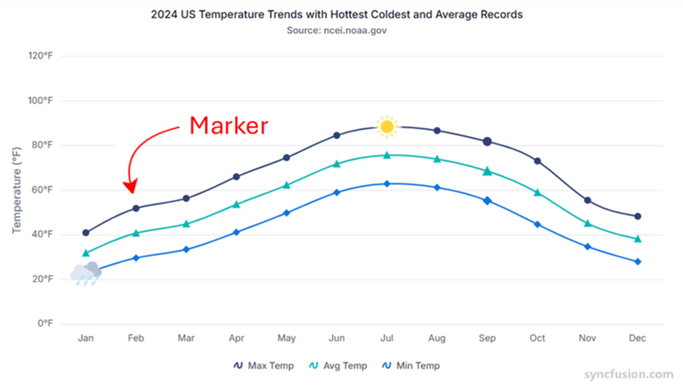

# Data markers in Angular Chart component

Data markers are visual indicators placed at each data point on a series, helping to clearly identify and highlight individual values in your chart. Markers improve readability and accessibility, especially in line and area charts where data points may otherwise be unclear. Customize marker shape, color, size, and appearance to match your design requirements.

## Marker

Enable markers for data points by setting the [`visible`](https://ej2.syncfusion.com/angular/documentation/api/chart/markerSettingsModel#visible) option to `true` in the [`marker`](https://ej2.syncfusion.com/angular/documentation/api/chart/seriesModel#marker) property. Each series receives distinct markers by default, improving visual differentiation.










  


## Shape

Assign different shapes to markers such as Rectangle, Circle, Diamond, Triangle, and others using the [`shape`](https://ej2.syncfusion.com/angular/documentation/api/chart/markerSettings#shape) property. Shape selection helps distinguish between multiple series and improves visual clarity.










  


>Note : To know more about the marker shape type refer the [`shape`](https://ej2.syncfusion.com/angular/documentation/api/chart/markerSettings#shape).

## Images

Apart from the shapes, you can also add custom images to mark the data point using the [`imageUrl`](https://ej2.syncfusion.com/angular/documentation/api/chart/markerSettingsModel#imageurl) property.










  


## Customization

Marker's color and border can be customized using [`fill`](https://ej2.syncfusion.com/angular/documentation/api/chart/markerSettingsModel#fill) and [`border`](https://ej2.syncfusion.com/angular/documentation/api/chart/markerSettingsModel#border) properties.










  


## Customizing specific point

You can also customize the specific marker and label using [`pointRender`](https://ej2.syncfusion.com/angular/documentation/api/chart/chartModel#pointrender) event. The [`pointRender`](https://ej2.syncfusion.com/angular/documentation/api/chart/chartModel#pointrender) event allows you to change the shape, color and border for a point.










  


## Fill marker with series color

Marker can be filled with the series color by setting the [`isFilled`](https://ej2.syncfusion.com/angular/documentation/api/chart/markerSettingsModel#isfilled) property to **true**.










  


## Customize the marker with different shape using event

Use the [`pointRender`](https://ej2.syncfusion.com/angular/documentation/api/chart/chartModel#pointrender) event to customize marker shapes. In the handler, set the `shape` for each data point as needed.










  

