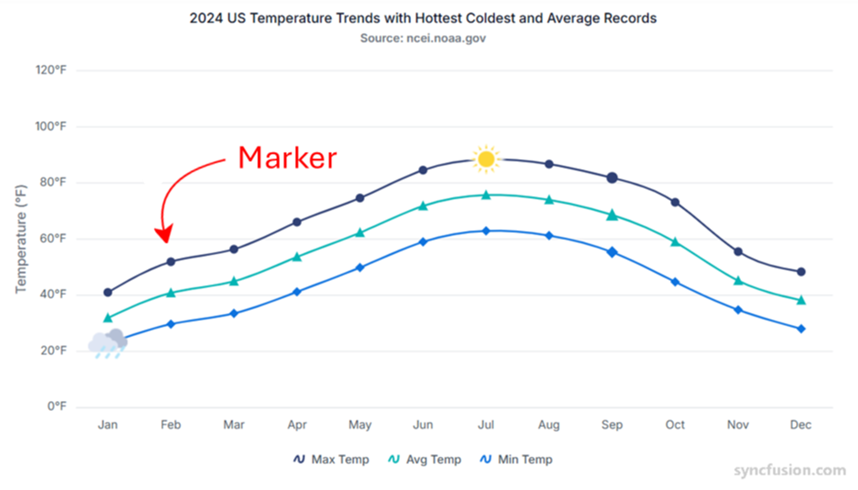

# Markers in Angular Chart

Data markers are visual indicators placed at each data point on a series, helping you to clearly identify and highlight individual values in your chart. Markers improve readability and accessibility, especially in line and area charts where data points may otherwise be unclear. You can customize the marker shape, color, size, and appearance to match your design requirements.

## Marker

Enable markers for data points by setting the [`visible`](https://ej2.syncfusion.com/angular/documentation/api/chart/markerSettingsModel#visible) option to `true` in the [`marker`](https://ej2.syncfusion.com/angular/documentation/api/chart/seriesModel#marker) property. Each series receives a distinct marker shape by default, improving visual differentiation across series.










  


## Shape

Assign different shapes to markers — such as Rectangle, Circle, Diamond, Triangle, Pentagon, Star, HorizontalLine, VerticalLine, and Cross — using the [`shape`](https://ej2.syncfusion.com/angular/documentation/api/chart/markerSettingsModel#shape) property. Shape selection helps distinguish between multiple series and improves visual clarity.










  


>**Note** : To know more about the marker shape types, refer to the [`shape`](https://ej2.syncfusion.com/angular/documentation/api/chart/markerSettingsModel#shape) property and its supported values.

## Images

In addition to built-in shapes, you can also mark each data point with a custom image using the [`imageUrl`](https://ej2.syncfusion.com/angular/documentation/api/chart/markerSettingsModel#imageurl) property. Provide a URL or relative asset path that resolves to a PNG, JPG, or SVG file. For best results, set `width` and `height` on the marker to match the image's natural dimensions.










  


## Customization

Marker color, size, and border can be customized using the [`fill`](https://ej2.syncfusion.com/angular/documentation/api/chart/markerSettingsModel#fill), [`width`](https://ej2.syncfusion.com/angular/documentation/api/chart/markerSettingsModel#width), [`height`](https://ej2.syncfusion.com/angular/documentation/api/chart/markerSettingsModel#height), and [`border`](https://ej2.syncfusion.com/angular/documentation/api/chart/markerSettingsModel#border) properties. The `width` and `height` set the **marker** size (not the series line width). The `border` object accepts `width` and `color` keys.










  


## Customizing specific markers

You can customize individual markers using the [`pointRender`](https://ej2.syncfusion.com/angular/documentation/api/chart/chartModel#pointrender) event. Inside the event handler, assign values to `args.fill`, `args.shape`, and `args.border` to override defaults for any data point based on its index or value.

The following example changes the fill, shape, and border for the marker at index `3`:










  


### Assigning different shapes per point

You can also use the [`pointRender`](https://ej2.syncfusion.com/angular/documentation/api/chart/chartModel#pointrender) event to dynamically assign a different `shape` to each data point — useful when you want to vary marker shapes across the series based on the point index or value.










  


## Fill marker with series color

The marker can be filled with the series color by setting the [`isFilled`](https://ej2.syncfusion.com/angular/documentation/api/chart/markerSettingsModel#isfilled) property to **true**. When `isFilled` is enabled, any explicitly set `fill` is overridden by the series color.










  

