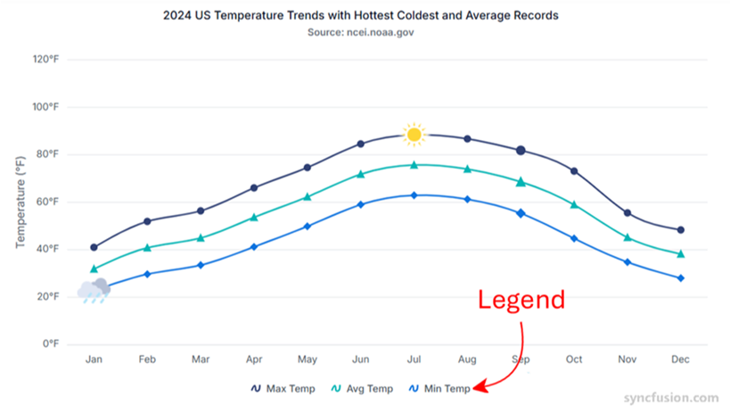

# Legend in Angular Chart component

The legend provides information about the series rendered in the chart and helps users identify each series by its color, shape, or style.

To get started quickly with legends in Angular Charts, refer to the following video:



## Position and alignment

By using the [`position`](https://ej2.syncfusion.com/angular/documentation/api/chart/legendSettings#position) property, the legend can be positioned at the left, right, top, or bottom of the chart. By default, the legend is positioned at the bottom of the chart.










  


Custom positioning allows the legend to be placed anywhere in the chart using [`x`](https://ej2.syncfusion.com/angular/documentation/api/chart/location#x) and [`y`](https://ej2.syncfusion.com/angular/documentation/api/chart/location#y) coordinates.










  


<!-- markdownlint-disable MD036 -->

**Legend reverse**

<!-- markdownlint-disable MD036 -->

Use the [`reverse`](https://ej2.syncfusion.com/angular/documentation/api/chart/legendSettings#reverse) property to reverse the order of legend items. By default, the legend item for the first series is placed first.










  


**Legend alignment**

<!-- markdownlint-disable MD036 -->

Align the legend to `center`, `far`, or `near` using the [`alignment`](https://ej2.syncfusion.com/angular/documentation/api/chart/legendSettings#alignment) property.










  


## Customization

To change the legend icon shape, use the [`legendShape`](https://ej2.syncfusion.com/angular/documentation/api/chart/series#legendshape) property in the [`series`](https://ej2.syncfusion.com/angular/documentation/api/chart/series). By default, the legend icon shape is the `seriesType`.










  


### Legend size

By default, the legend occupies approximately 20%–25% of the chart height when positioned at the top or bottom, and 20%–25% of the chart width when positioned at the left or right. Change the default size using the [`width`](https://ej2.syncfusion.com/angular/documentation/api/chart/legendSettings#width) and [`height`](https://ej2.syncfusion.com/angular/documentation/api/chart/legendSettings#height) properties of [`legendSettings`](https://ej2.syncfusion.com/angular/documentation/api/chart/chartModel#legendsettings).










  


### Legend item size

Customize the size of legend items using the [`shapeHeight`](https://ej2.syncfusion.com/angular/documentation/api/chart/legendSettings#shapeheight) and [`shapeWidth`](https://ej2.syncfusion.com/angular/documentation/api/chart/legendSettings#shapewidth) properties.










  


### Paging for legend

Paging is enabled automatically when legend items exceed the legend bounds. Navigate between pages using the provided navigation buttons.










  


### Legend text wrap

When legend text exceeds the container, enable wrapping using the [`textWrap`](https://ej2.syncfusion.com/angular/documentation/api/chart/legendSettings#textwrap) property. Wrapping can also be controlled using the [`maximumLabelWidth`](https://ej2.syncfusion.com/angular/documentation/api/chart/legendSettings#maximumlabelwidth) property.










  


## Set the label color based on series color

Set the legend label color based on the series color by using the chart’s [`loaded`](https://ej2.syncfusion.com/angular/documentation/api/chart#loaded) event.










  


## Series selection on legend

By default, clicking a legend item toggles the visibility of its series. To select a series through a legend click, disable [`toggleVisibility`](https://ej2.syncfusion.com/angular/documentation/api/chart/legendSettings#togglevisibility).










  


## Enable animation

You can customize the animation while clicking legend by setting [`enableAnimation`](https://ej2.syncfusion.com/angular/documentation/api/chart/legendSettings#enableanimation) as true or false using the [`enableAnimation`](https://ej2.syncfusion.com/angular/documentation/api/chart/legendSettings#enableanimation) property in chart.










  


## Collapse legend item

By default, series name will be displayed as legend. To skip the legend for a particular series, you can give empty string to the series name.










  


## Legend title

You can set title for legend using [`title`](https://ej2.syncfusion.com/angular/documentation/api/chart/legendSettings#title) property in [`legendSettings`](https://ej2.syncfusion.com/angular/documentation/api/chart/chartModel#legendsettings). You can also customize the [`fontStyle`](https://ej2.syncfusion.com/angular/documentation/api/chart/fontModel#fontstyle), [`size`](https://ej2.syncfusion.com/angular/documentation/api/chart/fontModel#size), [`fontWeight`](https://ej2.syncfusion.com/angular/documentation/api/chart/fontModel#fontweight), [`color`](https://ej2.syncfusion.com/angular/documentation/api/chart/fontModel#color), [`textAlignment`](https://ej2.syncfusion.com/angular/documentation/api/chart/fontModel#textalignment), [`fontFamily`](https://ej2.syncfusion.com/angular/documentation/api/chart/fontModel#fontfamily), [`opacity`](https://ej2.syncfusion.com/angular/documentation/api/chart/fontModel#opacity) and [`textOverflow`](https://ej2.syncfusion.com/angular/documentation/api/chart/fontModel#textoverflow) of legend title. [`titlePosition`](https://ej2.syncfusion.com/angular/documentation/api/chart/legendSettings#titleposition) is used to set the legend position in `Top`, `Left` and `Right` position. [`maximumTitleWidth`](https://ej2.syncfusion.com/angular/documentation/api/chart/legendSettings#maximumtitlewidth) is used to set the width of the legend title. By default, it will be `100px`.










  


## Arrow page navigation

By default, the page number will be enabled while legend paging. Now, you can disable that page number and also you can get left and right arrows for page navigation. You have to set `false` value to [`enablePages`](https://ej2.syncfusion.com/angular/documentation/api/chart/legendSettings#enablepages) to get this support.










  


## Legend item padding

The [`itemPadding`](https://ej2.syncfusion.com/angular/documentation/api/chart/legendSettings#itempadding) property can be used to adjust the space between the legend items.










  


## Legend layout

The [`layout`](https://ej2.syncfusion.com/angular/documentation/api/chart/legendSettingsModel#layout) property in [`legendSettings`](https://ej2.syncfusion.com/angular/documentation/api/chart#legendsettings) allows you to display the legend either horizontally or vertically. By default, the [`layout`](https://ej2.syncfusion.com/angular/documentation/api/chart/legendSettingsModel#layout) is set to **Auto**. The [`maximumColumns`](https://ej2.syncfusion.com/angular/documentation/api/chart/legendSettingsModel#maximumcolumns) property in [`legendSettings`](https://ej2.syncfusion.com/angular/documentation/api/chart#legendsettings) defines the maximum number of columns that can be displayed within the available space when using the auto layout. Additionally, enabling the [`fixedWidth`](https://ej2.syncfusion.com/angular/documentation/api/chart/legendSettingsModel#fixedwidth) property in [`legendSettings`](https://ej2.syncfusion.com/angular/documentation/api/chart#legendsettings) ensures that all legend items are displayed with equal widths. The width of each item is determined by the maximum width among the legend items.










  


## Legend template

Legend templates allow you to replace default legend icons and text with custom HTML for each series. This enables branded styles, richer content (icons, multi-line text, badges), improved readability, and localization.

You can customize the legend items by using the [`template`](https://ej2.syncfusion.com/angular/documentation/api/chart/legendSettingsModel) property of [`legendSettings`](https://ej2.syncfusion.com/angular/documentation/api/chart/legendSettingsModel). Legend interactions (click to toggle series) remain unless [`ToggleVisibility`](https://ej2.syncfusion.com/angular/documentation/api/chart/legendsettings#togglevisibility) is set to false. Templates work with all legend positions, alignments, and paging.









        


>**Note**: To use legend feature, inject `LegendService` into the `@NgModule.Providers`.

## Customize each shape in legend

Use the [`legendRender`](https://ej2.syncfusion.com/angular/documentation/api/chart/chartModel#legendrender) event to customize legend item shapes. In the handler, set `args.shape` to the desired shape for each item.










  


