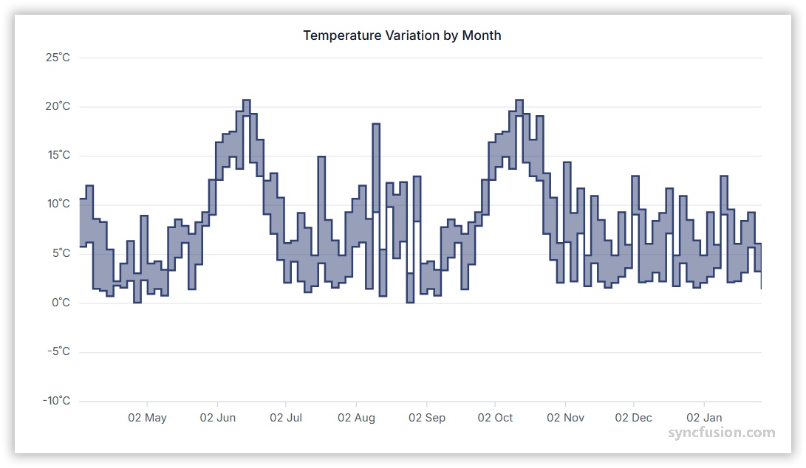

# Range Step Area Chart in Angular Charts

## Range Step Area

To render a range step area series in your chart, you need to follow a few steps to configure it correctly. 

Here's a concise guide on how to do this:

1. **Set the series type**: Define the series [`type`](https://ej2.syncfusion.com/angular/documentation/api/chart/seriesDirective#type) as `RangeStepArea` in your chart configuration. This indicates that the data should be represented as a range step area chart, which is ideal for displaying data points as a range with high and low values. It connects these points with vertical and horizontal lines, creating a step like appearance.

2. **Inject the RangeStepAreaSeries module**: Use the `@NgModule.providers` method to inject the `RangeAreaSeriesService` module into your chart. This step is essential, as it ensures that the necessary functionalities for rendering range step area series are available in your chart.

3. **Provide high and low values**: The `RangeStepArea` series requires two y-values for each data point, you need to specify both the high and low values. The high value represents the maximum range, while the low value represents the minimum range for each data point. These values define the upper and lower boundaries of the area for each point on the chart.

















## Binding data with series

You can bind data to the chart using the [`dataSource`](https://ej2.syncfusion.com/angular/documentation/api/chart/seriesDirective#datasource) property within the series configuration. This allows you to connect a JSON dataset or remote data to your chart. To display the data correctly, map the fields from the data to the chart series [`xName`](https://ej2.syncfusion.com/angular/documentation/api/chart/seriesDirective#xname), [`high`](https://ej2.syncfusion.com/angular/documentation/api/chart/seriesDirective#high), and [`low`](https://ej2.syncfusion.com/angular/documentation/api/chart/seriesDirective#low) properties.

















## Series customization

The following properties can be used to customize the `range step area` series.

**Fill**

The [fill](https://ej2.syncfusion.com/angular/documentation/api/chart/seriesDirective#fill) property determines the color applied to the series.

















**Opacity**

The [opacity](https://ej2.syncfusion.com/angular/documentation/api/chart/seriesDirective#opacity) property specifies the transparency level of the fill. Adjusting this property allows you to control how opaque or transparent the fill color of the series appears.

















**Border**

Use the [border](https://ej2.syncfusion.com/angular/documentation/api/chart/seriesDirective#border) property to customize the width, color and dasharray of the series border.

















**Step**

Use the [`step`](https://ej2.syncfusion.com/angular/documentation/api/chart/seriesDirective#step) property to change the position of the steps in a range step area series.

















**No risers**

You can eliminate the vertical lines between points by using the [`noRisers`](https://ej2.syncfusion.com/angular/documentation/api/chart/seriesModel#norisers) property in a series. This approach is useful for highlighting trends without the distraction of risers.














  


## Empty points

Data points with `null` or `undefined` values are considered empty. Empty data points are ignored and not plotted on the chart.

**Mode**

Use the [`mode`](https://ej2.syncfusion.com/angular/documentation/api/accumulation-chart/emptyPointSettingsModel#mode) property to define how empty or missing data points are handled in the series. The default mode for empty points is `Gap`.

















**Fill**

Use the [`fill`](https://ej2.syncfusion.com/angular/documentation/api/accumulation-chart/emptyPointSettingsModel#fill) property to customize the fill color of empty points in the series.

















**Border**

Use the [`border`](https://ej2.syncfusion.com/angular/documentation/api/accumulation-chart/emptyPointSettingsModel#border) property to customize the width and color of the border for empty points.

















## Events

### Series render

The [`seriesRender`](https://ej2.syncfusion.com/angular/documentation/api/sparkline/iSeriesRenderingEventArgs) event allows you to customize series properties, such as data, fill, and name, before they are rendered on the chart.

















### Point render

The [`pointRender`](https://ej2.syncfusion.com/angular/documentation/api/chart/iPointRenderEventArgs) event allows you to customize each data point before it is rendered on the chart.

















## See also

* [Data label](../data-labels)
* [Tooltip](../tool-tip)