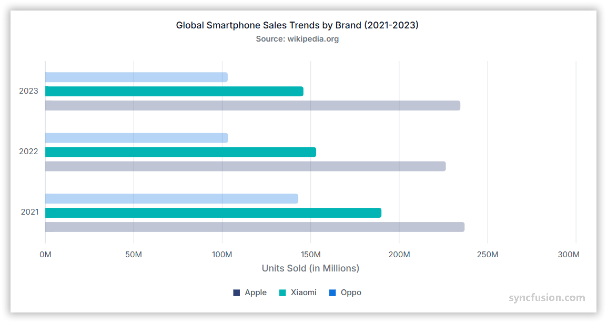

# Bar Chart in Angular Charts

## Bar

Bar charts are ideal for comparing values across different categories, displaying data horizontally where the length of each bar represents the value.

To render a [bar](https://www.syncfusion.com/angular-components/angular-charts/chart-types/bar-chart) series in your chart:

1. **Set the series type**: Define the series [`type`](https://ej2.syncfusion.com/angular/documentation/api/chart/seriesDirective#type) as `Bar` in your chart configuration. This indicates that the data should be represented as a bar chart, which makes it easy to compare values across categories.

2. **Inject the BarSeries module**: Use the `@NgModule.providers` method to inject the `BarSeriesService` module into your chart. This step is essential, as it ensures that the necessary functionalities for rendering bar series are available in your chart.














  


## Data binding for bar series

Connect your data to the chart using the [`dataSource`](https://ej2.syncfusion.com/angular/documentation/api/chart/seriesDirective#datasource) property within the series configuration. This property supports JSON datasets and remote data sources. Map the data fields to the chart series using [`xName`](https://ej2.syncfusion.com/angular/documentation/api/chart/seriesDirective#xname) and [`yName`](https://ej2.syncfusion.com/angular/documentation/api/chart/seriesDirective#yname) properties to ensure proper data visualization.














  


## Series customization

Customize the appearance of `bar` series using various styling properties to match your application's design requirements.

**Fill**

The [`fill`](https://ej2.syncfusion.com/angular/documentation/api/chart/seriesDirective#fill) property determines the color applied to the series.














  


**Gradient fill**

Apply gradient colors to create visually appealing bar series with smooth color transitions by configuring the [`fill`](https://ej2.syncfusion.com/angular/documentation/api/chart/seriesDirective#fill) property with gradient values.














  


**Opacity**

Control the transparency level of the bar fill using the [`opacity`](https://ej2.syncfusion.com/angular/documentation/api/chart/seriesDirective#opacity) property. Values range from 0 (completely transparent) to 1 (completely opaque).














  


**Border**

Customize the bar series border using the [`border`](https://ej2.syncfusion.com/angular/documentation/api/chart/seriesDirective#border) property to adjust width, color, and dash pattern.














  


## Bar spacing and dimensions

### Bar spacing

Use the [`columnSpacing`](https://ej2.syncfusion.com/angular/documentation/api/chart/seriesDirective#columnspacing) property in the series to adjust the space between bars.














  


### Bar width

Use the [`columnWidth`](https://ej2.syncfusion.com/angular/documentation/api/chart/seriesDirective#columnwidth) property in the series to adjust the width of the bars.














  


### Bar width in pixels

Use the [`columnWidthInPixel`](https://ej2.syncfusion.com/angular/documentation/api/chart/seriesDirective#columnwidthinpixel) property in the series to define the exact width of the bars in pixels. This property ensures that each bar maintains the specified width, providing a uniform appearance throughout the chart.














  


## Grouped bar charts

Use the [`groupName`](https://ej2.syncfusion.com/angular/documentation/api/chart/seriesDirective#groupname) property to group the data points in bar type charts. Data points with the same group name will be grouped together in the chart, making it easy to compare different sets of data.














  


## Cylindrical bar chart

To render a cylindrical bar chart, set the [`columnFacet`](https://ej2.syncfusion.com/angular/documentation/api/chart/seriesDirective#columnfacet) property to `Cylinder` in the chart series. This property transforms the regular bars into cylindrical shapes, enhancing the visual representation of the data.














  


## Empty points

Data points with `null` or `undefined` values are considered empty points. These points are handled according to the specified mode and can be customized for better visual representation.

**Mode**

Use the [`mode`](https://ej2.syncfusion.com/angular/documentation/api/chart/emptyPointSettings#mode) property to define how empty or missing data points are handled in the series. The default mode for empty points is `Gap`.














  


**Fill**

Customize the fill color of empty points using the [`fill`](https://ej2.syncfusion.com/angular/documentation/api/chart/emptyPointSettings#fill) property to maintain visual consistency or highlight missing data.














  


**Border**

Customize the border appearance of empty points using the [`border`](https://ej2.syncfusion.com/angular/documentation/api/chart/emptyPointSettings#border) property to adjust width and color.














  


## Corner radius customization

### Series corner radius

The [`cornerRadius`](https://ej2.syncfusion.com/angular/documentation/api/chart/seriesDirective#cornerradius) property in the chart series is used to customize the corner radius for bar series. This allows you to create bars with rounded corners, giving your chart a more polished appearance. You can customize each corner of the bars using the topLeft, topRight, bottomLeft, and bottomRight properties.














  


### Individual point corner radius

The corner radius can be customized for individual points in the chart series using the [`pointRender`](https://ej2.syncfusion.com/angular/documentation/api/chart/iPointRenderEventArgs) event by setting the [`cornerRadius`](https://ej2.syncfusion.com/angular/documentation/api/chart/iPointRenderEventArgs#cornerradius) property in its event argument.














  


## Events

### Series render

The [`seriesRender`](https://ej2.syncfusion.com/angular/documentation/api/chart/iSeriesRenderEventArgs) event allows customization of series properties, such as data, fill, and name, before rendering on the chart.














  


### Point render

The [`pointRender`](https://ej2.syncfusion.com/angular/documentation/api/chart/iPointRenderEventArgs) event allows customization of each data point before rendering on the chart.














  


## See also

* [Data label](../data-labels)
* [Tooltip](../tool-tip)
