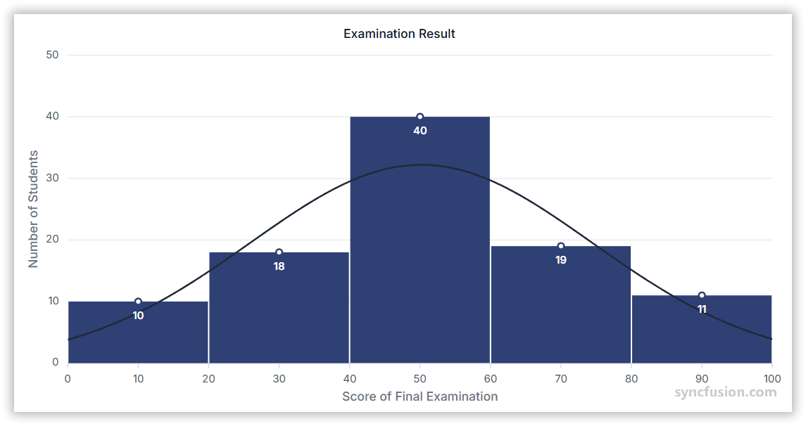

# Histogram Chart in Angular Charts

## Histogram

To render a [histogram](https://www.syncfusion.com/angular-components/angular-charts/chart-types/histogram-chart) series in your chart, you need to follow a few steps to configure it correctly.

Here's a concise guide on how to do this:

1. **Set the series type**: Define the series [`type`](https://ej2.syncfusion.com/angular/documentation/api/chart/seriesDirective/#type) as `Histogram` in your chart configuration. This indicates that the data should be represented as a histogram chart, providing a visual display of large amounts of data that are difficult to understand in a tabular or spreadsheet format.

2. **Inject the HistogramSeries module**: Use the `@NgModule.providers` method to inject the `HistogramSeriesService` module into your chart. This step is essential, as it ensures that the necessary functionalities for rendering histogram series are available in your chart.














  


## Events

### Series render

The [`seriesRender`](https://ej2.syncfusion.com/angular/documentation/api/chart/iSeriesRenderEventArgs/) event allows you to customize series properties, such as data, fill, and name, before they are rendered on the chart.














  


### Point render

The [`pointRender`](https://ej2.syncfusion.com/angular/documentation/api/chart/iPointRenderEventArgs/) event allows you to customize each data point before it is rendered on the chart.














  


## See Also

* [Data label](../data-labels/)
* [Tooltip](../tool-tip/)