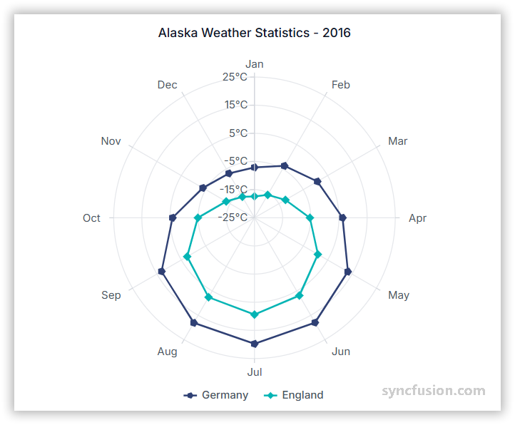

# Polar Chart in Angular Charts

## Polar

To render a [polar](https://www.syncfusion.com/angular-components/angular-charts/chart-types/polar-chart) series in your chart, you need to follow a few steps to configure it correctly. Here's a concise guide on how to do this:

1. **Set the series type**: Define the series [`type`](https://ej2.syncfusion.com/angular/documentation/api/chart/seriesDirective/#type) as `Polar` in your chart configuration. This indicates that the data should be represented as a polar chart, which is ideal for plotting data points on a circular graph.

2. **Inject the PolarSeries module**: Use the `@NgModule.providers` method to inject the `PolarSeriesService` module into your chart. This step is essential, as it ensures that the necessary functionalities for rendering polar series are available in your chart.














  


## Binding data with series

You can bind data to the chart using the [`dataSource`](https://ej2.syncfusion.com/angular/documentation/api/chart/seriesDirective/#datasource) property within the series configuration. This allows you to connect a JSON dataset or remote data to your chart. To display the data correctly, map the fields from the data to the chart series [`xName`](https://ej2.syncfusion.com/angular/documentation/api/chart/seriesDirective/#xname) and [`yName`](https://ej2.syncfusion.com/angular/documentation/api/chart/seriesDirective/#yname) properties.














  


## Draw Types

Use the [`drawType`](https://ej2.syncfusion.com/angular/documentation/api/chart/seriesDirective/#drawtype) property to change the series plotting type in a Polar chart to line, column, area, range column, spline, scatter, stacking area, spline area, or stacking column. The default value of `drawType` is `Line`.

### Line

To render a line draw type, you need to follow a few steps to configure it correctly.

1. **Set the Series Type**: Define the series [`drawType`](https://ej2.syncfusion.com/angular/documentation/api/chart/seriesDirective/#drawtype) as `Line` in your chart configuration. This indicates that the data should be represented as a polar line chart, with lines connecting each data point.

2. **Inject the LineSeries Module**: Use the `@NgModule.providers` method to inject the `LineSeriesService` module into your chart. This step is essential, as it ensures that the necessary functionalities for rendering polar line series are available in your chart.

The [`isClosed`](https://ej2.syncfusion.com/angular/documentation/api/chart/seriesDirective/#isclosed) property specifies whether to join the start and end points of a line series used in a polar chart to form a closed path. The default value of `isClosed` is **true**.














  


### Spline

To render a spline draw type, you need to follow a few steps to configure it correctly.

1. **Set the Series Type**: Define the series [`drawType`]([../../api/chart/series/#drawtype](https://ej2.syncfusion.com/angular/documentation/api/chart/seriesDirective/#drawtype)) as `Spline` in your chart configuration. This indicates that the data should be represented as a polar spline chart, with smooth, curved lines connecting each data point.

2. **Inject the SplineSeries Module**: Use the `@NgModule.providers` method to inject the `SplineSeriesService` module into your chart. This step is essential, as it ensures that the necessary functionalities for rendering polar spline series are available in your chart.














  


### Area

To render an area draw type, you need to follow a few steps to configure it correctly.

1. **Set the Series Type**: Define the series [`drawType`](https://ej2.syncfusion.com/angular/documentation/api/chart/seriesDirective/#drawtype) as `Area` in your chart configuration. This indicates that the data should be represented as a polar area chart, with filled areas below the lines connecting each data point.

2. **Inject the AreaSeries Module**: Use the `@NgModule.providers` method to inject the `AreaSeriesService` module into your chart. This step is essential, as it ensures that the necessary functionalities for rendering polar area series are available in your chart.














  


### Stacked Area

To render a stacked area draw type, you need to follow a few steps to configure it correctly.

1. **Set the Series Type**: Define the series [`drawType`](https://ej2.syncfusion.com/angular/documentation/api/chart/seriesDirective/#drawtype) as `StackingArea` in your chart configuration. This indicates that the data should be represented as a polar stacked area chart, with areas stacked on top of each other, displaying the cumulative value of multiple series.

2. **Inject the StackingAreaSeries Module**: Use the `@NgModule.providers` method to inject the `StackingAreaSeriesService` module into your chart. This step is essential, as it ensures that the necessary functionalities for rendering polar stacked area series are available in your chart.














  


### Column

To render a column draw type, you need to follow a few steps to configure it correctly.

1. **Set the Series Type**: Define the series [`drawType`](https://ej2.syncfusion.com/angular/documentation/api/chart/seriesDirective/#drawtype) as `Column` in your chart configuration. This indicates that the data should be represented as a polar column chart, allowing for the comparison of values across categories.

2. **Inject the ColumnSeries Module**: Use the `@NgModule.providers` method to inject the `ColumnSeriesService` module into your chart. This step is essential, as it ensures that the necessary functionalities for rendering polar column series are available in your chart.














  


### Stacked Column

To render a stacked column draw type, you need to follow a few steps to configure it correctly.

1. **Set the Series Type**: Define the series [`drawType`](https://ej2.syncfusion.com/angular/documentation/api/chart/seriesDirective/#drawtype) as `StackingColumn` in your chart configuration. This indicates that the data should be represented as a polar stacked column chart, with each column consisting of multiple segments stacked on top of each other.

2. **Inject the StackingColumnSeries Module**: Use the `@NgModule.providers` method to inject the `StackingColumnSeriesService` module into your chart. This step is essential, as it ensures that the necessary functionalities for rendering polar stacked column series are available in your chart.














  


### Range Column

To render a range column draw type, you need to follow a few steps to configure it correctly.

1. **Set the Series Type**: Define the series [`drawType`](https://ej2.syncfusion.com/angular/documentation/api/chart/seriesDirective/#drawtype) as `RangeColumn` in your chart configuration. This indicates that the data should be represented as a polar range column chart, where each column spans a range of values.

2. **Inject the RangeColumnSeries Module**: Use the `@NgModule.providers` method to inject the `RangeColumnSeriesService` module into your chart. This step is essential, as it ensures that the necessary functionalities for rendering polar range column series are available in your chart.














  


### Scatter

To render a scatter draw type, you need to follow a few steps to configure it correctly.

1. **Set the Series Type**: Define the series [`drawType`](https://ej2.syncfusion.com/angular/documentation/api/chart/seriesDirective/#drawtype) as `Scatter` in your chart configuration. This indicates that the data should be represented as a polar scatter chart.

2. **Inject the ScatterSeries Module**: Use the `@NgModule.providers` method to inject the `ScatterSeriesService` module into your chart. This step is essential, as it ensures that the necessary functionalities for rendering polar scatter series are available in your chart.














  


### Spline area

To render an spline area draw type, you need to follow a few steps to configure it correctly.

1. **Set the Series Type**: Define the series [`drawType`](https://ej2.syncfusion.com/angular/documentation/api/chart/seriesDirective/#drawtype) as `SplineArea` in your chart configuration. This indicates that the data should be represented as a polar spline area chart, where the series is drawn with smooth, curved lines connecting each data point, and the area beneath the line is filled with color.

2. **Inject the SplineAreaSeries Module**: Use the `@NgModule.providers` method to inject the `SplineAreaSeriesService` module into your chart. This step is essential, as it ensures that the necessary functionalities for rendering polar spline area series are available in your chart.














  


## Series Customization

## Start angle

You can customize the start angle of the polar series using [`startAngle`](https://ej2.syncfusion.com/angular/documentation/api/chart/axis#startangle) property. By default, `startAngle` is 0 degree.














  


## Radius

You can customize the radius of the polar series and polar series using [`coefficient`](https://ej2.syncfusion.com/angular/documentation/api/chart/axis#coefficient) property. By default, `coefficient` is 100.














  


## Empty points

Data points with `null` or `undefined` values are considered empty. Empty data points are ignored and not plotted on the chart.

**Mode**

Use the [`mode`](https://ej2.syncfusion.com/angular/documentation/api/accumulation-chart/emptyPointSettingsModel/#mode) property to define how empty or missing data points are handled in the series. The default mode for empty points is `Gap`.














  


**Fill**

Use the [`fill`](https://ej2.syncfusion.com/angular/documentation/api/accumulation-chart/emptyPointSettingsModel/#fill) property to customize the fill color of empty points in the series.














  


**Border**

Use the [`border`](https://ej2.syncfusion.com/angular/documentation/api/accumulation-chart/emptyPointSettingsModel/#border) property to customize the width and color of the border for empty points.














  


## Events

### Series render

The [`seriesRender`](https://ej2.syncfusion.com/angular/documentation/api/sparkline/iSeriesRenderingEventArgs/) event allows you to customize series properties, such as data, fill, and name, before they are rendered on the chart.














  


### Point render

The [`pointRender`](https://ej2.syncfusion.com/angular/documentation/api/chart/iPointRenderEventArgs/) event allows you to customize each data point before it is rendered on the chart.














  


## See Also

* [Data label](../data-labels/)
* [Tooltip](../tool-tip/)