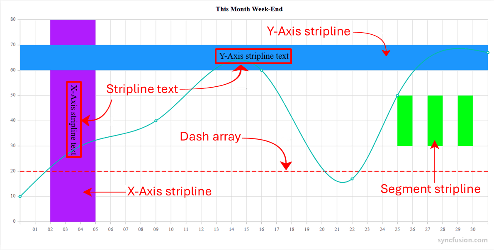

<!-- markdownlint-disable MD036 -->

# Strip Line in Angular Chart Component

<!-- markdownlint-disable MD036 -->

EJ2 chart supports horizontal and vertical strip lines and customization of stripline in both orientation.
To use Stripline in axis, we need to inject `StriplineService` into the `@NgModule.providers`

## Horizontal Strip lines

You can create Horizontal stripline by adding the `stripline` in the vertical axis and set `visible` option to true.
Striplines are rendered in the specified start to end range and you can add more than one stripline for an axis.










  


## Vertical Striplines

You can create vertical stripline by adding the`stripline` in the horizontal axis and set `visible` option to true.
Striplines are rendered in the specified start to end range and you can add more than one stripline for an axis.










  


## Stripline as band and line

We can utilize the stripline to visualize both the frequency band and transmission line characteristics by specifying its [start](https://ej2.syncfusion.com/angular/documentation/api/chart/striplinesettingsmodel#start) and [end](https://ej2.syncfusion.com/angular/documentation/api/chart/striplinesettingsmodel#end) properties in `StripLineSettingsModel`.










  


## Customize the strip line

Starting value in specific strip line can be customized by `start` property in strip line. Similarly, ending value is customized by `end`. It can be also set for starting from the corresponding origin of the axis by `startFromOrigin`.
Size of the strip line is customized by `size`. Border for the stripline is customized by `border`. Order of the strip line such that whether it should be rendered in behind or over the series elements is customized by `zIndex`.










  


## Customize the stripline text

You can customize the text rendered in stripline by `textStyle` property. Rotation of the strip line text can be changed by `rotation` property.
Horizontal and Vertical alignment of stripline text can be changed by `horizontalAlignment` and `verticalAlignment` property.










  


## Dash Array

You can create dash array stripline by using `dashArray` property. The Striplines are rendered with specified dash array values.










  


## Recurrence Stripline

The strip lines to be drawn repeatedly at the regular intervals – this will be useful when you want to mark an event that occurs recursively along the timeline of the chart. Following properties are used to configure this feature.

* `isRepeat`       - It is used for enable / disable the recurrence strip line.
* `repeatEvery`    - It is used for mention the stripline interval.
* `repeatUntil`    - It specifies the end value at which point strip line has to stop repeating.










  


## Size Type

The `sizeType` property refers the size of the stripline. They are,

* `Auto`
* `Pixel`
* `Years`
* `Months`
* `Days`
* `Hours`
* `Minutes`
* `Seconds`










  


## Segment Stripline

You can create stripline in a particular region with respect to segment. You can enable the segment stripline using `isSegmented` property. The start and end value of this type of stripline can be defined using `segmentStart` and `segmentEnd` properties.

* `isSegmented`     - It is used for enable the segment stripline.
* `segmentStart`    - Used to change the segment start value. Value correspond to associated axis.
* `segmentEnd`      - Used to change the segment end value. Value correspond to associated axis.
* `segmentAxisName` - Used to specify the name of the associated axis.










  


## See Also

* [Mark the threshold in chart](./how-to/threshold#mark-a-threshold-in-chart)