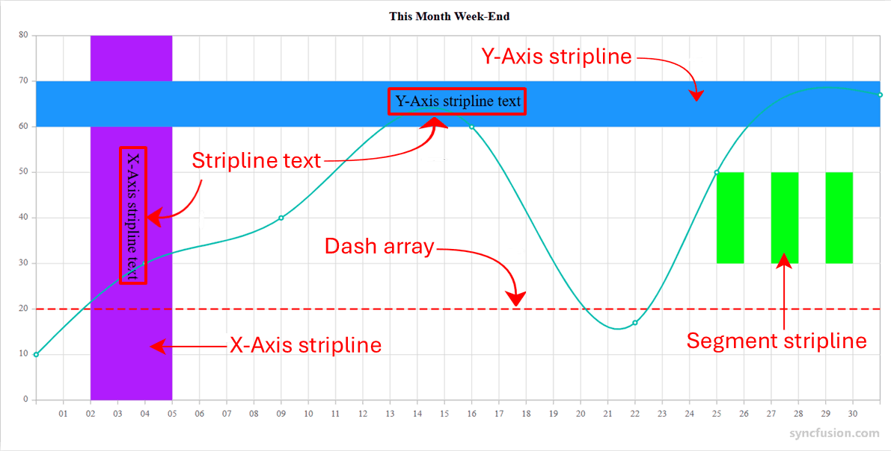

# Stripline in Angular Chart

The Angular Chart component supports both horizontal and vertical strip lines, which act as visual guides to highlight specific ranges within the chart area. Strip lines can be added to either axis and customized to suit your visualization needs.

## Horizontal striplines

Horizontal strip lines are created by adding the [`stripLines`](https://ej2.syncfusion.com/angular/documentation/api/chart/axisModel#striplines) configuration to the primary value (Y) axis and setting the [`visible`](https://ej2.syncfusion.com/angular/documentation/api/chart/stripLineSettingsModel#visible) property to `true`. They highlight horizontal ranges in the chart, and multiple strip lines can be added to the same axis.










  


## Vertical striplines

Vertical strip lines are created by adding the [`stripLines`](https://ej2.syncfusion.com/angular/documentation/api/chart/axisModel#striplines) configuration to the primary category (X) axis and enabling the [`visible`](https://ej2.syncfusion.com/angular/documentation/api/chart/stripLineSettingsModel#visible) property. They highlight vertical regions in the chart and support multiple entries for an axis.










  


## Stripline as band and line

A stripline can render as either a filled **band** (a region spanning from `start` to `end`) or a thin **line** (when `start` and `end` are very close). Specify the [`start`](https://ej2.syncfusion.com/angular/documentation/api/chart/stripLineSettingsModel#start) and [`end`](https://ej2.syncfusion.com/angular/documentation/api/chart/stripLineSettingsModel#end) values, along with any desired styling properties, within the [`StripLineSettingsModel`](https://ej2.syncfusion.com/angular/documentation/api/chart/stripLineSettingsModel) to switch between these visual forms.










  


## Customize the strip line

Strip lines can be customized to highlight specific regions more effectively:
- Use [`start`](https://ej2.syncfusion.com/angular/documentation/api/chart/stripLineSettingsModel#start) to set the beginning value of the strip line.
- Use [`end`](https://ej2.syncfusion.com/angular/documentation/api/chart/stripLineSettingsModel#end) to define the ending value.
- Use [`startFromOrigin`](https://ej2.syncfusion.com/angular/documentation/api/chart/stripLineSettingsModel#startfromorigin) to begin the strip line from the axis origin. When `startFromOrigin` is enabled, the start position defaults to the axis minimum and `size` defines the strip line's length.
- Use [`size`](https://ej2.syncfusion.com/angular/documentation/api/chart/stripLineSettingsModel#size) to specify the strip line height or width (based on orientation).
- Use [`color`](https://ej2.syncfusion.com/angular/documentation/api/chart/stripLineSettingsModel#color) to set the fill or stroke color of the strip line.
- Use [`opacity`](https://ej2.syncfusion.com/angular/documentation/api/chart/stripLineSettingsModel#opacity) to control the transparency of the strip line (values between 0 and 1).
- Use [`text`](https://ej2.syncfusion.com/angular/documentation/api/chart/stripLineSettingsModel#text) to display a label inside the strip line.
- Use [`border`](https://ej2.syncfusion.com/angular/documentation/api/chart/stripLineSettingsModel#border) to customize border appearance.
- Use [`zIndex`](https://ej2.syncfusion.com/angular/documentation/api/chart/stripLineSettingsModel#zindex) to control whether the strip line appears behind or above chart series.










  


## Customize the stripline text

Strip line text labels can be customized for readability and visual presentation:
- Use [`text`](https://ej2.syncfusion.com/angular/documentation/api/chart/stripLineSettingsModel#text) to define the label content.
- Use [`textStyle`](https://ej2.syncfusion.com/angular/documentation/api/chart/stripLineSettingsModel#textstyle) to set text appearance (size, color, font).
- Use [`rotation`](https://ej2.syncfusion.com/angular/documentation/api/chart/stripLineSettingsModel#rotation) to rotate the strip line text.
- Use [`horizontalAlignment`](https://ej2.syncfusion.com/angular/documentation/api/chart/stripLineSettingsModel#horizontalalignment) and [`verticalAlignment`](https://ej2.syncfusion.com/angular/documentation/api/chart/stripLineSettingsModel#verticalalignment) to adjust label placement.










  


## Dash array

Dashed strip lines can be rendered using the [`dashArray`](https://ej2.syncfusion.com/angular/documentation/api/chart/stripLineSettingsModel#dasharray) property. The value is a comma-separated list of numbers, where odd entries define the dash length and even entries define the gap length (in pixels). For example, `"5,5"` produces a 5-pixel dash followed by a 5-pixel gap.










  


## Recurrence stripline

Strip lines can be drawn repeatedly at regular intervals — useful when you want to mark an event that occurs recursively along the timeline of the chart. The following properties configure this feature.

* [`isRepeat`](https://ej2.syncfusion.com/angular/documentation/api/chart/stripLineSettingsModel#isrepeat) - Enables or disables the recurrence strip line.
* [`repeatEvery`](https://ej2.syncfusion.com/angular/documentation/api/chart/stripLineSettingsModel#repeatevery) - Specifies the stripline interval. The units must match the associated axis value type (for example, use years with a `DateTime` axis).
* [`repeatUntil`](https://ej2.syncfusion.com/angular/documentation/api/chart/stripLineSettingsModel#repeatuntil) - Specifies the end value at which the strip line stops repeating. If omitted, the strip line repeats until the axis maximum.










  


## Size type

The [`sizeType`](https://ej2.syncfusion.com/angular/documentation/api/chart/stripLineSettingsModel#sizetype) property determines how the strip line `size` value is interpreted. Use `Pixel` for a fixed pixel width, or use `Years`, `Months`, `Days`, `Hours`, `Minutes`, or `Seconds` when the associated axis is a `DateTime` axis and the size should be measured in those units. `Auto` lets the chart choose based on the axis context.

Supported units include:

* `Auto`
* `Pixel`
* `Years`
* `Months`
* `Days`
* `Hours`
* `Minutes`
* `Seconds`

For more details on working with date-time axes, see [DateTime Axis](../axis/axis-types/date-time-axis).










  


## Segment stripline

You can restrict a stripline to a particular region of the chart with respect to a segment defined on a different axis. Use [`isSegmented`](https://ej2.syncfusion.com/angular/documentation/api/chart/stripLineSettingsModel#issegmented) to enable this feature, and [`segmentStart`](https://ej2.syncfusion.com/angular/documentation/api/chart/stripLineSettingsModel#segmentstart) and [`segmentEnd`](https://ej2.syncfusion.com/angular/documentation/api/chart/stripLineSettingsModel#segmentend) to define the range.

* [`isSegmented`](https://ej2.syncfusion.com/angular/documentation/api/chart/stripLineSettingsModel#issegmented) - Enables the segment stripline.
* [`segmentStart`](https://ej2.syncfusion.com/angular/documentation/api/chart/stripLineSettingsModel#segmentstart) - Sets the segment start value. The value corresponds to the associated axis.
* [`segmentEnd`](https://ej2.syncfusion.com/angular/documentation/api/chart/stripLineSettingsModel#segmentend) - Sets the segment end value. The value corresponds to the associated axis.
* [`segmentAxisName`](https://ej2.syncfusion.com/angular/documentation/api/chart/stripLineSettingsModel#segmentaxisname) - Specifies the name of the associated axis. Required when the chart contains multiple axes and the default axis cannot be unambiguously resolved.










  


## See Also

* [Mark the threshold in chart](../how-to/threshold)

## Troubleshooting

If your strip lines do not appear in the chart:

* Ensure `StriplineService` is registered in the component's `providers` array.
* Confirm you use the property name `stripLines` (plural) on the axis, not `stripline` (singular).
* Ensure the host workspace's `package.json` includes `@syncfusion/ej2-angular-charts`.

For compatibility information and version-specific notes, refer to the Syncfusion Angular Charts release notes.