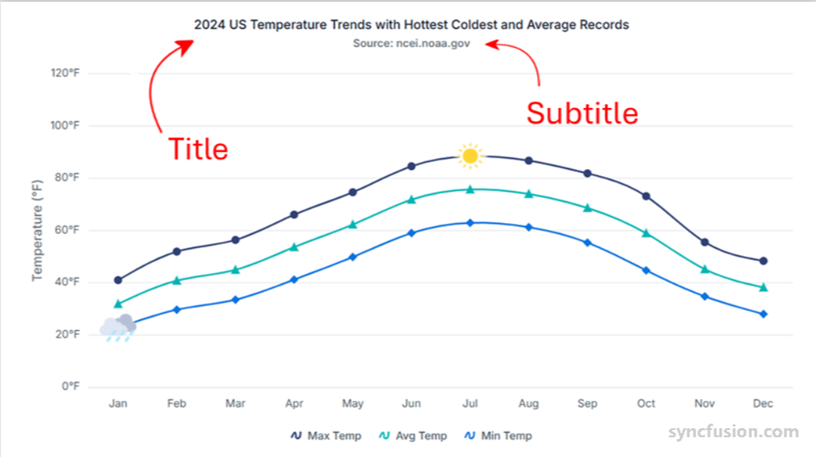

# Chart title and subtitle in Angular Chart component

The chart title appears at the top of the chart area, serving as a clear and prominent heading for the data visualization, while the subtitle provides additional context.

## Chart title

Chart can be given a title using [`title`](https://ej2.syncfusion.com/angular/documentation/api/chart#title) property, to show the information about the data plotted.










  


### Title position

By using the [`position`](https://ej2.syncfusion.com/angular/documentation/api/chart/titleSettingsModel#position) property in [`titleStyle`](https://ej2.syncfusion.com/angular/documentation/api/chart#titlestyle), you can position the [`title`](https://ej2.syncfusion.com/angular/documentation/api/chart#title) at left, right, top or bottom of the chart. The title is positioned at the top of the chart, by default.










  


The custom option helps you to position the title anywhere in the chart using [`x`](https://ej2.syncfusion.com/angular/documentation/api/chart/titleSettingsModel#x) and [`y`](https://ej2.syncfusion.com/angular/documentation/api/chart/titleSettingsModel#y) coordinates.










  


### Title alignment

You can align the title to the near, far, or center of the chart using the [`textAlignment`](https://ej2.syncfusion.com/angular/documentation/api/chart/titleSettingsModel#textalignment) property.










  


### Title wrap

Chart can be given a title using [`title`](https://ej2.syncfusion.com/angular/documentation/api/chart#title) property, to show the information about the data plotted.










  


## Chart subTitle

Chart can be given a subtitle using [`subTitle`](https://ej2.syncfusion.com/angular/documentation/api/chart#subtitle) property, to show the information about the data plotted.










  
