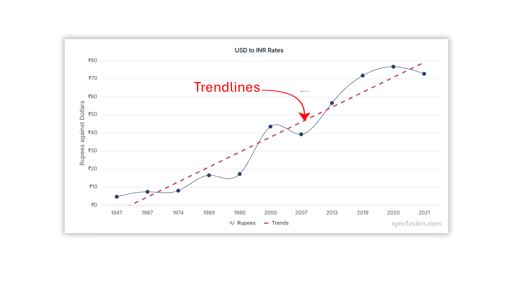

<!-- markdownlint-disable MD036 -->

# Trend lines in Angular Chart component

Trendlines help identify patterns, direction, and overall trends in numerical data. They project the general movement of data values and are widely used in analytics, forecasting, and financial charts. Trendlines can be added to Cartesian series types such as Line, Column, Scatter, Area, Candle, and Hilo (excluding bar series). Multiple trendlines can be added to a single series based on the analysis needs.

Charts support six types of trendlines: **Linear**, **Exponential**, **Logarithmic**, **Polynomial**, **Power**, and **Moving Average**.

## Linear

A linear trendline is a straight, best‑fit line used to describe data with a constant rate of increase or decrease. Set the trendline [`type`](https://ej2.syncfusion.com/angular/documentation/api/chart/trendline#type) to `Linear` and inject the `Trendlines` module using `Chart.Inject(Trendlines)`.










  


## Exponential

An exponential trendline displays a curved pattern useful when data rises or falls at increasing rates. Exponential trendlines cannot be generated if the dataset includes zero or negative values.

Set the trendline [`type`](https://ej2.syncfusion.com/angular/documentation/api/chart/trendlineModel#type) to `Exponential` and inject the `Trendlines` module.










  


## Logarithmic

A logarithmic trendline is a best‑fit curved line suitable when the data increases or decreases quickly and then stabilizes. It supports both positive and negative values.

A logarithmic trendline can use negative and/or positive values.

Set [`type`](https://ej2.syncfusion.com/angular/documentation/api/chart/trendline#type) to `Logarithmic` and inject the `Trendlines` module.










  


## Polynomial

A polynomial trendline is useful when data fluctuates. It uses a curved line that can model more complex datasets.

Set [`type`](https://ej2.syncfusion.com/angular/documentation/api/chart/trendlineModel#type) to `Polynomial` and inject the `Trendlines` module. Use [`polynomialOrder`](https://ej2.syncfusion.com/angular/documentation/api/chart/trendlineModel#polynomialorder) to define the degree of the polynomial.

`polynomialOrder` used to define the polynomial value.










  


## Power

A power trendline is ideal for datasets where measurements increase at a constant rate. It displays a curved line that best fits exponential growth or decay patterns.

Set [`type`](https://ej2.syncfusion.com/angular/documentation/api/chart/trendlineModel#type) to `Power` and inject the `Trendlines` module.










  


## Moving Average

A moving average trendline smooths fluctuations to reveal overall trends more clearly. The [`period`](https://ej2.syncfusion.com/angular/documentation/api/chart/trendlineModel#period) property specifies the number of data points used to calculate each average.

Set [`type`](https://ej2.syncfusion.com/angular/documentation/api/chart/trendlineModel#type) to `MovingAverage` and inject the `Trendlines` module.

`period` property defines the period to find the moving average.










  


**Customization of Trendlines**

Customize trendline appearance using the [`fill`](https://ej2.syncfusion.com/angular/documentation/api/chart/trendlineModel#fill) property for color and the [`width`](https://ej2.syncfusion.com/angular/documentation/api/chart/trendlineModel#width) property for line thickness.










  


## Forecasting

Trendline forecasting extends the existing trendline to estimate future and past values.

**Forward Forecasting**

Use the [`forwardForecast`](https://ej2.syncfusion.com/angular/documentation/api/chart/trendlineModel#forwardforecast) property to extend the trendline into the future.










  


**Backward Forecasting**

Use the [`backwardForecast`](https://ej2.syncfusion.com/angular/documentation/api/chart/trendlineModel#backwardforecast) property to extend the trendline into past data points.










  


## Show or hide a trendline

Control visibility using the [`visible`](https://ej2.syncfusion.com/angular/documentation/api/chart/trendlineModel#visible) property of the trendline.










  
