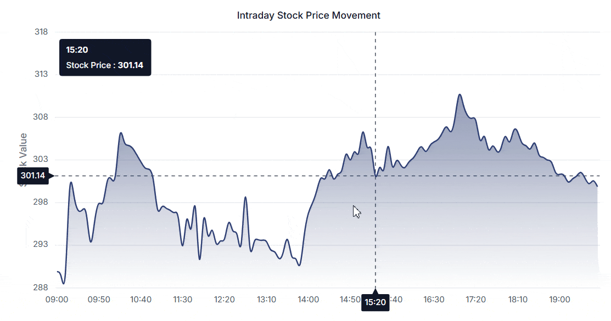

# Cross hair and track ball in Angular Chart component

Crosshair has a vertical and horizontal line to view the value of the axis at mouse or touch position.

Crosshair lines can be enabled by using [`enable`](https://ej2.syncfusion.com/angular/documentation/api/chart/crosshairSettings#enable) property in the [`crosshair`](https://ej2.syncfusion.com/angular/documentation/api/chart/chartModel#crosshair).










  


## Tooltip for axis

Tooltip label for an axis can be enabled by using [`enable`](https://ej2.syncfusion.com/angular/documentation/api/chart/crosshairTooltipModel#enable)
property of [`crosshairTooltip`](https://ej2.syncfusion.com/angular/documentation/api/chart/axisModel#crosshairtooltip) in the corresponding axis.










  


## Customization

The [`fill`](https://ej2.syncfusion.com/angular/documentation/api/chart/crosshairTooltip#fill) and [`textStyle`](https://ej2.syncfusion.com/angular/documentation/api/chart/crosshairTooltip#textstyle) property of the [`crosshairTooltip`](https://ej2.syncfusion.com/angular/documentation/api/chart/axisModel#crosshairtooltip) is used to customize the background color and font style of the crosshair label respectively. Color and width of the crosshair line can be customized by using the [`line`](https://ej2.syncfusion.com/angular/documentation/api/chart/crosshairSettings#line) property in the [`crosshair`](https://ej2.syncfusion.com/angular/documentation/api/chart/chartModel#crosshair).










  


>Note: To use crosshair feature, inject `CrosshairService` into the `@NgModule.providers`.

## Snap to data

Enabling the [`snapToData`](https://ej2.syncfusion.com/angular/documentation/api/chart/crosshairSettingsModel#snaptodata) property in the [`crosshair`](https://ej2.syncfusion.com/angular/documentation/api/chart/chartModel#crosshair) aligns it with the nearest data point instead of following the exact mouse position.










  


## Trackball

Trackball is used to track a data point closest to the mouse or touch position. Trackball marker indicates the closest point and trackball tooltip displays the information about the point. To use trackball feature, inject `CrosshairService` and `TooltipService` into the `@NgModule.providers`.

Trackball can be enabled by setting the [`enable`](https://ej2.syncfusion.com/angular/documentation/api/chart/crosshairSettings#enable) property of the [`crosshair`](https://ej2.syncfusion.com/angular/documentation/api/chart/chartModel#crosshair) to true and [`shared`](https://ej2.syncfusion.com/angular/documentation/api/chart/tooltipSettingsModel#shared) property in [`tooltip`](https://ej2.syncfusion.com/angular/documentation/api/chart/chartModel#tooltip) to true in chart.










  


To know more about Crosshair and Trackball, you can check on this video:



## Crosshair highlight

The [`highlightCategory`](https://ej2.syncfusion.com/angular/documentation/api/chart/crosshairSettings#highlightcategory) property in the [`crosshair`](https://ej2.syncfusion.com/angular/documentation/api/chart/chartModel#crosshair) highlights the background of the entire category when hovered over. The crosshair color can be customized using the [`color`](https://ej2.syncfusion.com/angular/documentation/api/chart/borderModel#color) property within the [`line`](https://ej2.syncfusion.com/angular/documentation/api/chart/crosshairSettings#line) configuration.










  
