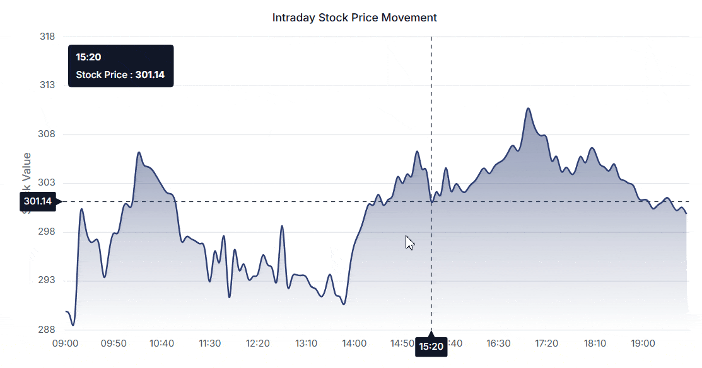

# Crosshair and Trackball in Angular Chart

The crosshair displays a vertical and/or horizontal line that shows the axis value at the mouse or touch position.

>**Note**: To use the crosshair feature, inject `CrosshairService` into the component's `providers` array (or `@NgModule.providers` for module-based apps).

Crosshair lines can be enabled by using the [`enable`](https://ej2.syncfusion.com/angular/documentation/api/chart/crosshairSettings#enable) property in the [`crosshair`](https://ej2.syncfusion.com/angular/documentation/api/chart/chartModel#crosshair).

















## Axis tooltip

Tooltip label for an axis can be enabled by using the [`enable`](https://ej2.syncfusion.com/angular/documentation/api/chart/crosshairTooltipModel#enable) property of the [`crosshairTooltip`](https://ej2.syncfusion.com/angular/documentation/api/chart/axisModel#crosshairtooltip) in the corresponding axis.

















## Customization

The [`fill`](https://ej2.syncfusion.com/angular/documentation/api/chart/crosshairTooltip#fill) and [`textStyle`](https://ej2.syncfusion.com/angular/documentation/api/chart/fontModel) properties of the [`crosshairTooltip`](https://ej2.syncfusion.com/angular/documentation/api/chart/axisModel#crosshairtooltip) are used to customize the background color and font style of the crosshair label, respectively. The color and width of the crosshair line can be customized by using the [`line`](https://ej2.syncfusion.com/angular/documentation/api/chart/crosshairSettings#line) property in the [`crosshair`](https://ej2.syncfusion.com/angular/documentation/api/chart/chartModel#crosshair).

















## Snap to data

Enabling the [`snapToData`](https://ej2.syncfusion.com/angular/documentation/api/chart/crosshairSettings#snaptodata) property in the [`crosshair`](https://ej2.syncfusion.com/angular/documentation/api/chart/chartModel#crosshair) aligns the line with the nearest data point on both axes instead of following the exact mouse position.













## Trackball

Trackball is used to track the data point closest to the mouse or touch position. The trackball marker indicates the closest point and the trackball tooltip displays the information about that point. To use the trackball feature, inject `CrosshairService` and `TooltipService` into the component's `providers` array (or `@NgModule.providers` for module-based apps).

The trackball can be enabled by:

* Setting the [`enable`](https://ej2.syncfusion.com/angular/documentation/api/chart/crosshairSettings#enable) property of the [`crosshair`](https://ej2.syncfusion.com/angular/documentation/api/chart/chartModel#crosshair) to **true**.
* Setting the [`lineType`](https://ej2.syncfusion.com/angular/documentation/api/chart/crosshairSettings#linetype) property of the [`crosshair`](https://ej2.syncfusion.com/angular/documentation/api/chart/chartModel#crosshair) to **Vertical** (recommended so the line snaps to a single x-coordinate across all series).
* Setting the [`shared`](https://ej2.syncfusion.com/angular/documentation/api/chart/tooltipSettings#shared) property in [`tooltip`](https://ej2.syncfusion.com/angular/documentation/api/chart/chartModel#tooltip) to **true**.













To know more about Crosshair and Trackball, you can check on this video:



## Crosshair highlight

The [`highlightCategory`](https://ej2.syncfusion.com/angular/documentation/api/chart/crosshairSettings#highlightcategory) property in the [`crosshair`](https://ej2.syncfusion.com/angular/documentation/api/chart/chartModel#crosshair) highlights the background of the entire category when the user hovers over the chart. The crosshair color can be customized using the [`color`](https://ej2.syncfusion.com/angular/documentation/api/chart/borderModel#color) property within the [`line`](https://ej2.syncfusion.com/angular/documentation/api/chart/crosshairSettings#line) configuration.













## Crosshair Label Customization

The [`crosshairLabelRender`](https://ej2.syncfusion.com/angular/documentation/api/chart/chartModel#crosshairlabelrender) event fires before each crosshair axis label is rendered, allowing you to customize the label's appearance or content, or to prevent it from being displayed. The event handler argument is typed as [`ICrosshairLabelRenderEventArgs`](https://ej2.syncfusion.com/angular/documentation/api/chart/iCrosshairLabelRenderEventArgs) and exposes the following properties:

- `text` - The label text that can be modified.
- `value` - The data value at the crosshair position.
- `axisName` - The axis identifier (for example, `primaryXAxis` or `primaryYAxis`).
- `axisOrientation` - Either `Horizontal` or `Vertical` (see [`AxisOrientation`](https://ej2.syncfusion.com/angular/documentation/api/chart/axisOrientation)).
- `textStyle` - A nested [`FontModel`](https://ej2.syncfusion.com/angular/documentation/api/chart/fontModel) object whose properties (such as `color`, `size`, `fontWeight`) can be modified to customize the label font.
- `fill` - Background color of the label.
- `cancel` - Set to **true** to skip rendering the label.















