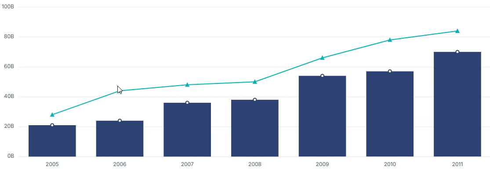

<!-- markdownlint-disable MD036 -->

# Data editing in Angular Chart component

## Enable Data Editing

We can use the data editing through inject the `DataEditingService` module. It provides drag and drop support to the rendered points. Now, we can change the location or value of the point based on its `y` value.  To enable the data editing, set the `enable` property to true in the drag settings of the series. Also, we can set color using `fill` property and set the data editing minimum and maximum range using `minY` and `maxY` properties.










  
