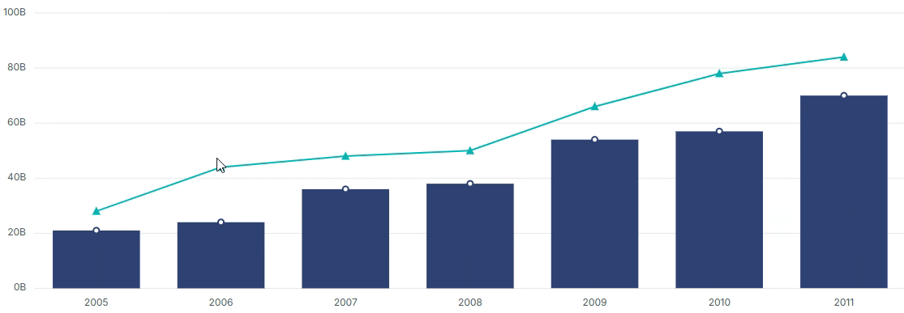

<!-- markdownlint-disable MD036 -->

# Data Editing in Angular Chart

>**Note**: To use the data editing feature, inject `DataEditingService` from `@syncfusion/ej2-angular-charts` into the component's `providers` (for standalone components) or `@NgModule.providers` (for module-based components).

Data editing allows users to modify chart data points interactively by dragging the rendered points to new positions. This functionality adds drag-and-drop support for data points.



## Enable data editing

To activate data editing, set the `enable` property of `dragSettings` to **true** on the corresponding series.










  


## Customization

The following `dragSettings` properties can be used to customize the data editing behavior and appearance:

- `fill` — Sets the color of the editable data points.
- `minY` and `maxY` — Define the minimum and maximum allowable range for editing the data points on the Y axis.

These options control both the visual feedback and the valid value range when editing data directly on the chart.










  


## Events

The data editing feature raises the `dragComplete` event after the user drops a data point. Use this event to persist changes, validate the new value, or update related UI.



```ts
public dragComplete(args: any): void {
    // args.currentValue contains the new Y value
    // args.point.index and args.series.index identify the edited point
    console.log(`Series ${args.series.index}, Point ${args.point.index} moved to ${args.currentValue}`);
}
```

Bind it on the `<ejs-chart>` element:

```html
<ejs-chart id="chart-container" [dragComplete]="dragComplete" ...>
</ejs-chart>
```



## Supported series types

Data editing is supported for the following series types: `Line`, `Column`, and `Scatter`.
