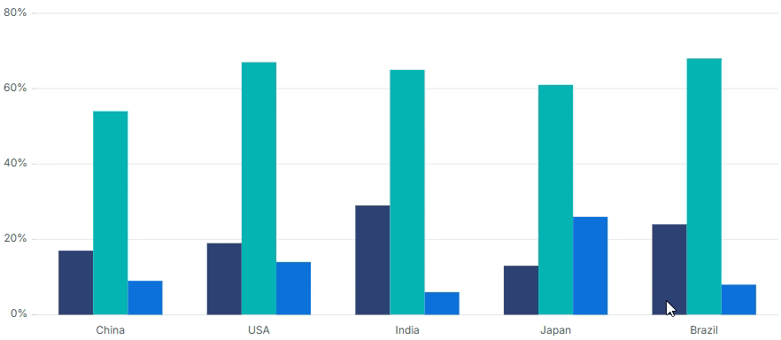

<!-- markdownlint-disable MD036 -->

# Selection in Angular Chart

The chart provides selection support for both series and individual data points when users interact with the chart using mouse clicks.



> **Note:** When the mouse is clicked on the data points, the corresponding series legend will also be selected.

> **Note:** To use the selection feature, inject `SelectionService` into `NgModule.providers` (or add it to the component `providers` array for standalone components).

The chart supports the following selection modes:

* None
* Point
* Series
* Cluster
* DragXY
* DragX
* DragY
* Lasso

## Point

You can select a point by setting [`selectionMode`](https://ej2.syncfusion.com/angular/documentation/api/chart/chartModel#selectionmode) to `Point`.













## Series

You can select a series by setting [`selectionMode`](https://ej2.syncfusion.com/angular/documentation/api/chart/chartModel#selectionmode) to `Series`.













## Cluster

You can select the points that correspond to the same index in all the series by setting [`selectionMode`](https://ej2.syncfusion.com/angular/documentation/api/chart/chartModel#selectionmode) to `Cluster`.










  


## Rectangular selection

**DragXY, DragX and DragY**

To fetch the collection of data under a particular region, set [`selectionMode`](https://ej2.syncfusion.com/angular/documentation/api/chart/chartModel#selectionmode) to `DragXY`. These modes require Cartesian (XY-value) series.

* DragXY - Allows data to be selected with respect to both the horizontal and vertical axes.
* DragX - Allows data to be selected with respect to the horizontal axis.
* DragY - Allows data to be selected with respect to the vertical axis.

The selected data is returned as an array collection in the [`dragComplete`](https://ej2.syncfusion.com/angular/documentation/api/chart/iDragCompleteEventArgs) event.













### Lasso selection

To select a region by drawing freehand shapes to fetch a collection of data, set [`selectionMode`](https://ej2.syncfusion.com/angular/documentation/api/chart/chartModel#selectionmode) to `Lasso`. You can also select multiple regions on the chart through this mode.













### Multi-region selection

To select multiple regions on the chart with `DragXY`, `DragX`, `DragY`, or `Lasso`, set the [`allowMultiSelection`](https://ej2.syncfusion.com/angular/documentation/api/chart/chartModel#allowmultiselection) property to `true`.













## Selection type

You can select multiple points or series by enabling the [`isMultiSelect`](https://ej2.syncfusion.com/angular/documentation/api/chart#ismultiselect) property.













## Selection on load

You can select a point or series programmatically on a chart using the [`selectedDataIndexes`](https://ej2.syncfusion.com/angular/documentation/api/chart#selecteddataindexes) property. The property accepts an array of objects with the following shape:

| Field   | Type     | Description                                |
|---------|----------|--------------------------------------------|
| series  | `number` | Zero-based index of the series to select.  |
| point   | `number` | Zero-based index of the point in the series. |

The selection is applied after the chart is rendered, so set this property in `ngOnInit` (or before the chart is rendered) for the selection to appear on initial load.













## Customization for selection

You can apply a custom style to selected points or series with the [`selectionStyle`](https://ej2.syncfusion.com/angular/documentation/api/chart/series#selectionstyle) property. The value is a CSS class name, so the corresponding class must be defined in your stylesheet. For example:

```css
.chartSelection1 { fill: #1e90ff; }
.chartSelection2 { fill: #2ca02c; }
.chartSelection3 { fill: #d62728; }
```













## Selection through legend

You can show or hide a series by clicking its legend item using the [`toggleVisibility`](https://ej2.syncfusion.com/angular/documentation/api/chart/legendSettingsModel#toggleVisibility) property of `legendSettings`. To highlight the corresponding series when the user hovers over a legend item, use the [`enableHighlight`](https://ej2.syncfusion.com/angular/documentation/api/chart/legendSettings#enableHighlight) property. Legend highlighting requires the `HighlightService` to be injected alongside `SelectionService`.

> When [`highlightMode`](https://ej2.syncfusion.com/angular/documentation/api/chart/highlightmode) is set to `Series`, `Cluster`, or `Point`, legend highlighting will still occur even when [`enableHighlight`](https://ej2.syncfusion.com/angular/documentation/api/chart/legendSettings#enableHighlight) is set to `false`. This is because the [`highlightMode`](https://ej2.syncfusion.com/angular/documentation/api/chart/highlightmode) takes precedence, so hovering over legend items will trigger highlighting of the corresponding series regardless of the legend [`enableHighlight`](https://ej2.syncfusion.com/angular/documentation/api/chart/legendSettings#enableHighlight) setting.













## See Also

* [Display selected data for range selection](../how-to/selected-data-grid)