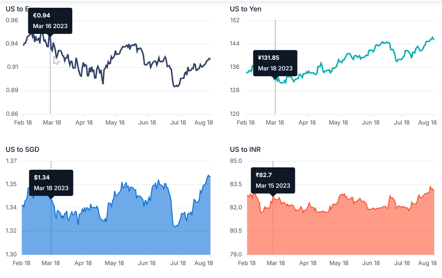

# Synchronized Charts in Angular Chart component

Synchronized charts allow multiple chart instances to share common interactions so that actions performed on one chart are reflected across the others. This approach is useful for comparing related datasets and analyzing trends consistently across multiple visualizations.

## Tooltip synchronization

The tooltip can be synchronized across multiple charts using the [`showTooltip`](https://ej2.syncfusion.com/angular/documentation/api/chart#showtooltip) and [`hideTooltip`](https://ej2.syncfusion.com/angular/documentation/api/chart#hidetooltip) methods. When you hover over a data point in one chart, the `showTooltip` method can be called for the other charts to display related information in other connected charts simultaneously.

> **Note:** To use tooltip synchronization, inject `TooltipService` into `@NgModule.providers`.

In the `showTooltip` method, specify the following parameters programmatically to enable the tooltip for a particular chart:

* `x` - Specifies the data point x-value or x-coordinate value.
* `y` - Specifies the data point y-value or y-coordinate value.










  


## Crosshair synchronization

The crosshair can be synchronized across multiple charts using the [`showCrosshair`](https://ej2.syncfusion.com/angular/documentation/api/chart#showcrosshair) and [`hideCrosshair`](https://ej2.syncfusion.com/angular/documentation/api/chart#hidecrosshair) methods. When you hover over one chart, the `showCrosshair` method can be called for the other charts to align with data points in other connected charts, simplifying data comparison and analysis.

> **Note:** To use crosshair synchronization, inject the `CrosshairService` into the `@NgModule.providers`.

In the `showCrosshair` method, specify the following parameters programmatically to enable the crosshair for a particular chart:

* `x` - Specifies the x-value of the point or x-coordinate.
* `y` - Specifies the y-value of the point or y-coordinate.










  


## Zooming synchronization

Zoom levels can be synchronized across multiple charts using the [`zoomComplete`](https://ej2.syncfusion.com/angular/documentation/api/chart/iZoomCompleteEventArgs) event. In the `zoomComplete` event, retrieve the [`currentZoomFactor`](https://ej2.syncfusion.com/angular/documentation/api/chart/iZoomCompleteEventArgs#currentzoomfactor) and [`currentZoomPosition`](https://ej2.syncfusion.com/angular/documentation/api/chart/iZoomCompleteEventArgs#currentzoomposition) values from the zoomed chart. These values can then be applied to the other charts using the [`zoomSettings`](https://ej2.syncfusion.com/angular/documentation/api/chart/zoomSettings) property to ensure that all synchronized charts maintain the same zoom state during user interaction.

> **Note:** To use zooming synchronization, inject the `ZoomService` into the `@NgModule.providers`.










  


## Selection synchronization

Selection can be synchronized across multiple charts using the [`selectionComplete`](https://ej2.syncfusion.com/angular/documentation/api/chart/iSelectionCompleteEventArgs) event. In the `selectionComplete` event, retrieve the selected data values or region from the active chart and apply the same selection state to the other charts. This ensures consistent selection behavior across all connected charts and helps maintain a unified analysis experience.

> **Note:** To use selection synchronization, inject the `SelectionService` into the `@NgModule.providers`. Additionally, enable selection by setting the [`selectionMode`](https://ej2.syncfusion.com/angular/documentation/api/chart/chartModel#selectionmode) property in the chart.










  
