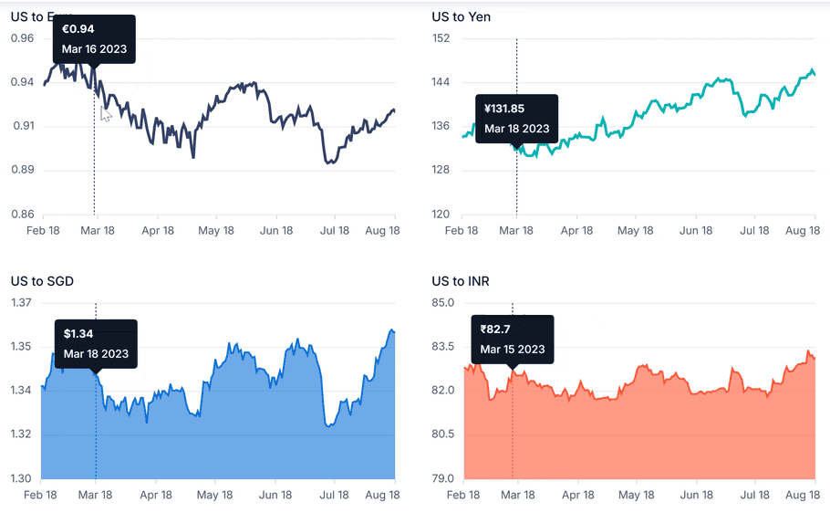

# Synchronized Charts in Angular Chart

Synchronized charts allow multiple chart instances to share common interactions so that actions in one chart are mirrored in the others. This is useful for comparing related datasets and analyzing trends consistently across multiple visualizations. The following sections describe how to synchronize tooltip, crosshair, zooming, and selection interactions across charts.

> **Note:** Inject the corresponding service (`TooltipService`, `CrosshairService`, `ZoomService`, or `SelectionService`) into the component `providers` for the feature you want to enable.

## Tooltip synchronization

The tooltip can be synchronized across multiple charts using the [`showTooltip`](https://ej2.syncfusion.com/angular/documentation/api/chart#showtooltip) and [`hideTooltip`](https://ej2.syncfusion.com/angular/documentation/api/chart#hidetooltip) methods. When you hover over a data point in one chart, call `showTooltip` on the other charts to display related information simultaneously.

> **Note:** To use tooltip synchronization, inject `TooltipService` into the component `providers`.

In the `showTooltip` method, specify the following parameters programmatically to enable the tooltip for a particular chart:

* `x` – Specifies the pointer x-coordinate.
* `y` – Specifies the pointer y-coordinate.










  


## Crosshair synchronization

The crosshair can be synchronized across multiple charts using the [`showCrosshair`](https://ej2.syncfusion.com/angular/documentation/api/chart#showcrosshair) and [`hideCrosshair`](https://ej2.syncfusion.com/angular/documentation/api/chart#hidecrosshair) methods. When you hover over one chart, call `showCrosshair` on the other charts to align them with the active data point. This makes it easier to compare values at the same x-position across charts.

> **Note:** To use crosshair synchronization, inject `CrosshairService` into the component `providers`.

In the `showCrosshair` method, specify the following parameters programmatically to enable the crosshair for a particular chart:

* `x` – Specifies the pointer x-coordinate.
* `y` – Specifies the pointer y-coordinate.










  


## Zooming synchronization

Zoom levels can be synchronized across multiple charts using the [`zoomComplete`](https://ej2.syncfusion.com/angular/documentation/api/chart/iZoomCompleteEventArgs) event. In the `zoomComplete` event, retrieve the [`currentZoomFactor`](https://ej2.syncfusion.com/angular/documentation/api/chart/iZoomCompleteEventArgs#currentzoomfactor) and [`currentZoomPosition`](https://ej2.syncfusion.com/angular/documentation/api/chart/iZoomCompleteEventArgs#currentzoomposition) values from the zoomed chart. Apply these values to the other charts by setting `primaryXAxis.zoomFactor` and `primaryXAxis.zoomPosition` so that all synchronized charts maintain the same zoom state during user interaction. You can configure the available zoom operations through the [`zoomSettings`](https://ej2.syncfusion.com/angular/documentation/api/chart/zoomSettings) property (for example, `enableSelectionZooming` and `enablePan`).

> **Note:** To use zooming synchronization, inject `ZoomService` into the component `providers`.










  


## Selection synchronization

Selection can be synchronized across multiple charts using the [`selectionComplete`](https://ej2.syncfusion.com/angular/documentation/api/chart/iSelectionCompleteEventArgs) event. In the `selectionComplete` event, retrieve the selected data points from the active chart's `selectedDataValues` (each item exposes `pointIndex` and `seriesIndex`) and apply the same selection to the other charts by assigning the array to their `selectedDataIndexes` property, then calling `dataBind()`. This keeps selection behavior consistent across all connected charts.

> **Note:** To use selection synchronization, inject `SelectionService` into the component `providers`. Additionally, enable selection on each chart by setting the [`selectionMode`](https://ej2.syncfusion.com/angular/documentation/api/chart/chartModel#selectionmode) property (for example, `Point`, `DragX`, or `DragY`) and, optionally, [`selectionPattern`](https://ej2.syncfusion.com/angular/documentation/api/chart/chartModel#selectionpattern) (for example, `Box` or `None`).










  
