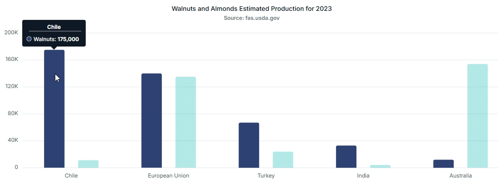

# Tooltip in Angular Chart component

<!-- markdownlint-disable MD036 -->

Chart will display details about the points through tooltip, when the mouse is moved over the point.



## Default tooltip

By default, tooltip is not visible. You can enable the tooltip by setting [`enable`](https://ej2.syncfusion.com/angular/documentation/api/chart/tooltipSettingsModel/#enable) property to **true** and by injecting `TooltipService` into the `NgModule.providers`.

To known about tooltip, you can check on this video:












  


<!-- markdownlint-disable MD013 -->

## Fixed tooltip

By default, tooltip track the mouse movement, but you can set a fixed position for the tooltip by using the [`location`](https://ej2.syncfusion.com/angular/documentation/api/chart/tooltipSettingsModel/#location) property.










  


## Format the tooltip

<!-- markdownlint-disable MD013 -->

By default, tooltip shows information of x and y value in points. In addition to that, you can show more information in tooltip. For example the format `${series.name} ${point.x}` shows series name and point x value.










  


<!-- markdownlint-disable MD013 -->

## Individual series format

<!-- markdownlint-disable MD013 -->

You can format the each series tooltip separately using series [`tooltipFormat`](https://ej2.syncfusion.com/angular/documentation/api/chart/seriesModel/#tooltipformat) property.

>Note: If series [`tooltipFormat`](https://ej2.syncfusion.com/angular/documentation/api/chart/seriesModel/#tooltipformat) is given, it shows the tooltip for that series in that format, or else it will take tooltip format.










  


<!-- markdownlint-disable MD013 -->

## Tooltip template

Any HTML elements can be displayed in the tooltip by using the [`template`](https://ej2.syncfusion.com/angular/documentation/api/chart/tooltipSettingsModel/#template) property of the tooltip. You can use the ${x} and ${y} as place holders in the HTML element to display the x and y values of the corresponding data point.










  


## Enable highlight

By setting the [`enableHighlight`](https://ej2.syncfusion.com/angular/documentation/api/chart/tooltipSettingsModel/#enablehighlight) property to **true**, you can highlight all points in the hovered series while dimming points in other series, enhancing focus and clarity.










  


## Tooltip mapping name

By default, tooltip shows information of x and y value in points. You can show more information from data source in tooltip by using the [`tooltipMappingName`](https://ej2.syncfusion.com/angular/documentation/api/chart/seriesModel/#tooltipmappingname) property of the tooltip. You can use the `${point.tooltip}` as place holders to display the specified tooltip content.










  


## Customize the appearance of tooltip

The [`fill`](https://ej2.syncfusion.com/angular/documentation/api/chart/tooltipSettingsModel/#fill) and [`border`](https://ej2.syncfusion.com/angular/documentation/api/chart/tooltipSettingsModel/#border) properties are used to customize the background color and border of the tooltip respectively. The [`textStyle`](https://ej2.syncfusion.com/angular/documentation/api/chart/tooltipSettingsModel/#textstyle) property in the tooltip is used to customize the font of the tooltip text. The [`highlightColor`](https://ej2.syncfusion.com/angular/documentation/api/chart/chartModel/#highlightcolor) property is used to customize the point color while hovering for tooltip.










  


## Hide tooltip in Angular Chart component

Use the [`tooltipRender`](https://ej2.syncfusion.com/angular/documentation/api/chart/chartModel/#tooltiprender) event to hide tooltips for deselected series. When a series is deselected, cancel the tooltip in the event.










  


## Percentage tooltip in Angular Chart component

Use the [`tooltipRender`](https://ej2.syncfusion.com/angular/documentation/api/chart/chartModel/#tooltiprender) event to display percentage values for pie points. Compute the percentage from `args.point.y` and `args.series.sumOfPoints`, then set the formatted result on `args.content`.










  


## Tooltip format in Angular Chart component

Use the [`tooltipRender`](https://ej2.syncfusion.com/angular/documentation/api/chart/chartModel/#tooltiprender) event to read the current point's x value and format it with `formatDate` for display in the tooltip.

The output will appear as follows,










  


## Tooltip as table in Angular Chart component

Render a table in the tooltip using the tooltip template.

- Define the template HTML as shown below.
- Assign the template's element id to the tooltip `template` property.

```
   <script id="Female-Material" type="text/x-template">
    <div id='templateWrap'>
        <table style="width:100%;  border: 1px solid black;">
        <tr><th colspan="2" bgcolor="#00FFFF">Female</th></tr>
        <tr><td bgcolor="#00FFFF">${x}:</td><td bgcolor="#00FFFF">${y}</td></tr>
        </table>
    </div>
   </script>

``` 










  


## Closest tooltip

The [`showNearestTooltip`](https://ej2.syncfusion.com/angular/documentation/api/chart/tooltipSettings/#shownearesttooltip) property in the chart tooltip displays tooltips based on the data points closest to the cursor.










  


## See Also

* [Hide Tooltip for Truncated Data Labels](https://support.syncfusion.com/kb/article/21374/how-to-hide-tooltip-for-truncated-data-labels-in-angular-pie-chart)
* [Hide Tooltips for Truncated Axis Labels](https://support.syncfusion.com/kb/article/21369/how-to-hide-tooltips-for-truncated-axis-labels-in-angular-charts)