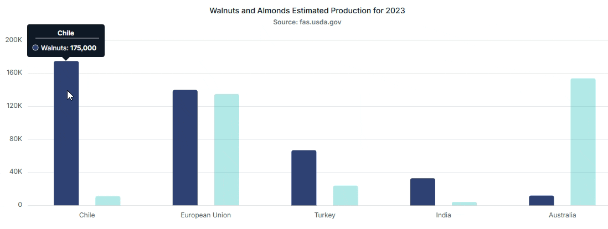

# Tooltip in Angular Chart

<!-- markdownlint-disable MD036 -->

The tooltip displays detailed information about a data point when the mouse pointer hovers over it. This guide covers enabling, formatting, templating, customizing, and interacting with the tooltip in the Syncfusion Angular Chart component.

**Available tooltip features:**

- Enable and configure the default tooltip
- Position the tooltip at a fixed location
- Format tooltip content (global, per-series, and inline)
- Render custom HTML and table layouts using templates
- Map additional data fields with `tooltipMappingName`
- Customize appearance (fill, border, text style, highlight color)
- Switch interaction modes (nearest, split, follow pointer, distance)
- Hide or transform tooltips with the `tooltipRender` event (date format, percentage)



## Default tooltip

By default, the tooltip is not visible. You can enable it by setting the [`enable`](https://ej2.syncfusion.com/angular/documentation/api/chart/tooltipSettingsModel#enable) property to **true** and injecting `TooltipService` into `@NgModule.providers`.

In addition to the service, import `ChartModule` (or `ChartAllModule`) into `@NgModule.imports`. For Angular 17+ standalone components, import `ChartComponent` directly.

```ts
import { NgModule } from '@angular/core';
import { BrowserModule } from '@angular/platform-browser';
import { BrowserAnimationsModule } from '@angular/platform-browser/animations';
import { ChartModule, ChartAllModule } from '@syncfusion/ej2-angular-charts';

@NgModule({
  imports: [BrowserModule, BrowserAnimationsModule, ChartModule],
  providers: [TooltipService],
  bootstrap: [AppComponent]
})
export class AppModule { }
```

To know about tooltip, you can check out this video:












  


<!-- markdownlint-disable MD013 -->

## Fixed tooltip

By default, the tooltip follows the mouse movement. To anchor the tooltip at a fixed position instead, set the [`location`](https://ej2.syncfusion.com/angular/documentation/api/chart/tooltipSettingsModel#location) property to an `{ x: number, y: number }` object measured in pixels from the top-left corner of the chart.

```ts
public tooltip: Object = {
    enable: true,
    location: { x: 120, y: 20 }
};
```










  


## Format the tooltip

<!-- markdownlint-disable MD013 -->

By default, the tooltip displays the x- and y-values of a data point. To display additional information, specify a custom format using the [`format`](https://ej2.syncfusion.com/angular/documentation/api/chart/tooltipSettingsModel#format) property. For example, the format `${series.name} ${point.x}` displays the series name along with the x-value of the data point.

Common tokens include `${point.x}`, `${point.y}`, `${point.high}`, `${point.low}`, `${point.open}`, `${point.close}`, `${point.volume}`, `${series.name}`, and `${series.type}`.










  


<!-- markdownlint-disable MD013 -->

## Individual series format

<!-- markdownlint-disable MD013 -->

You can format each series tooltip separately using the series [`tooltipFormat`](https://ej2.syncfusion.com/angular/documentation/api/chart/seriesModel#tooltipformat) property.

>Note: If the series [`tooltipFormat`](https://ej2.syncfusion.com/angular/documentation/api/chart/seriesModel#tooltipformat) is given, it shows the tooltip for that series in that format, or else it will take the chart's global tooltip format.










  


<!-- markdownlint-disable MD013 -->

## Inline tooltip formatting

The tooltip content can be formatted directly within the [`format`](https://ej2.syncfusion.com/angular/documentation/api/chart/tooltipSettingsModel#format) property by adding DateTime or number format specifiers to supported tooltip tokens. This allows you to control how point and series values are displayed without using additional events.

> The colon (`:`) syntax is implemented by the Syncfusion tooltip formatter, not the standard .NET / ICU formatter. Use only the format specifiers listed below.

A format specifier can be applied to a tooltip token by adding a colon (`:`) followed by the required format.

```ts
public tooltip = {
    enable: true,
    format: '${series.name} (${series.type})<br>${point.x:MMM yyyy} : ${point.y:n2}<br>Size: ${point.size}<br>Opacity: ${series.opacity}'
};

```

In the above example, `point.x` is displayed in month-year format, `point.y` is displayed with two decimal places, `point.size` displays the size value of the data point, and `series.opacity` displays the opacity value applied to the series.

Inline formatting can be applied to the following tooltip tokens:

- `point.x` – Specifies the x-value of the data point, such as DateTime or category values.
- `point.y` – Specifies the numeric y-value of the data point.
- `point.size` – Specifies the size value of the data point, commonly used in bubble series.
- `point.high` and `point.low` – Specify the high and low values, commonly used in range and financial series.
- `point.open` and `point.close` – Specify the open and close values, commonly used in financial series.
- `point.volume` – Specifies the volume value, commonly used in financial series.
- `point.minimum` – Specifies the minimum value, commonly used in box and whisker series.
- `point.maximum` – Specifies the maximum value, commonly used in box and whisker series.
- `point.median` – Specifies the median value, commonly used in box and whisker series.
- `point.lowerQuartile` – Specifies the lower quartile value, commonly used in box and whisker series.
- `point.upperQuartile` – Specifies the upper quartile value, commonly used in box and whisker series.
- `point.outliers` – Specifies the outlier values, commonly used in box and whisker series.
- `point.percentage` – Specifies the percentage value of a data point, commonly used in pie, doughnut, funnel, and pyramid series.
- `series.name` – Specifies the name assigned to the series.
- `series.type` – Specifies the rendering type of the series, such as `Line`, `Spline`, or `Column`.
- `series.opacity` – Specifies the opacity value applied to the series. This value controls the visual transparency of the series and can be customized in the series configuration.

**Important:** The availability of point-specific tokens depends on the series type and the values configured in the data source. For example, `point.size` is applicable to bubble series, while `point.median`, `point.lowerQuartile`, and `point.upperQuartile` are applicable to box and whisker series. The `series.name` and `series.type` tokens return string values, so DateTime or number formatting is not applied to these tokens.

The following format types are supported:

- DateTime formats such as `MMM yyyy`, `MM:yy`, and `dd MMM`
- Number formats such as:
  - `n2` – number with two decimal places
  - `n0` – number without decimals
  - `c2` – currency format
  - `p1` – percentage format
  - `e1` – exponential notation 

If the specified format does not match the resolved value type, the original value is displayed.










  


## Tooltip template

Custom HTML content can be rendered in the tooltip using the [`template`](https://ej2.syncfusion.com/angular/documentation/api/chart/tooltipSettingsModel#template) property. You can use placeholders like `${x}` and `${y}` within the template to display the x- and y-values of the corresponding data point.

To register a template, add the `<script id="...">` block to `index.html` (or your root template) and assign the `id` to the `template` property in the tooltip configuration. The chart reads the script content by id at runtime.










  


## Enable highlight

By setting the [`enableHighlight`](https://ej2.syncfusion.com/angular/documentation/api/chart/tooltipSettingsModel#enablehighlight) property to **true**, all points in the hovered series are highlighted while the remaining points are dimmed. This behavior improves focus and readability during data analysis.










  


## Tooltip mapping name

By default, the tooltip displays only the x- and y-values of a data point. Additional information from the data source can be shown using the [`tooltipMappingName`](https://ej2.syncfusion.com/angular/documentation/api/chart/seriesModel#tooltipmappingname) property of the series. Use the `${point.tooltip}` placeholder in the tooltip format to display the mapped value.










  


## Customize the appearance of tooltip

The appearance of the tooltip can be customized using the following properties:

- [`fill`](https://ej2.syncfusion.com/angular/documentation/api/chart/tooltipSettingsModel#fill) - Specifies the background color of the tooltip.
- [`border`](https://ej2.syncfusion.com/angular/documentation/api/chart/tooltipSettingsModel#border) - Configures the tooltip border.
- [`textStyle`](https://ej2.syncfusion.com/angular/documentation/api/chart/tooltipSettingsModel#textstyle) - Customizes the tooltip text style.

The [`highlightColor`](https://ej2.syncfusion.com/angular/documentation/api/chart#highlightcolor) property is defined on the chart (not on the tooltip) and changes the color of a data point when it is highlighted during tooltip interaction.










  


## Hide tooltip

Use the [`tooltipRender`](https://ej2.syncfusion.com/angular/documentation/api/chart/chartModel#tooltiprender) event to hide tooltips for deselected series. Cancel the tooltip in the event by setting `args.cancel = true` when a series is deselected.

```ts
public tooltipRender(args: ITooltipRenderEventArgs): void {
    if (args.series.name === 'DeselectedSeries') {
        args.cancel = true;
    }
}
```










  


## Percentage tooltip

Use the [`tooltipRender`](https://ej2.syncfusion.com/angular/documentation/api/chart/chartModel#tooltiprender) event to display percentage values for pie points. Compute the percentage from `args.point.y` and `args.series.sumOfPoints`, then set the formatted result on `args.content`.

`sumOfPoints` is the numeric total of all `y` values in the current pie series and is supplied automatically by the chart during the event. The event's `args` object is of type [`ITooltipRenderEventArgs`](https://ej2.syncfusion.com/angular/documentation/api/chart/iToolTipRenderEventArgs).










  


## Format tooltip values with formatDate

Use the [`tooltipRender`](https://ej2.syncfusion.com/angular/documentation/api/chart/chartModel#tooltiprender) event to read the current point's x value and format it with Angular's `formatDate` utility before assigning it to `args.content`.

> `formatDate` must be imported from `@angular/common`.

```ts
import { formatDate } from '@angular/common';

public tooltipRender(args: ITooltipRenderEventArgs): void {
    args.content = formatDate(new Date(args.point.x as Date), 'MMM yyyy', 'en-US');
}
```

The output will appear as follows:










  


## Tooltip as table

Render a table in the tooltip using the tooltip template.

1. Add the template HTML to `index.html` (or the root component template).
2. Assign the template's element id to the tooltip [`template`](https://ej2.syncfusion.com/angular/documentation/api/chart/tooltipSettingsModel#template) property.

```
   <script id="Female-Material" type="text/x-template">
    <div id='templateWrap'>
        <table style="width:100%;  border: 1px solid black;">
        <tr><th colspan="2" bgcolor="#00FFFF">Female</th></tr>
        <tr><td bgcolor="#00FFFF">${x}:</td><td bgcolor="#00FFFF">${y}</td></tr>
        </table>
    </div>
   </script>

``` 










  


## Nearest tooltip

The [`showNearestTooltip`](https://ej2.syncfusion.com/angular/documentation/api/chart/tooltipSettingsModel#shownearesttooltip) property displays the tooltip for the data point nearest to the mouse pointer, even when the pointer is not directly positioned over the point. This is useful for line, spline, area, and other continuous series where the pointer rarely lands exactly on a data point.

> This property is also referred to as "closest tooltip" in the API documentation; both terms refer to the same `showNearestTooltip` setting.










  


## Split tooltip

The split tooltip displays a separate tooltip for each series at the same x-value, making it easier to compare values across multiple series. Each series' tooltip is rendered with its own color marker and uses the series-specific [`tooltipFormat`](https://ej2.syncfusion.com/angular/documentation/api/chart/seriesModel#tooltipformat) when provided.

Enable this feature by setting the [`split`](https://ej2.syncfusion.com/angular/documentation/api/chart/tooltipSettingsModel#split) property to **true** in the `tooltip` configuration.

















## Follow pointer

The follow-pointer feature enables the tooltip to track the mouse cursor or touch pointer as users interact with the chart. This provides a more dynamic and intuitive experience by keeping the tooltip close to the user's point of interaction. On touch devices, the tooltip tracks the touch point until the pointer is released.

Enable this feature by setting the [`followPointer`](https://ej2.syncfusion.com/angular/documentation/api/chart/tooltipSettingsModel#followpointer) property to **true**.

















## Tooltip distance

The [`distance`](https://ej2.syncfusion.com/angular/documentation/api/chart/tooltipSettingsModel#distance) property controls the spacing, in pixels, between the tooltip and the mouse pointer or target data point. Increasing this value prevents the tooltip from overlapping with the cursor or nearby chart elements, improving readability. Acceptable values are non-negative integers; there is no enforced upper limit, but values larger than the chart dimensions may push the tooltip out of view.

















## See Also

* [Hide Tooltip for Truncated Data Labels in Angular Pie Chart](https://support.syncfusion.com/kb/article/21374/how-to-hide-tooltip-for-truncated-data-labels-in-angular-pie-chart)
* [Hide Tooltips for Truncated Axis Labels in Angular Charts](https://support.syncfusion.com/kb/article/21369/how-to-hide-tooltips-for-truncated-axis-labels-in-angular-charts)