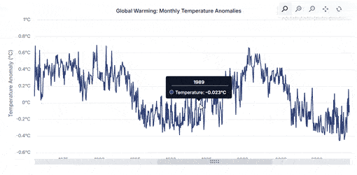

# Zooming in Angular Chart

Zooming in a chart refers to the process of magnifying a portion of the chart to focus on specific segments of data that matter most.



The minimum `app.module.ts` configuration required for all samples on this page is shown below:

```typescript
import { NgModule } from '@angular/core';
import { BrowserModule } from '@angular/platform-browser';
import { ChartModule, ZoomService } from '@syncfusion/ej2-angular-charts';
import { AppComponent } from './app.component';

@NgModule({
  imports: [BrowserModule, ChartModule],
  declarations: [AppComponent],
  providers: [ZoomService],
  bootstrap: [AppComponent]
})
export class AppModule { }
```

## Enable Zooming

The chart can be zoomed in the following three ways.

* Selection - By setting the [`enableSelectionZooming`](https://ej2.syncfusion.com/angular/documentation/api/chart/zoomSettingsModel#enableselectionzooming) property to true in `zoomSettings`, you can zoom the chart by using the rubber band selection.
* Mousewheel - By setting the [`enableMouseWheelZooming`](https://ej2.syncfusion.com/angular/documentation/api/chart/zoomSettingsModel#enablemousewheelzooming) property to true in `zoomSettings`, you can zoom in and zoom out the chart by scrolling the mouse wheel.
* Pinch - By setting the [`enablePinchZooming`](https://ej2.syncfusion.com/angular/documentation/api/chart/zoomSettingsModel#enablepinchzooming) property to true in `zoomSettings`, you can zoom the chart through pinch gestures on touch-enabled devices.

>Pinch zooming is supported only in browsers that support multi-touch gestures. Currently IE11, Chrome and Opera browsers support multi-touch in desktop devices.

To know about Zooming and Panning, you can check on this video:












  


After zooming the chart, a zoom toolbar appears with `Zoom`, `Zoom In`, `Zoom Out`, `Pan`, and `Reset` buttons.
Selecting the **Pan** option enables panning of the chart, and selecting the **Reset** option restores the chart to its original zoom level.

## Zoom Modes

The [`mode`](https://ej2.syncfusion.com/angular/documentation/api/chart/zoomSettingsModel#mode) property in `zoomSettings` specifies whether the chart is allowed to scale along the horizontal axis or the vertical axis. The default value of the `mode` is `XY` (both axes).

The following zoom modes are available:

* `X` - Allows you to zoom the chart horizontally.
* `Y` - Allows you to zoom the chart vertically.
* `XY` - Allows you to zoom the chart both vertically and horizontally.










  


## Toolbar

By default, the **Zoom In**, **Zoom Out**, **Pan**, and **Reset** buttons are displayed in the toolbar after the chart is zoomed. You can customize the toolbar to show only the desired options using the [`toolbarItems`](https://ej2.syncfusion.com/angular/documentation/api/chart/zoomSettingsModel#toolbaritems) property. The available toolbar items are `Zoom`, `ZoomIn`, `ZoomOut`, `Pan`, and `Reset`. Additionally, by using the [`showToolbar`](https://ej2.syncfusion.com/angular/documentation/api/chart/zoomSettingsModel#showtoolbar) property, you can display the toolbar for zooming and panning the chart during initial rendering.










  


### Toolbar customization

The zoom toolbar in the chart can be repositioned using the [`toolbarPosition`](https://ej2.syncfusion.com/angular/documentation/api/chart/zoomSettingsModel#toolbarposition) property, allowing flexible alignment and placement. It supports horizontal alignments (**Near**, **Center**, and **Far**) and vertical alignments (**Top**, **Middle**, and **Bottom**), with default values set to **Far** and **Top**, respectively. For precise placement, the [`x`](https://ej2.syncfusion.com/angular/documentation/api/chart/toolbarPositionModel#x) and [`y`](https://ej2.syncfusion.com/angular/documentation/api/chart/toolbarPositionModel#y) properties (specified in pixels) can be used to adjust the toolbar's position within the chart area. Additionally, enabling the [`draggable`](https://ej2.syncfusion.com/angular/documentation/api/chart/toolbarPositionModel#draggable) property allows users to freely move the toolbar within the chart area, ensuring optimal usability.










  


## Enable Pan

By using the [`enablePan`](https://ej2.syncfusion.com/angular/documentation/api/chart/zoomSettingsModel#enablePan) property, you can enable panning of the zoomed chart directly, without selecting the **Pan** option in the toolbar.










  


## Enable Scrollbar

By using the [`enableScrollbar`](https://ej2.syncfusion.com/angular/documentation/api/chart/zoomSettingsModel#enablescrollbar) property, you can add a scrollbar to the chart that allows you to zoom or pan. The appearance of the scrollbar can be customized using the properties in [`scrollbarSettings`](https://ej2.syncfusion.com/angular/documentation/api/chart/scrollbarSettingsModel). For example, you can use the [`trackColor`](https://ej2.syncfusion.com/angular/documentation/api/chart/scrollbarSettingsModel#trackcolor) and [`trackRadius`](https://ej2.syncfusion.com/angular/documentation/api/chart/scrollbarSettingsModel#trackradius) properties to customize the track of the scrollbar, and the [`scrollbarRadius`](https://ej2.syncfusion.com/angular/documentation/api/chart/scrollbarSettingsModel#scrollbarradius) and [`scrollbarColor`](https://ej2.syncfusion.com/angular/documentation/api/chart/scrollbarSettingsModel#scrollbarcolor) properties to customize the scroller. The ability to zoom through the scrollbar can be enabled or disabled using the [`enableZoom`](https://ej2.syncfusion.com/angular/documentation/api/chart/scrollbarSettingsModel#enablezoom) property in [`scrollbarSettings`](https://ej2.syncfusion.com/angular/documentation/api/chart/scrollbarSettingsModel). Additionally, you can change the color of the grip and the height of the scrollbar using the [`gripColor`](https://ej2.syncfusion.com/angular/documentation/api/chart/scrollbarSettingsModel#gripcolor) and [`height`](https://ej2.syncfusion.com/angular/documentation/api/chart/scrollbarSettingsModel#height) properties.










  


### Initial Scrollbar

To show the scrollbar on initial render, configure the following:

* Set a `zoomFactor` (a numeric value between 0 and 1) on `primaryXAxis`.
* Set the axis property `isZoomed` to `true` inside the chart's [`load`](https://ej2.syncfusion.com/angular/documentation/api/chart/chartModel#load) event handler (for example: `args.axis.isZoomed = true;`).
* Set `enableScrollbar` to `true` in `zoomSettings`.










  


### Position

The [`position`](https://ej2.syncfusion.com/angular/documentation/api/chart/scrollbarSettings#position) property allows you to specify the preferred scrollbar location. By default, both the vertical and horizontal scrollbars are rendered next to their respective axes, which corresponds to the [`placeNextToAxisLine`](https://ej2.syncfusion.com/angular/documentation/api/chart/scrollbarPositionType) value. Using the customization options below, you can position the scrollbar as desired:

* Default value: `placeNextToAxisLine` (scrollbar is rendered next to the axis line).
* Horizontal scrollbar: Available positions are [`Top`](https://ej2.syncfusion.com/angular/documentation/api/chart/scrollbarPositionType) and [`Bottom`](https://ej2.syncfusion.com/angular/documentation/api/chart/scrollbarPositionType).
* Vertical scrollbar: Available positions are [`Left`](https://ej2.syncfusion.com/angular/documentation/api/chart/scrollbarPositionType) and [`Right`](https://ej2.syncfusion.com/angular/documentation/api/chart/scrollbarPositionType).










  


## Enable Animation

Enable the [`enableAnimation`](https://ej2.syncfusion.com/angular/documentation/api/chart/zoomSettingsModel#enableanimation) property to experience smooth transitions when zooming in on the chart.










  


## Auto Interval on Zooming

By using the [`enableAutoIntervalOnZooming`](https://ej2.syncfusion.com/angular/documentation/api/chart/axis#enableautointervalonzooming) property, the axis interval is calculated automatically based on the zoomed range. Configure this property on the desired axis (for example, `primaryXAxis`) as shown in the following snippet:

```typescript
primaryXAxis: {
  valueType: 'DateTime',
  enableAutoIntervalOnZooming: true
}
```

> Note: When `enableAutoIntervalOnZooming` is enabled, any manually set `interval` value on the axis is ignored for the zoomed range.










  
