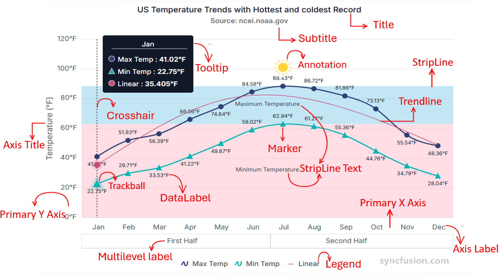

# Chart Component Overview

The EJ2 Chart component is a high-performance, interactive visualization library for presenting data across a broad set of chart types. It supports line, bar, area, column, pie, financial, spline and other series formats, and is optimized for responsive rendering, smooth interactions, and large datasets. Typical use cases include trend analysis, comparisons, distributions, and time-series exploration.

# Key features of Chart Component are as follows:

* [**Title & Subtitle:**](./chart-elements/title-subtitle.md)
    * Title: Displays a clear heading summarizing the purpose of the chart.
    * Subtitle: Offers optional supporting context below the main title.

* [**Axis:**](./chart-axis.md) Configures the X and Y axes, including scale, labels, intervals, gridlines, and formatting options for accurate mapping of data.
* [**Series:**](./chart-elements/series/series-overview.md) Represents collections of data points rendered as line, bar, area, column, or other series types for comparison and analysis.

| Series Type Modules | Description |
|---------------------|-------------|
| **Line Series Modules** | |
| [Line](./chart-elements/series/lines/line.md) | Classic continuous line chart for visualizing trends over time or ordered categories. |
| [Step Line](./chart-elements/series/lines/step-line.md) | Connects points with horizontal and vertical segments to emphasize discrete changes between values. |
| [Spline](./chart-elements/series/lines/spline.md) | Smoothed line rendering using splines for a polished, curved trend visualization. |
| [Stacked Line](./chart-elements/series/lines/stacked-line.md) | Stacks multiple line series to show cumulative contributions across categories. |
| [Multi‑colored Line](./chart-elements/series/lines/line#multicolored-line) | Applies different colors to line segments based on value ranges or conditions for emphasis. |
| **Area Series Modules** | |
| [Area](./chart-elements/series/area/area.md) | Filled area beneath a line to show magnitude and emphasize volume over a range. |
| [Stacked Area](./chart-elements/series/area/stacked-area.md) | Stacks multiple area series to visualize part‑to‑whole contributions over the same axis. |
| [100% Stacked Area](./chart-elements/series/area/stacked-area.md) | Normalizes stacked areas to 100% to compare relative proportions across categories. |
| [Range Area](./chart-elements/series/area/range-area.md) | Displays min–max ranges per x-value, useful for variability or confidence bands. |
| [Spline Range Area](./chart-elements/series/area/spline-range-area.md) | Smooth (spline) version of range area for visually refined min–max presentation. |
| **Column & Bar Series Modules** | |
| [Column](./chart-elements/series/column-bar/column.md) | Vertical bars for straightforward comparison of categorical values. |
| [Bar](./chart-elements/series/column-bar/bar.md) | Horizontal bars ideal for long category labels or ranking lists. |
| [Stacked Column/Bar](./chart-elements/series/column-bar/stacked-column.md) | Combines multiple series within a single column/bar to show component contributions. |
| [100% Stacked Column/Bar](./chart-elements/series/column-bar/stacked-column.md) | Displays proportional composition of each column/bar scaled to 100%. |
| [Range Column](./chart-elements/series/column-bar/range-column.md) | Renders high–low (min–max) values per category as columns (useful for ranges). |
| **Financial Series Modules** | |
| [Candlestick](./chart-elements/series/financial/candle.md) | Standard OHLC (open/high/low/close) bars with color coding to show price movement direction. |
| [Hilo](./chart-elements/series/financial/high-low.md) | Shows only high and low values per period for a compact volatility view. |
| [HiloOpenClose](./chart-elements/series/financial/high-low-open-close.md) | Full OHLC representation including open and close markers for detailed financial analysis. |
| **Technical Indicator Modules** | |
| [Technical indicators overview](./chart-elements/technical-indicators.md) | See available indicators (RSI, MACD, Bollinger Bands, EMA, SMA, ATR, Momentum, Stochastic, TMA, Accumulation Distribution) and usage examples. |
| **Statistical Series Modules** | |
| [Box & Whisker](./chart-elements/series/other/box-whisker.md) | Visualizes distribution with median, quartiles and outliers for statistical comparison. |
| [Histogram](./chart-elements/series/other/histogram.md) | Displays frequency distribution of numeric data bins to reveal distribution shape. |
| [Pareto](./chart-elements/series/other/pareto.md) | Bar plus cumulative line for 80/20 analysis—ranks factors by importance and shows cumulative impact. |
| [Error Bar](./chart-elements/series/other/error-bar.md) | Adds error/uncertainty ranges to points (± values) to convey variation or measurement error. |
| **Specialized Series Modules** | |
| [Scatter](./chart-elements/series/scatter-bubble/scatter.md) | Plots individual x/y points to reveal correlation, clusters or outliers between two variables. |
| [Bubble](./chart-elements/series/scatter-bubble/bubble.md) | Scatter variant where point size encodes a third numeric dimension (size‑encoded values). |
| [Polar & Radar](./chart-elements/series/polar-radar/polar.md) | Circular multi‑axis charts for comparing multivariate data around a central point. |
| [Waterfall](./chart-elements/series/other/waterfall.md) | Shows sequential positive/negative contributions to illustrate cumulative totals or reconciliations. |
| [Vertical Chart](./chart-elements/series/other/vertical.md) | Inverted orientation for charts (rotated axes) to improve readability for certain datasets. |

* [**Legend:**](./chart-elements/legend.md) Provides a list of series names along with their corresponding colors and symbols, which helps to identify multiple datasets.
* [**Marker:**](./chart-elements/data-markers.md) Uses symbols (circle, square, diamond) to denote individual data points for visibility.
* [**Data label:**](./chart-elements/data-labels.md) Displays data point values directly on or near chart elements, enhancing readability.
* [**Zooming:**](./chart-interactive/zooming.md) Enables to closely inspect chart data by zooming in through selection, mouse wheel, or pinch gestures, and navigate with tools like zoom‑in, zoom‑out, pan, and reset.
* [**Tooltip:**](./chart-interactive/tool-tip.md) Shows precise values and related data when hovering over or focusing a data point—helping users access details without cluttering the chart.
* [**Crosshair and trackball:**](./chart-interactive/cross-hair-and-track-ball.md) Crosshair shows vertical and horizontal lines to precisely read axis values at the mouse or touch position. Trackball highlights the nearest data point with a marker and displays its details in a tooltip.
* [**Annotation:**](./chart-elements/chart-annotations.md) Allows placement of custom text, shapes, or images at specific coordinates to highlight insights.
* [**Trendline:**](./chart-elements/trend-lines.md) Adds fitted lines (such as linear, exponential, or moving average) to illustrate overall patterns or directional trends in the data.
* [**Multilevel label:**](./chart-elements/axis/axis-labels.md#multilevel-labels) upports hierarchical labeling on the axis, allowing grouped or tiered categories for clearer categorization.
* [**Stripline:**](./chart-elements/strip-line.md) Highlights specific axis ranges with bands and labels to emphasize thresholds or important periods.
* [**Synchronization:**](./chart-interactive/synchronized-chart.md) Ensures multiple charts stay aligned by sharing actions like zooming, panning, or cursor movement.
* [**Selection:**](./chart-interactive/selection.md) Enables users to highlight individual points, series, or specific region. This includes point selection, series selection, and drag‑based selection depending on configuration.
* [**Export and print:**](./chart-print.md) Provides the options to Export the chart to  PDF, SVG and CSV formats and to print the chart.
* [**Accessibility:**](./accessibility.md) Visually presents data while offering accessibility customization that improves usability for individuals with disabilities.
* [**Internationalization:**](./internationalization.md) Enables charts to adapt to different languages, number formats, date formats, and cultural settings so users across regions can view data in a locally familiar and meaningful way.
* [**Localization:**](./localization.md) Customizes the chart’s text—such as labels, tooltips, legends, and messages—to the user’s language so the interface feels native to different regions.

