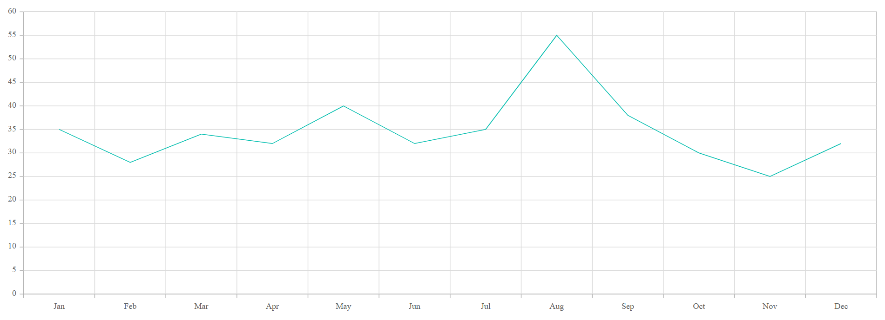

# Getting Started with Angular Chart Component

This section explains the steps required to create a simple [chart](https://www.syncfusion.com/angular-components/angular-charts) and demonstrates the basic usage of the chart component.

> **Ready to streamline your Syncfusion<sup style="font-size:70%">&reg;</sup> Angular development?** Discover the full potential of Syncfusion<sup style="font-size:70%">&reg;</sup> Angular components with Syncfusion<sup style="font-size:70%">&reg;</sup> AI Coding Assistant. Effortlessly integrate, configure, and enhance your projects with intelligent, context-aware code suggestions, streamlined setups, and real-time insights—all seamlessly integrated into your preferred AI-powered IDEs like VS Code, Cursor, Syncfusion<sup style="font-size:70%">&reg;</sup> CodeStudio and more. [Explore Syncfusion<sup style="font-size:70%">&reg;</sup> AI Coding Assistant](https://ej2.syncfusion.com/angular/documentation/mcp-server/ai-coding-assistant/getting-started)

To get started quickly with Angular Chart using CLI and Schematics, view the following video:



## Prerequisites

Before getting started, ensure that your development environment meets the [system requirements for Syncfusion® Angular UI components](https://ej2.syncfusion.com/angular/documentation/system-requirement).

## Before You Begin

This guide uses the standalone application structure generated by the latest Angular CLI.

The main files used in this guide are:

- `src/app/app.ts` — Defines the root standalone component.
- `src/index.html` — Contains the Angular root element.

N> In newer Angular CLI standalone projects, the root component may be generated as `src/app/app.ts`. In NgModule-based Angular projects, the equivalent file is typically `src/app/app.component.ts`.

N> If your application uses an older NgModule-based structure, import `ChartModule` in the application module, such as `app.module.ts`, instead of adding it to the standalone component `imports` collection.

## Step 1: Create a Project Folder

Create a folder named `my-project` in your desired location. This folder will contain your Syncfusion Chart Angular project.

## Step 2: Set up the Angular environment

Start by opening your project in the terminal on your system **(Command Prompt, PowerShell, or Terminal)**.

Use [Angular CLI](https://github.com/angular/angular-cli) to create and manage Angular applications. Install Angular CLI globally using the following command:

```bash
npm install -g @angular/cli
```

## Step 3: Create an Angular application

Create a new Angular application using the following command.

```bash
ng new my-chart-app
```

During project creation, Angular CLI may prompt you to choose stylesheet, SSR/SSG, and AI tool configuration options. For this basic Chart sample, you can use the following options:

* **Stylesheet system**: Choose any option. This guide uses `CSS` for simplicity and applies the Syncfusion® Tailwind 3 theme through CSS imports.
* **SSR and SSG/Pre-rendering**: Select `No`.
* **AI tools configuration**: Select `None`.

Navigate to the project folder:

```bash
cd my-chart-app
```

## Step 4: Install the Syncfusion® Angular Chart package

All Syncfusion Essential® JS 2 packages are available in the [npmjs.com](https://www.npmjs.com/~syncfusionorg) registry.

Install the Angular Chart package using the following command:

```bash
npm install @syncfusion/ej2-angular-charts --save
```

N> Installing `@syncfusion/ej2-angular-charts` automatically installs the required dependency packages.

## Step 5: Register the Chart module and add the component

Import `ChartModule` from `@syncfusion/ej2-angular-charts` and add it to the `imports` collection of the standalone component. Then, add the Angular Chart component using the `<ejs-chart>` selector in the component template.

Update the `src/app/app.ts` file as follows:

```typescript
import { Component } from '@angular/core';
import { ChartModule } from '@syncfusion/ej2-angular-charts';

@Component({
  selector: 'app-root',
  standalone: true,
  imports: [ChartModule],
  providers: [],
  template: `<ejs-chart id='chart-container'></ejs-chart>`
})
export class App {}
```

This renders an empty chart in the application.

N> The component selector must match the root element used in the `src/index.html` file. Angular CLI commonly uses `<app-root></app-root>`, so this example uses `selector: 'app-root'`.

## Step 6: Create your first Chart with data source and series type

This section explains how to create a simple chart by binding data, configuring the axis, and rendering a series using Angular Chart components.

The following example demonstrates how to visualize monthly sales data using a line chart. It also shows how to configure the horizontal axis and map data fields using the `primaryXAxis`, `dataSource`, `xName`, and `yName` properties.

Update the `src/app/app.ts` file as follows:

```typescript
import { Component, OnInit } from '@angular/core';
import { ChartModule, CategoryService, LineSeriesService } from '@syncfusion/ej2-angular-charts';

@Component({
    selector: 'app-root',
    standalone: true,
    imports: [ChartModule],
    providers: [CategoryService, LineSeriesService],
    template: `
        <ejs-chart 
            id="chart-container" 
            [primaryXAxis]='primaryXAxis' 
        >
            <e-series-collection>
                <e-series 
                    [dataSource]='chartData' 
                    type='Line' 
                    xName='month' 
                    yName='sales'
                >
                </e-series>
            </e-series-collection>
        </ejs-chart>
    `
})
export class App implements OnInit {
    public primaryXAxis?: Object;
    public chartData?: Object[];
    ngOnInit(): void {
        this.chartData = [
            { month: 'Jan', sales: 35 }, { month: 'Feb', sales: 28 },
            { month: 'Mar', sales: 34 }, { month: 'Apr', sales: 32 },
            { month: 'May', sales: 40 }, { month: 'Jun', sales: 32 },
            { month: 'Jul', sales: 35 }, { month: 'Aug', sales: 55 },
            { month: 'Sep', sales: 38 }, { month: 'Oct', sales: 30 },
            { month: 'Nov', sales: 25 }, { month: 'Dec', sales: 32 }
        ];
        this.primaryXAxis = {
            valueType: 'Category'
        };
    }
}
```

In this example:

* [`primaryXAxis`](https://ej2.syncfusion.com/angular/documentation/api/chart/index-default#primaryxaxis) defines the configuration of the horizontal axis.
* [`dataSource`](https://ej2.syncfusion.com/angular/documentation/api/chart/series#datasource) provides the JSON data used to render the chart.
* [`type`](https://ej2.syncfusion.com/angular/documentation/api/chart/series#type) specifies the chart series type, such as Line, Column, or Bar.
* [`xName`](https://ej2.syncfusion.com/angular/documentation/api/chart/series#xname) maps the category field (for example, month) from the data source to the x-axis.
* [`yName`](https://ej2.syncfusion.com/angular/documentation/api/chart/series#yname) maps the data field (for example, sales) from the data source to the y-axis.
* [`<e-series-collection>`] and [`<e-series>`] directives are used to define and render one or more series in the chart.

## Step 7: Run the application

Run the application using the following command:

```bash
npm start
```

Open the generated local URL (for example, `http://localhost:4200/`) from terminal in the browser. The application displays the chart as shown below:

 
