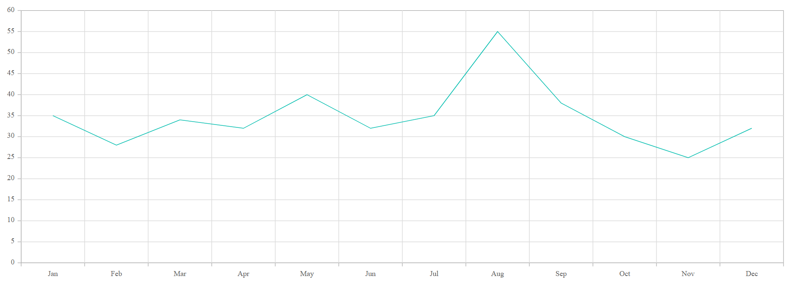

# Getting Started with Angular Chart Component

This section explains the steps required to create a simple chart and demonstrates the basic usage of the [Angular Chart](https://www.syncfusion.com/angular-components/angular-charts) component.

> **Ready to streamline your Syncfusion<sup style="font-size:70%">&reg;</sup> Angular development?** Discover the full potential of Angular Components with Syncfusion<sup style="font-size:70%">&reg;</sup> AI Coding Assistant. Effortlessly integrate, configure, and enhance your projects with intelligent, context-aware code suggestions, streamlined setups, and real-time insights—all seamlessly integrated into your preferred AI-powered IDEs like VS Code, Cursor, Syncfusion<sup style="font-size:70%">&reg;</sup> CodeStudio and more. [Explore Syncfusion<sup style="font-size:70%">&reg;</sup> AI Coding Assistant](https://ej2.syncfusion.com/angular/documentation/mcp-server/ai-coding-assistant/getting-started)

To get started quickly with Angular Chart using CLI and Schematics, view the following video:



## Prerequisites

Before getting started, ensure that your environment meets the [system requirements for Syncfusion® Angular UI components](https://ej2.syncfusion.com/angular/documentation/system-requirement), which covers supported Node.js, Angular, and `@syncfusion/ej2-angular-charts` versions.

## Before You Begin

This guide uses the standalone application structure generated by the latest Angular CLI.

The main files used in this guide are:

- `src/app/app.ts` — Defines the root standalone component.
- `src/index.html` — Contains the Angular root element.

> **Note:** In newer Angular CLI standalone projects, the root component may be generated as `src/app/app.ts`. In NgModule-based Angular projects, the equivalent file is typically `src/app/app.component.ts`.

> **Note:** If your application uses an older NgModule-based structure, import `ChartModule` in the application module, such as `app.module.ts`, instead of adding it to the standalone component `imports` collection.

## Step 1: Install the Angular CLI

Use [Angular CLI](https://github.com/angular/angular-cli) to create and manage Angular applications. Install Angular CLI globally using the following command:

```bash
npm install -g @angular/cli
```

Verify the installation:

```bash
ng version
```

## Step 2: Create an Angular application

Create a new Angular application using the following non-interactive command:

```bash
ng new my-chart-app
```

This command creates the `my-chart-app` folder and applies the recommended options (CSS stylesheet, no SSR, and default settings). If you prefer interactive prompts, choose the following options:

* **Stylesheet system**: Choose any option. This guide uses `CSS` for simplicity and applies the Syncfusion Tailwind 3 theme via CSS imports.
* **SSR and SSG/Pre-rendering**: Select `No`.
* **AI tools configuration**: Select `None`.

Navigate to the project folder:

```bash
cd my-chart-app
```

Open the project in Command Prompt, PowerShell, or Terminal before proceeding to the next step.

## Step 3: Install the Syncfusion® Angular Chart package

All Syncfusion Essential® JS 2 packages are available in the [npmjs.com](https://www.npmjs.com/~syncfusionorg) registry. The [Angular Chart package](https://www.npmjs.com/package/@syncfusion/ej2-angular-charts) can be installed using the following command:

```bash
npm install @syncfusion/ej2-angular-charts
```

> **Note:** Installing `@syncfusion/ej2-angular-charts` automatically installs the required dependency packages.

## Step 4: Register the Chart module and add the component

Import `ChartModule` from `@syncfusion/ej2-angular-charts` and add it to the `imports` collection of the standalone component. Then, add the Angular Chart component using the `<ejs-chart>` selector in the component template.

Update the `src/app/app.ts` file as follows:

```typescript
import { Component } from '@angular/core';
import { ChartModule } from '@syncfusion/ej2-angular-charts';

@Component({
  selector: 'app-root',
  standalone: true,
  imports: [ChartModule],
  template: `<ejs-chart id='chart-container'></ejs-chart>`
})
export class App {}
```

This renders an empty chart in the application's view.

> **Note:** The component selector must match the root element used in the `src/index.html` file. Angular CLI commonly uses `<app-root></app-root>`, so this example uses `selector: 'app-root'`.

Run the application with `npm start` and verify that an empty chart renders before proceeding to the next step.

## Step 5: Create your first Chart with data source and series type

This section explains how to create a simple chart by binding data, configuring the axis, and rendering a series using the Angular Chart component.

The following example demonstrates how to visualize monthly sales data using a line chart. It also shows how to configure the horizontal axis and map data fields using the [primaryXAxis](https://ej2.syncfusion.com/angular/documentation/api/chart/index-default#primaryxaxis), [dataSource](https://ej2.syncfusion.com/angular/documentation/api/chart/series#datasource), [xName](https://ej2.syncfusion.com/angular/documentation/api/chart/series#xname), and [yName](https://ej2.syncfusion.com/angular/documentation/api/chart/series#yname) properties.

Update the src/app/app.ts file as follows:










  


The chart renders a line with the month names (Jan–Dec) on the horizontal axis and the sales values on the vertical axis. Hovering over a data point displays a tooltip with the corresponding month and sales value.

The following table summarizes the key properties used in this example:

| Properties | Description |
| --- | --- |
| [`primaryXAxis`](https://ej2.syncfusion.com/angular/documentation/api/chart/index-default#primaryxaxis) | Defines the configuration of the horizontal axis. |
| [`dataSource`](https://ej2.syncfusion.com/angular/documentation/api/chart/series#datasource) | Provides the JSON data used to render the chart. |
| [`type`](https://ej2.syncfusion.com/angular/documentation/api/chart/series#type) | Specifies the chart series type, such as Line, Column, or Bar. |
| [`xName`](https://ej2.syncfusion.com/angular/documentation/api/chart/series#xname) | Maps the category field (for example, month) from the data source to the x-axis. |
| [`yName`](https://ej2.syncfusion.com/angular/documentation/api/chart/series#yname) | Maps the data field (for example, sales) from the data source to the y-axis. |
| [`<e-series-collection>`](https://ej2.syncfusion.com/angular/documentation/api/chart/seriesdirective) and [`<e-series>`](https://ej2.syncfusion.com/angular/documentation/api/chart/seriesdirective) | Directives used to define and render one or more series in the chart. |

## Step 6: Run the application

Run the application using the following command:

```bash
npm start
```

Open the generated local URL (for example, `http://localhost:4200/`) from the terminal in the browser. The application displays a line chart showing monthly sales from January to December, as shown below:



## Troubleshooting

If the chart does not render as expected, check for these common issues:

* **"No provider for CategoryService" error**: Confirm that `CategoryService` and `LineSeriesService` are added to the component's `providers` array. Each chart series type requires its corresponding service.
* **Chart not visible**: Verify that the `<ejs-chart>` element has a unique `id` and that the component's `selector` matches the root element used in `src/index.html` (commonly `<app-root>`).
* **Data not displayed**: Check that the `xName` and `yName` values match the field names in your data source exactly, and that the `dataSource` is assigned before the chart renders.
* **Build errors**: Run `ng version` to confirm that Node.js, Angular CLI, and `@syncfusion/ej2-angular-charts` are on supported versions, and check the terminal output for the specific error.
* **Port already in use**: If `npm start` fails because port `4200` is in use, run `ng serve --port 4201` (or another free port) instead.

## See also

* [Chart Axis](chart-axis) — Customize the chart axes.
* [Chart Series Types](./series/series-types/area-types) — Explore other series types such as Column, Bar, and Area.
* [Data Binding](./data-binding/working-with-data) — Bind the chart to remote data sources.
