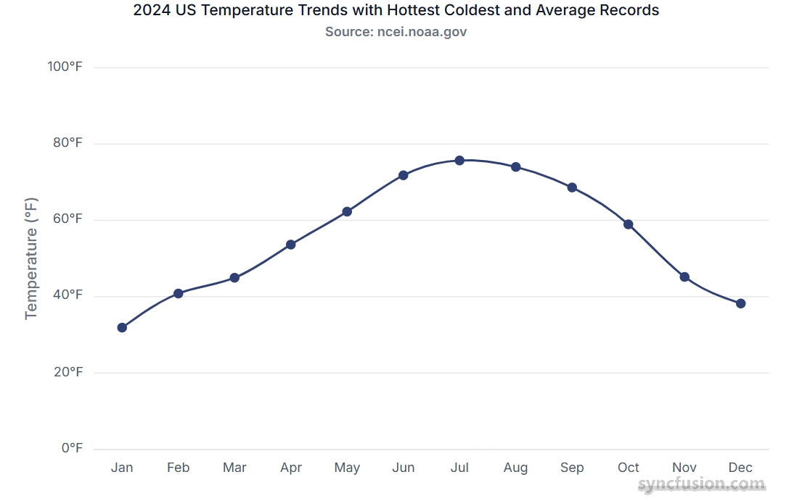
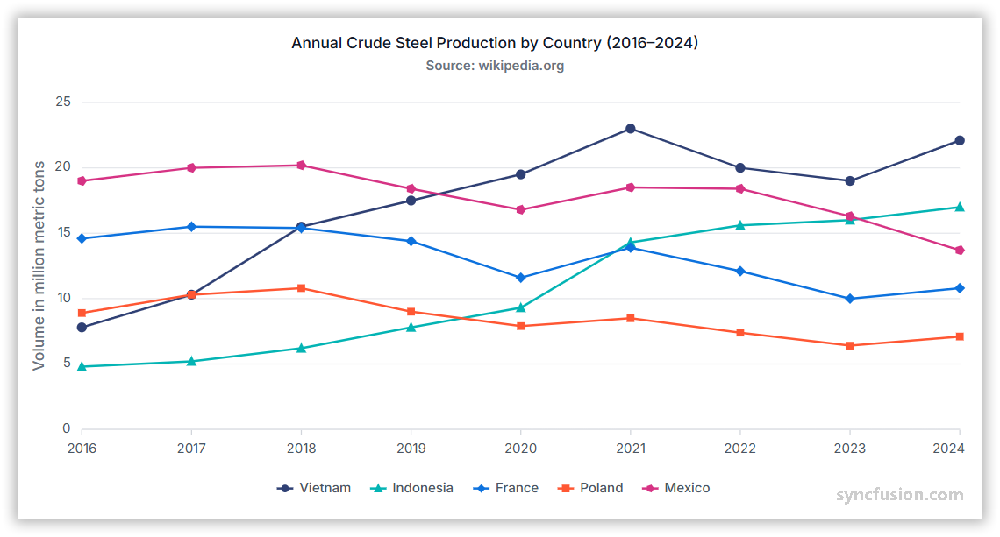

# Overview of Chart Series

## **What is a series?**

A series represents a set of related data points visualized together on a chart. Each series is plotted using a specific rendering type, such as Line, Column, Area, Spline, or Scatter. A single chart can contain one or multiple series, allowing you to compare trends or relationships across datasets.

## Single Series

A single series refers to a chart that displays only one set of data points. It represents one continuous dataset plotted on the chart, allowing you to visualize trends or values from a single source of data.

## Multiple series

A multiple series chart displays two or more datasets together, allowing you to compare trends or values across different series.
 

## Binding data with series

You can bind data to the chart using the [`dataSource`](https://ej2.syncfusion.com/angular/documentation/api/chart/seriesDirective#datasource) property within the series configuration. This allows you to connect a JSON dataset or remote data to your chart. To display the data correctly, map the fields from the data to the chart series [`xName`](https://ej2.syncfusion.com/angular/documentation/api/chart/seriesDirective#xname) and [`yName`](https://ej2.syncfusion.com/angular/documentation/api/chart/seriesDirective#yname) properties.

















## Common series properties

| Property | Description |
|---|---|
| [type](https://ej2.syncfusion.com/angular/documentation/api/chart/seriesdirective#type) | Series rendering type: `Line`, `Column`, `Area`, `Bar`, `Spline`, `Scatter`, etc. |
| [dataSource](https://ej2.syncfusion.com/angular/documentation/api/chart/seriesdirective#datasource) | Array or remote data source bound to the series. |
| [xName](https://ej2.syncfusion.com/angular/documentation/api/chart/seriesdirective#xname) | Field name in the data source used for X-axis values. |
| [yName](https://ej2.syncfusion.com/angular/documentation/api/chart/seriesdirective#yname) | Field name in the data source used for Y-axis values. |
| [name](https://ej2.syncfusion.com/angular/documentation/api/chart/seriesdirective#name) | Series label shown in the legend and tooltips. |
| [visible](https://ej2.syncfusion.com/angular/documentation/api/chart/seriesdirective#visible) | Determines whether the series is displayed on the chart. |
| [fill](https://ej2.syncfusion.com/angular/documentation/api/chart/seriesdirective#fill) | Fill color or gradient for the series. |
| [width](https://ej2.syncfusion.com/angular/documentation/api/chart/seriesdirective#width) | Stroke width for line-type series. |
| [marker](https://ej2.syncfusion.com/angular/documentation/api/chart/seriesdirective#marker) | Object configuring data point markers (visibility, size, shape, fill). |
| [opacity](https://ej2.syncfusion.com/angular/documentation/api/chart/seriesdirective#opacity) | Series transparency (0.0 - 1.0). |
| [dashArray](https://ej2.syncfusion.com/angular/documentation/api/chart/seriesdirective#dasharray) | Dash pattern for stroke lines (for example: `"5,3"`). |
| [animation](https://ej2.syncfusion.com/angular/documentation/api/chart/seriesdirective#animation) | Animation options (enable, duration, delay) for series rendering. |
| [enableTooltip](https://ej2.syncfusion.com/angular/documentation/api/chart/seriesdirective#enabletooltip) | Enable or disable tooltip for the series points. |
| [columnSpacing](https://ej2.syncfusion.com/angular/documentation/api/chart/seriesdirective#columnspacing) | Spacing between bars/columns for Column/Bar series. |
| [columnWidth](https://ej2.syncfusion.com/angular/documentation/api/chart/seriesdirective#columnwidth) | Width of columns/bars (relative or pixel value). |
| [border](https://ej2.syncfusion.com/angular/documentation/api/chart/seriesdirective#border) | Border settings (color, width) for Area, Column, and Bar series. |
| [legendShape](https://ej2.syncfusion.com/angular/documentation/api/chart/seriesdirective#legendshape) | Shape/icon used in the legend for the series. |
| [emptyPointSettings](https://ej2.syncfusion.com/angular/documentation/api/chart/seriesdirective#emptypointsettings) | How to render empty/null points (gap, zero, average, etc.). |
| [errorBar](https://ej2.syncfusion.com/angular/documentation/api/chart/seriesdirective#errorbar) | Configuration to render error bars for each point. |
| [trendlines](https://ej2.syncfusion.com/angular/documentation/api/chart/seriesdirective#trendlines) | Add trendlines (Linear, Polynomial, Moving Average, etc.). |
| [marker](https://ej2.syncfusion.com/angular/documentation/api/chart/markersettingsmodel) | Configuration object for highlighting individual data points with symbols (circle, diamond, etc.). |
| [dataLabel](https://ej2.syncfusion.com/angular/documentation/api/chart/datalabelsettingsmodel) | Configuration object for displaying the value of each data point directly on the chart. |
