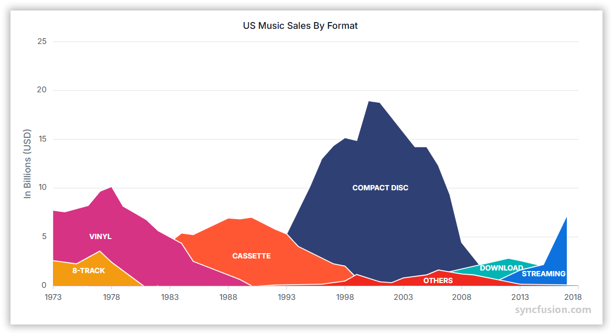

# Area Chart in Angular Charts

## Area

Area charts are ideal for visualizing trends over time or across categories by displaying data as filled regions beneath connecting lines. They effectively show cumulative values and help compare multiple data series.

To render an [area](https://www.syncfusion.com/angular-components/angular-charts/chart-types/area-chart) series in your chart:

1. **Set the series type**: Define the series [`type`](https://ej2.syncfusion.com/angular/documentation/api/chart/seriesDirective#type) as `Area` in your chart configuration.

2. **Inject the AreaSeries module**: Use the `@NgModule.providers` method to inject the `AreaSeriesService` module into your chart to enable area series functionality.














  


## Data binding for area series

Connect your data to the chart using the [`dataSource`](https://ej2.syncfusion.com/angular/documentation/api/chart/seriesDirective#datasource) property within the series configuration. This property supports JSON datasets and remote data sources. Map the data fields to the chart series using [`xName`](https://ej2.syncfusion.com/angular/documentation/api/chart/seriesDirective#xname) and [`yName`](https://ej2.syncfusion.com/angular/documentation/api/chart/seriesDirective#yname) properties to ensure proper data visualization.














  


## Series customization

Customize the appearance of `area` series using various styling properties to match your application's design requirements.

**Fill**

The [`fill`](https://ej2.syncfusion.com/angular/documentation/api/chart/seriesDirective#fill) property determines the color applied to the series.














  


**Gradient fill**

Apply gradient colors to create visually appealing area series with smooth color transitions by configuring the [`fill`](https://ej2.syncfusion.com/angular/documentation/api/chart/seriesDirective#fill) property with gradient values.














  


**Opacity**

Control the transparency level of the area fill using the [`opacity`](https://ej2.syncfusion.com/angular/documentation/api/chart/seriesDirective#opacity) property. Values range from 0 (completely transparent) to 1 (completely opaque).














  


## Area border

Customize the area series border using the [`border`](https://ej2.syncfusion.com/angular/documentation/api/chart/seriesDirective#border) property to adjust width, color, and dash pattern.














  


## Multicolored area

Create area series with different colored segments to highlight specific data ranges or categories.

To render a multicolored area series:

1. **Set the series type**: Define the series [`type`](https://ej2.syncfusion.com/angular/documentation/api/chart/seriesDirective#type) as `MultiColoredArea`.

2. **Inject the MultiColoredAreaSeries module**: Use the `@NgModule.providers` method to inject the `MultiColoredAreaSeries` module.

3. **Configure segments**: Define segments using the [`segments`](https://ej2.syncfusion.com/angular/documentation/api/chart/seriesDirective#segments) property with these options:
   * [value](https://ej2.syncfusion.com/angular/documentation/api/chart/chartSegmentModel#value) - Specifies the endpoint of the segment.
   * [color](https://ej2.syncfusion.com/angular/documentation/api/chart/chartSegmentModel#color) - Defines the segment color.
   * [dashArray](https://ej2.syncfusion.com/angular/documentation/api/chart/chartSegmentModel#dasharray) - Defines dash patterns for the segment.














  


## Empty points

Data points with `null` or `undefined` values are considered empty points. These points are handled according to the specified mode and can be customized for better visual representation.

**Mode**

Use the [`mode`](https://ej2.syncfusion.com/angular/documentation/api/chart/emptyPointSettings#mode) property to define how empty or missing data points are handled in the series. The default mode for empty points is `Gap`.














  


**Fill**

Customize the fill color of empty points using the [`fill`](https://ej2.syncfusion.com/angular/documentation/api/chart/emptyPointSettings#fill) property to maintain visual consistency or highlight missing data.














  


**Border**

Customize the border appearance of empty points using the [`border`](https://ej2.syncfusion.com/angular/documentation/api/chart/emptyPointSettings#border) property to adjust width and color.














  


## Events

### Series render

The [`seriesRender`](https://ej2.syncfusion.com/angular/documentation/api/chart/iSeriesRenderEventArgs) event allows customization of series properties, such as data, fill, and name, before rendering on the chart.














  


### Point render

The [`pointRender`](https://ej2.syncfusion.com/angular/documentation/api/chart/iPointRenderEventArgs  ) event allows customization of each data point before rendering on the chart.














  


## See also

* [Data label](../data-labels)
* [Tooltip](../tool-tip)