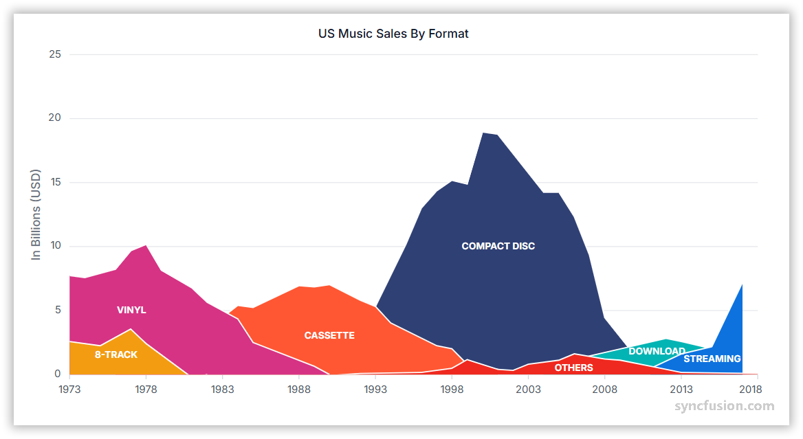

# Area Chart in Angular Charts

## Area

Area charts are ideal for visualizing trends over time or across categories by displaying data as filled regions beneath connecting lines. They effectively show cumulative values and help compare multiple data series.



To render an [area](https://www.syncfusion.com/angular-components/angular-charts/chart-types/area-chart) series in your chart:

1. **Set the series type**: Define the series [`type`](https://ej2.syncfusion.com/angular/documentation/api/chart/seriesDirective#type) as `Area` in your chart configuration.

2. **Inject the AreaSeriesService provider**: Use the `@NgModule.providers` method to inject the `AreaSeriesService` provider into your chart to enable area series functionality.














  


## Data binding for area series

To display meaningful data in your area chart, connect your data source to the series. Use the [`dataSource`](https://ej2.syncfusion.com/angular/documentation/api/chart/seriesDirective#datasource) property within the series configuration. This property supports JSON datasets and remote data sources. Map the data fields to the chart series using [`xName`](https://ej2.syncfusion.com/angular/documentation/api/chart/seriesDirective#xname) and [`yName`](https://ej2.syncfusion.com/angular/documentation/api/chart/seriesDirective#yname) properties to ensure proper data visualization.














  


## Series customization

Customize the appearance of `area` series using various styling properties to match your application's design requirements.

### Solid fill

The [`fill`](https://ej2.syncfusion.com/angular/documentation/api/chart/seriesdirective#fill) property determines the color applied to the series.














  


### Gradient fill

The [`fill`](https://ej2.syncfusion.com/angular/documentation/api/chart/seriesdirective#fill) property can apply an SVG gradient to a area series. Define the gradient within an SVG `<defs>` element using a unique ID, and assign it to the series in the `url(#gradientId)` format. Place the following SVG element in your application's `index.html` file, inside the `<body>` element and outside the `<app-container>` element.

```html
    <svg>
        <defs>
            <linearGradient id="oilGradient" x1="0%" y1="0%" x2="0%" y2="100%">
                <stop offset="0%" style="stop-color:#2F1B14;stop-opacity:0.9" />
                <stop offset="40%" style="stop-color:#8B4513;stop-opacity:0.8" />
                <stop offset="80%" style="stop-color:#CD853F;stop-opacity:0.7" />
                <stop offset="100%" style="stop-color:#F4A460;stop-opacity:0.8" />
                </linearGradient>

            <linearGradient id="coalGradient" x1="0%" y1="0%" x2="0%" y2="100%">
                <stop offset="0%" style="stop-color:#0F0F0F;stop-opacity:0.9" />
                <stop offset="30%" style="stop-color:#2F2F2F;stop-opacity:0.8" />
                <stop offset="70%" style="stop-color:#4F4F4F;stop-opacity:0.7" />
                <stop offset="100%" style="stop-color:#696969;stop-opacity:0.8" />
            </linearGradient>
        </defs>
    </svg>
```

The series then references it via `fill='url(#oilGradient)'` and `fill='url(#coalGradient)'`.














  


### Opacity

Control the transparency level of the area fill using the [`opacity`](https://ej2.syncfusion.com/angular/documentation/api/chart/seriesDirective#opacity) property. Values range from 0 (completely transparent) to 1 (completely opaque). Default value is `1`.














  


### Series Border

Customize the area series border using the [`border`](https://ej2.syncfusion.com/angular/documentation/api/chart/seriesDirective#border) property. The `border` object supports the following fields:

* [`width`](https://ej2.syncfusion.com/angular/documentation/api/chart/bordermodel#width) - Border thickness in pixels.
* [`color`](https://ej2.syncfusion.com/angular/documentation/api/chart/bordermodel#color) - Border stroke color.
* [`dashArray`](https://ej2.syncfusion.com/angular/documentation/api/chart/bordermodel#dasharray) - Dash pattern (e.g. `'2,5'`). Sets a dashed border.

Example: `{ width: 2, color: '#962D18', dashArray: '2,5' }`.














  


## Multicolored area

The multicolored area is a variant of the basic area series that allows each segment of the area to be rendered with a different color, helping to highlight specific data ranges or categories.

To render a multicolored area series:

1. **Set the series type**: Define the series [`type`](https://ej2.syncfusion.com/angular/documentation/api/chart/seriesDirective#type) as `MultiColoredArea`.

2. **Inject the MultiColoredAreaSeriesService provider**: Use the `@NgModule.providers` method to inject the `MultiColoredAreaSeriesService` provider.

3. **Configure segments**: Define segments using the [`segments`](https://ej2.syncfusion.com/angular/documentation/api/chart/seriesdirective#segments) property with `ChartSegmentModel` options:
   * [value](https://ej2.syncfusion.com/angular/documentation/api/chart/chartsegmentmodel#value) - Specifies the endpoint (x-value) of the segment. Default: `null`.
   * [color](https://ej2.syncfusion.com/angular/documentation/api/chart/chartsegmentmodel#color) - Defines the segment color. Default: `null`.
   * [dashArray](https://ej2.syncfusion.com/angular/documentation/api/chart/chartsegmentmodel#dasharray) - Defines dash patterns for the segment border. Default: `'0`.














  


## Empty points

Data points with `null` or `undefined` values are considered empty points. These points are handled according to the specified mode and can be customized for better visual representation.

### Mode

Use the [`mode`](https://ej2.syncfusion.com/angular/documentation/api/chart/emptyPointSettings#mode) property to define how empty or missing data points are handled in the series. Available values are:

* `Gap` (default) - Leaves a gap at the empty point.
* `Drop` - Drops the empty point and connects adjacent points.
* `Zero` - Replaces the empty point with `0`.
* `Average` - Replaces the empty point with the average of adjacent points.














  


### Empty Point Fill

Customize the fill color of empty points using the [`fill`](https://ej2.syncfusion.com/angular/documentation/api/chart/emptyPointSettings#fill) property to maintain visual consistency or highlight missing data. Applies when `mode` is `Zero` or `Average`.














  


### Empty Point Border

Customize the border appearance of empty points using the [`border`](https://ej2.syncfusion.com/angular/documentation/api/chart/emptyPointSettings#border) property to adjust `width` and `color`. Applies when `mode` is `Zero` or `Average`.














  


## Events

### Series render

The [`seriesRender`](https://ej2.syncfusion.com/angular/documentation/api/chart/iSeriesRenderEventArgs) event allows customization of series properties, such as data, fill, and name, before rendering on the chart.














  


### Point render

The [`pointRender`](https://ej2.syncfusion.com/angular/documentation/api/chart/iPointRenderEventArgs) event allows customization of each data point before rendering on the chart.














  


## Troubleshooting

* Ensure `AreaSeriesService` is registered in the providers; otherwise the area series will not render.
* **Gradient fill renders as solid color:** the SVG gradient referenced by `fill='url(#id)'` is not defined. Add a matching `<linearGradient>` (or `<radialGradient>`) inside a `<defs>` block in the chart template, or in a global stylesheet.
* If `MultiColoredArea` segments are not visible, verify each segment's `value` is monotonically increasing and matches an x-value in the data. Confirm that `segmentAxis` (`X` or `Y`) matches the axis of the `value` field.
* Empty-point customization (`fill`/`border`) only takes effect when `mode` is `Zero` or `Average`. For `Gap` and `Drop`, no marker/fill is drawn.

## See Also

* [Data label](../../../chart-elements/data-labels)
* [Tooltip](../../../chart-interactive/tool-tip)