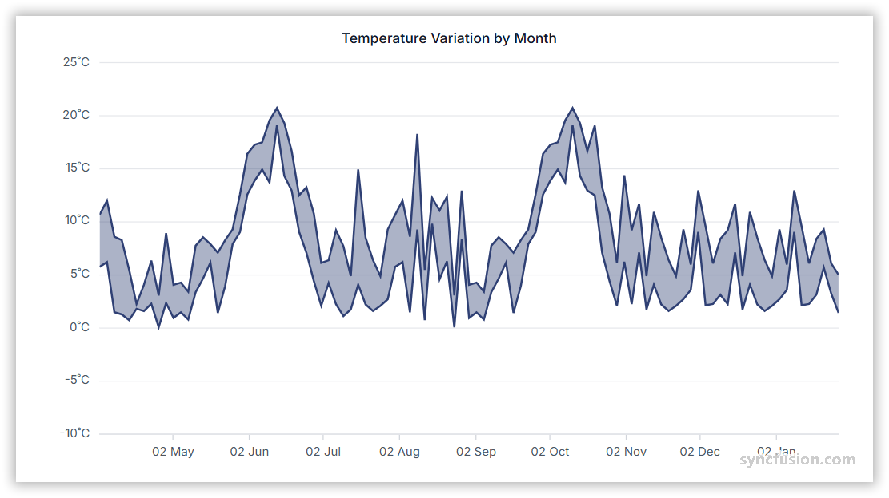

# Range Area Chart in Angular Charts

## Range Area

Range area chart displays the area between two data values (a high and a low) for each point, forming a shaded band.



To render a [range area](https://www.syncfusion.com/angular-components/angular-charts/chart-types/range-area-chart) series in your chart, you need to follow a few steps to configure it correctly. 

Here's a concise guide on how to do this:

1. **Set the series type**: Define the series [`type`](https://ej2.syncfusion.com/angular/documentation/api/chart/seriesDirective#type) as `RangeArea` in your chart configuration. This indicates that the data should be represented as a range area chart, which is ideal for visualizing a range of values for each data point. This type of chart is particularly useful for displaying data that has a range between a minimum and maximum value, such as temperature ranges, stock price ranges, or any other type of data that varies within a specific interval.

2. **Register the RangeAreaSeriesService provider**: Register `RangeAreaSeriesService` (along with any other chart services you need) in the component's `providers` array.

3. **Provide high and low values**: The `RangeArea` series requires two value fields for each data point. Set [`high`](https://ej2.syncfusion.com/angular/documentation/api/chart/seriesdirective#high) to the field name representing the upper bound and [`low`](https://ej2.syncfusion.com/angular/documentation/api/chart/seriesdirective#low) to the field name for the lower bound. Together with [`xName`](https://ej2.syncfusion.com/angular/documentation/api/chart/seriesdirective#xName) these define the band rendered at each point on the chart.

















## Binding data with series

Bind data via the [`dataSource`](https://ej2.syncfusion.com/angular/documentation/api/chart/seriesdirective#datasource) property on the series. Map the fields from your records to [`xName`](https://ej2.syncfusion.com/angular/documentation/api/chart/seriesdirective#xname), [`high`](https://ej2.syncfusion.com/angular/documentation/api/chart/seriesdirective#high), and [`low`](https://ej2.syncfusion.com/angular/documentation/api/chart/seriesdirective#low) so the chart knows which value drives each bound.

















## Series customization

The following properties customize the `range area` series.

### Solid fill

The [`fill`](https://ej2.syncfusion.com/angular/documentation/api/chart/seriesdirective#fill) property determines the color applied to the series. Default value is `null`.

















### Gradient fill

The [`fill`](https://ej2.syncfusion.com/angular/documentation/api/chart/seriesdirective#fill) property can apply an SVG gradient to a range area series. Define the gradient within an SVG `<defs>` element using a unique ID, and assign it to the series in the `url(#gradientId)` format. Place the following SVG element in your application's `index.html` file, inside the `<body>` element and outside the `<app-container>` element.

```html
<svg>
    <defs>
        <linearGradient id="gradient">
            <stop offset="0%" style="stop-color:blue;stop-opacity:5" />
            <stop offset="50%" style="stop-color:violet;stop-opacity:5" />
        </linearGradient>
    </defs>
</svg>
```

















### Opacity

The [`opacity`](https://ej2.syncfusion.com/angular/documentation/api/chart/seriesdirective#opacity) property specifies the transparency level of the fill. Valid range is `0` (completely transparent) to `1` (completely opaque). Default value is `1`.

















### Series Border

Use the [`border`](https://ej2.syncfusion.com/angular/documentation/api/chart/seriesdirective#border) property of the series to style its border. The `border` object supports these fields:

* [`width`](https://ej2.syncfusion.com/angular/documentation/api/chart/bordermodel#width) - Border thickness in pixels.
* [`color`](https://ej2.syncfusion.com/angular/documentation/api/chart/bordermodel#color) - Border stroke color.
* [`dashArray`](https://ej2.syncfusion.com/angular/documentation/api/chart/bordermodel#dashArray) - Dash pattern for the border (for example `'5,5'`).

















## Empty points

Data points with `null` or `undefined` values are considered empty. How an empty point is rendered on the chart depends on the [`mode`](https://ej2.syncfusion.com/angular/documentation/api/chart/emptypointsettings#mode) you choose.

### Mode

Use the [`mode`](https://ej2.syncfusion.com/angular/documentation/api/chart/emptypointsettings#mode) property to define how empty or missing data points are handled. Available values are:

* `Gap` (default) - Leaves a gap at the empty point.
* `Drop` - Drops the empty point and connects adjacent points.
* `Zero` - Replaces the empty point with the value `0`.
* `Average` - Replaces the empty point with the average of adjacent points.

















### Empty Point Fill

Use the [`fill`](https://ej2.syncfusion.com/angular/documentation/api/chart/emptypointsettings#fill) property to customize the fill color of empty points in the series. Applies only when `mode` is `Zero` or `Average`.

















### Empty Point Border

Use the [`border`](https://ej2.syncfusion.com/angular/documentation/api/chart/emptypointsettings#border) property to customize the width and color of the border for empty points. Applies only when `mode` is `Zero` or `Average`.

















## Events

### Series render

The [`seriesRender`](https://ej2.syncfusion.com/angular/documentation/api/chart/iseriesrendereventargs) event allows you to customize series properties, such as data, fill, and name, before they are rendered on the chart.

















### Point render

The [`pointRender`](https://ej2.syncfusion.com/angular/documentation/api/chart/ipointrendereventargs) event allows you to customize each data point before it is rendered on the chart.


















## Troubleshooting

* Ensure `RangeAreaSeriesService` is registered in the providers; otherwise the range area series will not render.
* **Gradient fill renders as solid color:** the SVG gradient referenced by `fill='url(#gradient)'` is not defined. Add a matching `<linearGradient>` (or `<radialGradient>`) inside a `<defs>` block in the chart template, or in a global stylesheet.
* **Empty-point customization has no visible effect:** the `fill` and `border` settings on `emptyPointSettings` apply only when `mode` is `Zero` or `Average`. With `Gap` and `Drop` modes no marker is drawn.

## See Also

* [Range Step Area Chart](./step-area)
* [Spline Range Area Chart](./spline-range-area)
* [Data label](../../../chart-elements/data-labels)
* [Tooltip](../../../chart-interactive/tool-tip)
