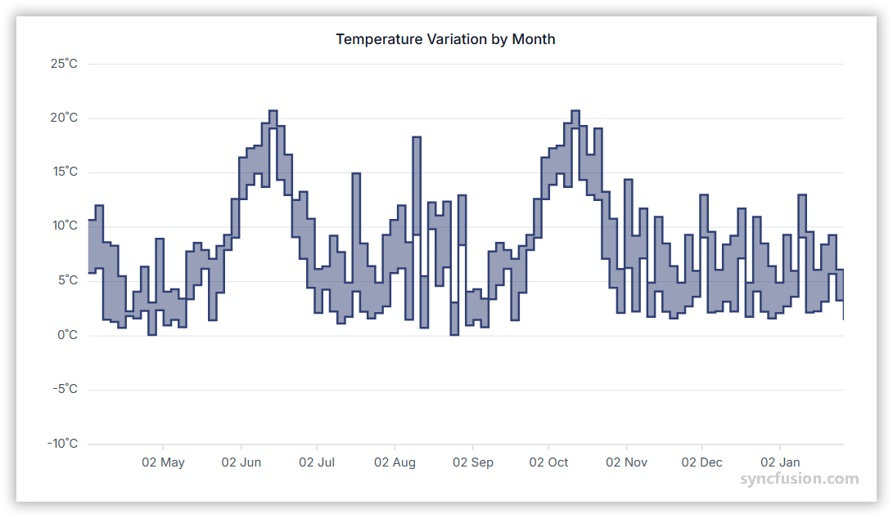

# Range Step Area Chart in Angular Charts

## Range Step Area

A range step area chart displays the high–low range using a stepped shape instead of smooth or straight lines.

To render a range step area series in your chart, you need to follow a few steps to configure it correctly. 

Here's a concise guide on how to do this:

1. **Set the series type**: Define the series [`type`](https://ej2.syncfusion.com/angular/documentation/api/chart/seriesdirective#type) as `RangeStepArea` in your chart configuration. This indicates that the data should be represented as a range step area chart, which is ideal for displaying data points as a range with high and low values. It connects these points with vertical and horizontal lines, creating a step like appearance.

2. **Register the RangeStepAreaSeriesService provider**: Register `RangeStepAreaSeriesService` (along any other chart services you need) in the component's `providers` array.

3. **Provide high and low values**: The `RangeStepArea` series requires two value fields for each data point. Set [`high`](https://ej2.syncfusion.com/angular/documentation/api/chart/seriesdirective#high) to the field name representing the upper bound and [`low`](https://ej2.syncfusion.com/angular/documentation/api/chart/seriesdirective#low) to the field name for the lower bound. Together with [`xName`](https://ej2.syncfusion.com/angular/documentation/api/chart/seriesdirective#xname) these define the stepped band rendered at each point on the chart.

















## Binding data with series

Bind data via the [`dataSource`](https://ej2.syncfusion.com/angular/documentation/api/chart/seriesdirective#datasource) property on the series. Map the fields from your records to [`xName`](https://ej2.syncfusion.com/angular/documentation/api/chart/seriesdirective#xname), [`high`](https://ej2.syncfusion.com/angular/documentation/api/chart/seriesdirective#high), and [`low`](https://ej2.syncfusion.com/angular/documentation/api/chart/seriesdirective#low) so the chart knows which value drives each bound.

















## Series customization

The following properties customize the `range step area` series.

### Fill

The [`fill`](https://ej2.syncfusion.com/angular/documentation/api/chart/seriesdirective#fill) property determines the color applied to the series. Default value is `null`.

















### Opacity

The [`opacity`](https://ej2.syncfusion.com/angular/documentation/api/chart/seriesdirective#opacity) property specifies the transparency level of the fill. Valid range is `0` (completely transparent) to `1` (completely opaque). Default value is `1`.

















### Series Border

Use the [`border`](https://ej2.syncfusion.com/angular/documentation/api/chart/seriesdirective#border) property to style the series border. The `border` object supports these fields:

* `width` - Border thickness in pixels.
* `color` - Border stroke color.
* `dashArray` - Dash pattern for the border (for example `'5'`, `'5,5'`, or `'2,3,4'`).

The included snippet sets `border = { width: 2, color: '#ff4251', dashArray: '5' }`.

















### Step

Use the [`step`](https://ej2.syncfusion.com/angular/documentation/api/chart/seriesdirective#step) property to change the position of the steps in a range step area series. Available values are:

* `Left` (default) - The step rises/joins on the left side of each x-interval.
* `Center` - The step is centered in each x-interval.
* `Right` - The step rises/joins on the right side of each x-interval.

















### No Risers

Eliminate the vertical lines between points by setting the [`noRisers`](https://ej2.syncfusion.com/angular/documentation/api/chart/seriesmodel#norisers) property to `true` on the series. This is useful for highlighting horizontal trends without the visual noise of risers.














  


## Empty points

Data points with `null` or `undefined` values are considered empty. How an empty point is rendered on the chart depends on the [`mode`](https://ej2.syncfusion.com/angular/documentation/api/chart/emptypointsettingsmodel#mode) you choose.

### Mode

Use the [`mode`](https://ej2.syncfusion.com/angular/documentation/api/chart/emptypointsettingsmodel#mode) property to define how empty or missing data points are handled. Available values are:

* `Gap` (default) - Leaves a gap at the empty point.
* `Drop` - Drops the empty point and connects adjacent points.
* `Zero` - Replaces the empty point with the value `0`.
* `Average` - Replaces the empty point with the average of adjacent points.

















### Empty Point Fill

Use the [`fill`](https://ej2.syncfusion.com/angular/documentation/api/chart/emptypointsettingsmodel#fill) property to customize the fill color of empty points in the series. Applies only when `mode` is `Zero` or `Average`.

















### Empty Point Border

Use the [`border`](https://ej2.syncfusion.com/angular/documentation/api/chart/emptypointsettingsmodel#border) property to customize the width and color of the border for empty points. Applies only when `mode` is `Zero` or `Average`.

















## Events

### Series render

The [`seriesRender`](https://ej2.syncfusion.com/angular/documentation/api/chart/iseriesrendereventargs) event allows you to customize series properties, such as data, fill, and name, before they are rendered on the chart. The handler in the included snippet assigns `args.fill = '#ff6347'`, applying a tomato color to the series before render.

















### Point render

The [`pointRender`](https://ej2.syncfusion.com/angular/documentation/api/chart/ipointrendereventargs) event allows you to customize each data point before it is rendered on the chart. The handler in the included snippet assigns `args.fill = '#ff6347'` on every point before render.

















## Troubleshooting

* Ensure `RangeStepAreaSeriesService` is registered in the providers; otherwise the range step area series will not render.
* **Step position doesn't change:** confirm you used a value accepted by the [`step`](https://ej2.syncfusion.com/angular/documentation/api/chart/seriesdirective#step) property — `Left`, `Center`, or `Right`. Any other string is treated as the default.
* **Empty-point customization has no visible effect:** the `fill` and `border` settings on `emptyPointSettings` apply only when `mode` is `Zero` or `Average`. With `Gap` and `Drop` modes no marker is drawn.

## See Also

* [Range Area Chart](./range-area)
* [Spline Range Area Chart](./spline-range-area)
* [Step Area Chart](./step-area)
* [Data label](../../../chart-elements/data-labels)
* [Tooltip](../../../chart-interactive/tool-tip)