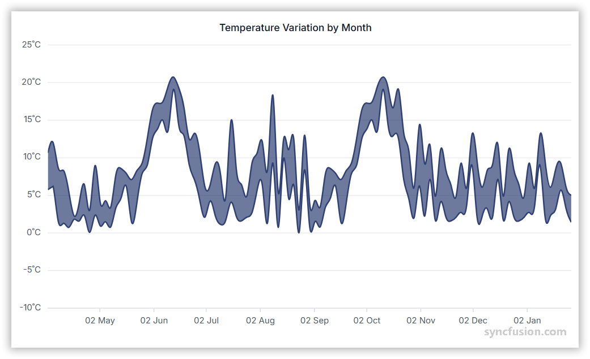

# Spline Range Area Chart in Angular Charts

## Spline Range Area

A spline range area chart shows the shaded area between two smooth spline curves representing high and low values.

To render a [spline range area](https://www.syncfusion.com/angular-components/angular-charts/chart-types/spline-range-area-chart) series in your chart, you need to follow a few steps to configure it correctly.

Here's a concise guide on how to do this:

1. **Set the series type**: Define the series [`type`](https://ej2.syncfusion.com/angular/documentation/api/chart/seriesdirective#type) as `SplineRangeArea` in your chart configuration. This indicates that the data should be represented as a spline range area chart, which is ideal for visualizing continuous data points as a set of splines that vary between high and low values over intervals of time and across different categories.

2. **Register the SplineRangeAreaSeriesService provider**: Register `SplineRangeAreaSeriesService` (along with any other chart services you need) in the component's `providers` array.

















## Binding data with series

Bind data via the [`dataSource`](https://ej2.syncfusion.com/angular/documentation/api/chart/seriesdirective#datasource) property on the series. Map the fields from your records to [`xName`](https://ej2.syncfusion.com/angular/documentation/api/chart/seriesdirective#xname), [`high`](https://ej2.syncfusion.com/angular/documentation/api/chart/seriesdirective#high), and [`low`](https://ej2.syncfusion.com/angular/documentation/api/chart/seriesdirective#low) so the chart knows which value drives each bound. The included basic sample renders two `SplineRangeArea` series (`England` and `India`) on the same `dataSource`, where the second series reuses the same `xName` and supplies different field names (`high1` / `low1`).

















## Series customization

The following properties customize the `spline range area` series.

### Fill

The [`fill`](https://ej2.syncfusion.com/angular/documentation/api/chart/seriesdirective#fill) property determines the color applied to the series. Default value is `null`.

















### Opacity

The [`opacity`](https://ej2.syncfusion.com/angular/documentation/api/chart/seriesdirective#opacity) property specifies the transparency level of the fill. Valid range is `0` (completely transparent) to `1` (completely opaque). Default value is `1`.

















### Series Border

Use the [`border`](https://ej2.syncfusion.com/angular/documentation/api/chart/seriesdirective#border) property to style the series border. The `border` object supports these fields:

* `width` - Border thickness in pixels.
* `color` - Border stroke color.
* `dashArray` - Dash pattern for the border (for example `'5'`, `'5,5'`, or `'2,3,4'`).

Example: `{ width: 2, color: 'red', dashArray: '5,5' }`.

















## Empty points

Data points with `null` or `undefined` values are considered empty. How an empty point is rendered on the chart depends on the [`mode`](https://ej2.syncfusion.com/angular/documentation/api/chart/emptypointsettingsmodel#mode) you choose.

### Mode

Use the [`mode`](https://ej2.syncfusion.com/angular/documentation/api/chart/emptypointsettingsmodel#mode) property to define how empty or missing data points are handled. Available values are:

* `Gap` (default) - Leaves a gap at the empty point.
* `Drop` - Drops the empty point and connects adjacent points.
* `Zero` - Replaces the empty point with the value `0`.
* `Average` - Replaces the empty point with the average of adjacent points.

















### Empty Point Fill

Use the [`fill`](https://ej2.syncfusion.com/angular/documentation/api/chart/emptypointsettingsmodel#fill) property to customize the fill color of empty points in the series. Applies only when `mode` is `Zero` or `Average`.

















### Empty Point Border

Use the [`border`](https://ej2.syncfusion.com/angular/documentation/api/chart/emptypointsettingsmodel#border) property to customize the width and color of the border for empty points. Applies only when `mode` is `Zero` or `Average`.

















## Events

### Series render

The [`seriesRender`](https://ej2.syncfusion.com/angular/documentation/api/chart/iseriesrendereventargs) event allows you to customize series properties, such as data, fill, and name, before they are rendered on the chart. The included handler branches on `args.series.index` and assigns a different `args.fill` per series.

















### Point render

The [`pointRender`](https://ej2.syncfusion.com/angular/documentation/api/chart/ipointrendereventargs) event allows you to customize each data point before it is rendered on the chart. The included handler branches on `args.point.index` and assigns a different `args.fill` for even versus odd-indexed points.

















## Troubleshooting

* Ensure `SplineRangeAreaSeriesService` is registered in the providers; otherwise the spline range area series will not render.
* **Empty-point customization has no visible effect:** the `fill` and `border` settings on `emptyPointSettings` apply only when `mode` is `Zero` or `Average`. With `Gap` and `Drop` modes no marker is drawn.

## See Also

* [Range Area Chart](./range-area)
* [Spline Area Chart](./spline-area)
* [Data label](../../../chart-elements/data-labels)
* [Tooltip](../../../chart-interactive/tool-tip)
