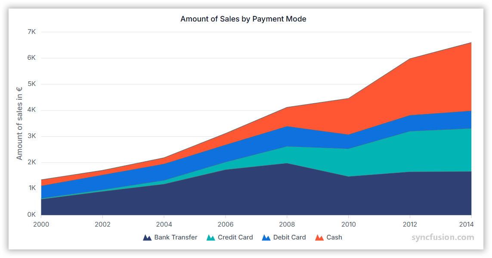

# Stacked Area Chart in Angular Charts

## Stacked Area

A stacked area chart displays multiple area series stacked on top of each other to show the cumulative total.



To render a [stacked area](https://www.syncfusion.com/angular-components/angular-charts/chart-types/stacked-area-chart) series in your chart, you need to follow a few steps to configure it correctly. 

Here's a concise guide on how to do this:

1. **Set the series type**: Define the series [`type`](https://ej2.syncfusion.com/angular/documentation/api/chart/seriesdirective#type) as `StackingArea` in your chart configuration. This indicates that the data should be represented as a stacked area chart, which is ideal for showing the contribution of each part to a total over time or across other categorical data.

2. **Register the StackingAreaSeriesService provider**: Register `StackingAreaSeriesService` (along with any other chart services you need) in the component's `providers` array.

















## Binding data with series

Bind data via the [`dataSource`](https://ej2.syncfusion.com/angular/documentation/api/chart/seriesdirective#datasource) property on the series. Map the fields from your records to [`xName`](https://ej2.syncfusion.com/angular/documentation/api/chart/seriesdirective#xname) and [`yName`](https://ej2.syncfusion.com/angular/documentation/api/chart/seriesdirective#yname) so the chart knows which value drives each point. The included basic sample renders four `StackingArea` series (`Organic`, `Fair-trade`, `Veg Alternatives`, `Others`) on the same `dataSource`, with each series pointing to a different `yName` (`y`, `y1`, `y2`, `y3`).

















## Series customization

The following properties customize the `stacked area` series.

### Solid fill

The [`fill`](https://ej2.syncfusion.com/angular/documentation/api/chart/seriesdirective#fill) property determines the color applied to the series. Default value is `null`.

















### Gradient fill

The [`fill`](https://ej2.syncfusion.com/angular/documentation/api/chart/seriesdirective#fill) property can apply an SVG gradient to a stack area series. Define the gradient within an SVG `<defs>` element using a unique ID, and assign it to the series in the `url(#gradientId)` format. Place the following SVG elements in your application's `index.html` file, inside the `<body>` element and outside the `<app-container>` element.

```html
<svg>
    <defs>
        <linearGradient id="gradient1">
            <stop offset="0%" style="stop-color:blue;stop-opacity:1" />
            <stop offset="50%" style="stop-color:violet;stop-opacity:1" />
        </linearGradient>
    </defs>
</svg>

<svg>
    <defs>
        <linearGradient id="gradient2">
            <stop offset="0%" style="stop-color:darkred;stop-opacity:1" />
            <stop offset="50%" style="stop-color:darkorange;stop-opacity:1" />
        </linearGradient>
    </defs>
</svg>

<svg>
    <defs>
        <linearGradient id="gradient3">
            <stop offset="0%" style="stop-color:darkmagenta;stop-opacity:1" />
            <stop offset="50%" style="stop-color:darkcyan;stop-opacity:1" />
        </linearGradient>
    </defs>
</svg>

<svg>
    <defs>
        <linearGradient id="gradient4">
            <stop offset="0%" style="stop-color:darkviolet;stop-opacity:1" />
            <stop offset="50%" style="stop-color:darkgoldenrod;stop-opacity:1" />
        </linearGradient>
    </defs>
</svg>
```

















### Opacity

The [`opacity`](https://ej2.syncfusion.com/angular/documentation/api/chart/seriesdirective#opacity) property specifies the transparency level of the fill. Valid range is `0` (completely transparent) to `1` (completely opaque). Default value is `1`.

















### Series Border

Use the [`border`](https://ej2.syncfusion.com/angular/documentation/api/chart/seriesdirective#border) property to style the series border. The `border` object supports these fields:

* `width` - Border thickness in pixels.
* `color` - Border stroke color.
* `dashArray` - Dash pattern for the border (for example `'5'`, `'5,5'`, or `'2,3,4'`).

Example: `{ width: 2, color: '#ff4251', dashArray: '5,5' }`.

















## Empty points

Data points with `null` or `undefined` values are considered empty. How an empty point is rendered on the chart depends on the [`mode`](https://ej2.syncfusion.com/angular/documentation/api/chart/emptypointsettingsmodel#mode) you choose.

### Mode

Use the [`mode`](https://ej2.syncfusion.com/angular/documentation/api/chart/emptypointsettingsmodel#mode) property to define how empty or missing data points are handled. Available values are:

* `Gap` (default) - Leaves a gap at the empty point.
* `Drop` - Drops the empty point and connects adjacent points.
* `Zero` - Replaces the empty point with the value `0`.
* `Average` - Replaces the empty point with the average of adjacent points.

















### Empty Point Fill

Use the [`fill`](https://ej2.syncfusion.com/angular/documentation/api/chart/emptypointsettingsmodel#fill) property to customize the fill color of empty points in the series. Applies only when `mode` is `Zero` or `Average`.

















### Empty Point Border

Use the [`border`](https://ej2.syncfusion.com/angular/documentation/api/chart/emptypointsettingsmodel#border) property to customize the width and color of the border for empty points. Applies only when `mode` is `Zero` or `Average`.

















## Stack labels

The stack labels in stacked charts display cumulative total values for stack segments directly using data labels. If a stacked point has negative values, the stack labels are displayed below the point.

To enable stack labels, set `[stackLabels]='{ visible: true }'` on the chart.

















### Stack labels customization
Stack labels have various properties for customization to enhance the visual based on your requirements:

* [`visible`](https://ej2.syncfusion.com/angular/documentation/api/chart/stacklabelsettings#visible) - Specifies whether stack labels are visible. Setting to true will display the labels. Default is false.
* [`fill`](https://ej2.syncfusion.com/angular/documentation/api/chart/stacklabelsettings#fill) - Defines the background color of the stack labels. Accepts valid CSS color strings (hex, RGBA, etc.). Default is transparent.
* [`format`](https://ej2.syncfusion.com/angular/documentation/api/chart/stacklabelsettings#format) - Formats the text displayed in the stack labels. Supports placeholders like {value}. Default is null.
* [`angle`](https://ej2.syncfusion.com/angular/documentation/api/chart/stacklabelsettings#angle) - Specifies the rotation angle for stack labels in degrees. Default is 0.
* [`rx`](https://ej2.syncfusion.com/angular/documentation/api/chart/stacklabelsettings#rx) - Defines the rounded corner radius along the X-axis (horizontal direction) for the stack label background. Default is 5.
* [`ry`](https://ej2.syncfusion.com/angular/documentation/api/chart/stacklabelsettings#ry) - Defines the rounded corner radius along the Y-axis (vertical direction) for the stack label background. Default is 5.
* [`margin`](https://ej2.syncfusion.com/angular/documentation/api/chart/stacklabelsettings#margin) - Configures the margin around the stack label (left, right, top, and bottom).
* [`border`](https://ej2.syncfusion.com/angular/documentation/api/chart/stacklabelsettings#border) - Configures the appearance of the stack label's border.
* [`font`](https://ej2.syncfusion.com/angular/documentation/api/chart/stacklabelsettings#font) - Customizes the stack label text, including font size, color, style, weight, and family.

















## Events

### Series render

The [`seriesRender`](https://ej2.syncfusion.com/angular/documentation/api/chart/iseriesrendereventargs) event allows you to customize series properties, such as data, fill, and name, before they are rendered on the chart. The included handler branches on `args.series.index` (0–3) and assigns a different `args.fill` per series.

















### Point render

The [`pointRender`](https://ej2.syncfusion.com/angular/documentation/api/chart/ipointrendereventargs) event allows you to customize each data point before it is rendered on the chart. The included handler branches on `args.point.index` and assigns a different `args.fill` for even versus odd-indexed points.

















## Troubleshooting

* Ensure `StackingAreaSeriesService` is registered in the providers; otherwise the stacked area series will not render.
* **Stack labels do not appear:** set `[stackLabels]='{ visible: true }'` on the chart.
* **Empty-point customization has no visible effect:** the `fill` and `border` settings on `emptyPointSettings` apply only when `mode` is `Zero` or `Average`. With `Gap` and `Drop` modes no marker is drawn.
* **Gradient fill renders as solid color:** the SVG gradients referenced by `fill='url(#gradient1)'` etc. are not defined. Add matching `<linearGradient>` (or `<radialGradient>`) blocks inside a `<defs>` block in the chart template, or in a global stylesheet.

## See Also

* [Area Chart](./area)
* [Stacked Step Area Chart](./stacked-step-area)
* [Data label](../../../chart-elements/data-labels)
* [Tooltip](../../../chart-interactive/tool-tip)
