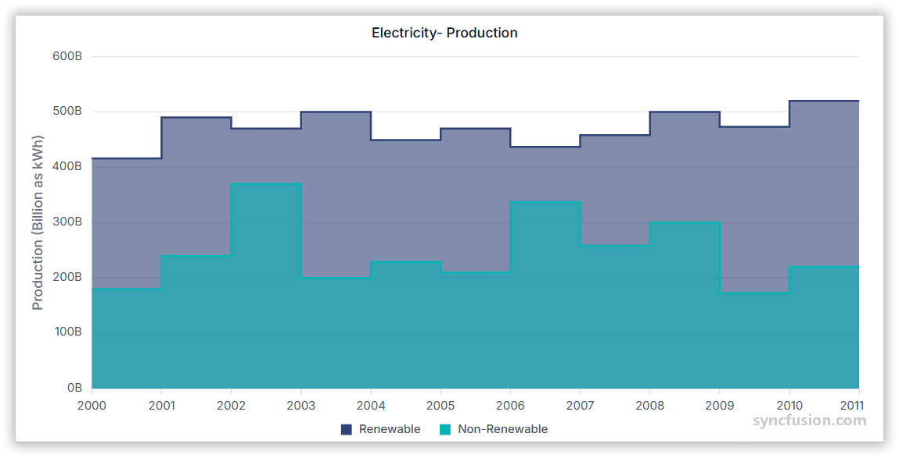

# Step Area Chart in Angular Charts

## Step Area

A step area chart fills the area under a step line, forming block-like segments.

To render a [step area](https://www.syncfusion.com/angular-components/angular-charts/chart-types/step-area-chart) series in your chart, you need to follow a few steps to configure it correctly.

Here's a concise guide on how to do this:

1. **Set the series type**: Define the series [`type`](https://ej2.syncfusion.com/angular/documentation/api/chart/seriesDirective#type) as `StepArea` in your chart configuration. This indicates that the data should be represented as a step area chart, which connects data points with vertical and horizontal lines, creating a step-like appearance.

2. **Inject the StepAreaSeries module**: Use the `@NgModule.providers` method to inject the `StepAreaSeriesService` module into your chart. This step is essential, as it ensures that the necessary functionalities for rendering step area series are available in your chart.

















## Binding data with series

You can bind data to the chart using the [`dataSource`](https://ej2.syncfusion.com/angular/documentation/api/chart/seriesDirective#datasource) property within the series configuration. This allows you to connect a JSON dataset or remote data to your chart. To display the data correctly, map the fields from the data to the chart series [`xName`](https://ej2.syncfusion.com/angular/documentation/api/chart/seriesDirective#xname) and [`yName`](https://ej2.syncfusion.com/angular/documentation/api/chart/seriesDirective#yname) properties.

















## Series customization

The following properties can be used to customize the `step area` series.

**Fill**

The [`fill`](https://ej2.syncfusion.com/angular/documentation/api/chart/seriesDirective#fill) property determines the color applied to the series.

















The [`fill`](https://ej2.syncfusion.com/angular/documentation/api/chart/seriesDirective#fill) property can be used to apply a gradient color to the step area series. By configuring this property with gradient values, you can create a visually appealing effect in which the color transitions smoothly from one shade to another.

















**Opacity**

The [`opacity`](https://ej2.syncfusion.com/angular/documentation/api/chart/seriesDirective#opacity) property specifies the transparency level of the fill. Adjusting this property allows you to control how opaque or transparent the fill color of the series appears.

















**Border**

Use the [`border`](https://ej2.syncfusion.com/angular/documentation/api/chart/seriesDirective#border) property to customize the width, color, and dasharray of the series border.

















**Step**

Use the [`step`](https://ej2.syncfusion.com/angular/documentation/api/chart/seriesDirective#step) property to change the position of the steps in a step area series.

















**No risers**

You can eliminate the vertical lines between points by using the [`noRisers`](https://ej2.syncfusion.com/angular/documentation/api/chart/seriesModel#norisers) property in a series. This approach is useful for highlighting trends without the distraction of risers.














  


## Empty points

Data points with `null` or `undefined` values are considered empty. Empty data points are ignored and not plotted on the chart.

**Mode**

Use the [`mode`](https://ej2.syncfusion.com/angular/documentation/api/chart/emptyPointSettingsModel#mode) property to define how empty or missing data points are handled in the series. The default mode for empty points is `Gap`.



 













**Fill**

Use the [`fill`](https://ej2.syncfusion.com/angular/documentation/api/chart/emptyPointSettingsModel#fill) property to customize the fill color of empty points in the series.

















**Border**

Use the [`border`](https://ej2.syncfusion.com/angular/documentation/api/chart/emptyPointSettingsModel#border) property to customize the width and color of the border for empty points.

















## Events

### Series render

The [`seriesRender`](https://ej2.syncfusion.com/angular/documentation/api/chart/iSeriesRenderEventArgs) event allows you to customize series properties, such as data, fill, and name, before they are rendered on the chart.

















### Point render

The [`pointRender`](https://ej2.syncfusion.com/angular/documentation/api/chart/iPointRenderEventArgs) event allows you to customize each data point before it is rendered on the chart.

















## See Also

* [Data label](../../../chart-elements/data-labels)
* [Tooltip](../../../chart-interactive/tool-tip)
