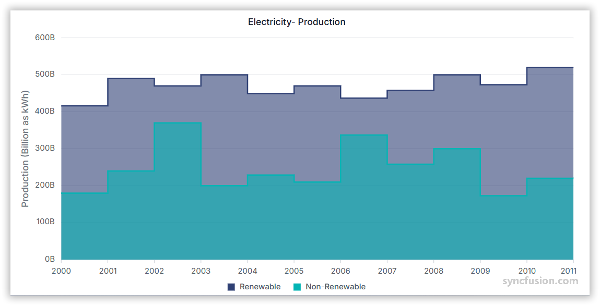

# Step Area Chart in Angular Charts

## Step Area

A step area chart fills the area under a step line, forming block-like segments.



To render a [step area](https://www.syncfusion.com/angular-components/angular-charts/chart-types/step-area-chart) series in your chart, you need to follow a few steps to configure it correctly.

Here's a concise guide on how to do this:

1. **Set the series type**: Define the series [`type`](https://ej2.syncfusion.com/angular/documentation/api/chart/seriesdirective#type) as `StepArea` in your chart configuration. This indicates that the data should be represented as a step area chart, which connects data points with vertical and horizontal lines, creating a step-like appearance.

2. **Register the StepAreaSeriesService provider**: Register `StepAreaSeriesService` (along with any other chart services you need) in the component's `providers` array.

















## Binding data with series

Bind data via the [`dataSource`](https://ej2.syncfusion.com/angular/documentation/api/chart/seriesdirective#datasource) property on the series. Map the fields from your records to [`xName`](https://ej2.syncfusion.com/angular/documentation/api/chart/seriesdirective#xname) and [`yName`](https://ej2.syncfusion.com/angular/documentation/api/chart/seriesdirective#yname) so the chart knows which value drives each point. The included basic sample renders a single `StepArea` series named `England` that maps `x` and `y` to the chart's x and y axes.

















## Series customization

The following properties customize the `step area` series.

### Solid fill

The [`fill`](https://ej2.syncfusion.com/angular/documentation/api/chart/seriesdirective#fill) property determines the color applied to the series. Default value is `null`.

















### Gradient fill

The [`fill`](https://ej2.syncfusion.com/angular/documentation/api/chart/seriesdirective#fill) property can apply an SVG gradient to a step area series. Define the gradient within an SVG `<defs>` element using a unique ID, and assign it to the series in the `url(#gradientId)` format. Place the following SVG element in your application's `index.html` file, inside the `<body>` element and outside the `<app-container>` element.

```html
<svg>
    <defs>
        <linearGradient id="gradient">
            <stop offset="0%" style="stop-color: blue; stop-opacity: 1" />
            <stop offset="50%" style="stop-color: violet; stop-opacity: 1" />
        </linearGradient>
    </defs>
</svg>
```

















### Opacity

The [`opacity`](https://ej2.syncfusion.com/angular/documentation/api/chart/seriesdirective#opacity) property specifies the transparency level of the fill. Valid range is `0` (completely transparent) to `1` (completely opaque). Default value is `1`.

















### Series Border

Use the [`border`](https://ej2.syncfusion.com/angular/documentation/api/chart/seriesdirective#border) property to style the series border. The `border` object supports these fields:

* `width` - Border thickness in pixels.
* `color` - Border stroke color.
* `dashArray` - Dash pattern for the border (for example `'5'`, `'5,5'`, or `'2,3,4'`).

Example: `{ width: 1.5, color: 'red', dashArray: '2,5' }`.

















### Step

Use the [`step`](https://ej2.syncfusion.com/angular/documentation/api/chart/seriesdirective#step) property to change the position of the steps in a step area series. Available values are:

* `Left` (default) - The step rises/joins on the left side of each x-interval.
* `Center` - The step is centered in each x-interval.
* `Right` - The step rises/joins on the right side of each x-interval.

















### No Risers

Eliminate the vertical lines between points by setting the [`noRisers`](https://ej2.syncfusion.com/angular/documentation/api/chart/seriesmodel#norisers) property to `true` on the series. The included sample also drops the series opacity to `0.1` and applies a thin `border` to keep the band visible without the vertical connectors.














  


## Empty points

Data points with `null` or `undefined` values are considered empty. How an empty point is rendered on the chart depends on the [`mode`](https://ej2.syncfusion.com/angular/documentation/api/chart/emptypointsettingsmodel#mode) you choose.

### Mode

Use the [`mode`](https://ej2.syncfusion.com/angular/documentation/api/chart/emptypointsettingsmodel#mode) property to define how empty or missing data points are handled. Available values are:

* `Gap` (default) - Leaves a gap at the empty point.
* `Drop` - Drops the empty point and connects adjacent points.
* `Zero` (used in the included `Mode`, `Fill`, and `Border` samples) - Replaces the empty point with the value `0`.
* `Average` - Replaces the empty point with the average of adjacent points.



 













### Empty Point Fill

Use the [`fill`](https://ej2.syncfusion.com/angular/documentation/api/chart/emptypointsettingsmodel#fill) property to customize the fill color of empty points in the series. Applies only when `mode` is `Zero` or `Average`.


















### Empty Point Border

Use the [`border`](https://ej2.syncfusion.com/angular/documentation/api/chart/emptypointsettingsmodel#border) property to customize the width and color of the border for empty points. Applies only when `mode` is `Zero` or `Average`.

















## Events

### Series render

The [`seriesRender`](https://ej2.syncfusion.com/angular/documentation/api/chart/iseriesrendereventargs) event allows you to customize series properties, such as data, fill, and name, before they are rendered on the chart. The handler in the included snippet assigns `args.fill = '#ff6347'`, applying a tomato color to the series before render.


















### Point render

The [`pointRender`](https://ej2.syncfusion.com/angular/documentation/api/chart/ipointrendereventargs) event allows you to customize each data point before it is rendered on the chart. The handler in the included snippet assigns `args.fill = 'red'` on every point before render.

















## Troubleshooting

* Ensure `StepAreaSeriesService` is registered in the providers; otherwise the step area series will not render.
* **Step position doesn't change:** confirm you used a value accepted by the `step` property — `Left`, `Center`, or `Right`. Any other string is treated as the default.
* **No risers not working:** make sure the attribute is spelled `noRisers` (not `noRaiser`). The included snippet accidentally contains both spellings; the correct one is `noRisers='true'`.
* **Empty-point customization has no visible effect:** the `fill` and `border` settings on `emptyPointSettings` apply only when `mode` is `Zero` or `Average`. With `Gap` and `Drop` modes no marker is drawn.
* **Gradient fill renders as solid color:** the SVG gradient referenced by `fill='url(#gradient)'` is not defined. Add a matching `<linearGradient>` (or `<radialGradient>`) inside a `<defs>` block in the chart template, or in a global stylesheet.

## See Also

* [Area Chart](./area)
* [Step Area Chart](./step-area)
* [Stacked Step Area Chart](./stacked-step-area)
* [Data label](../../../chart-elements/data-labels)
* [Tooltip](../../../chart-interactive/tool-tip)
