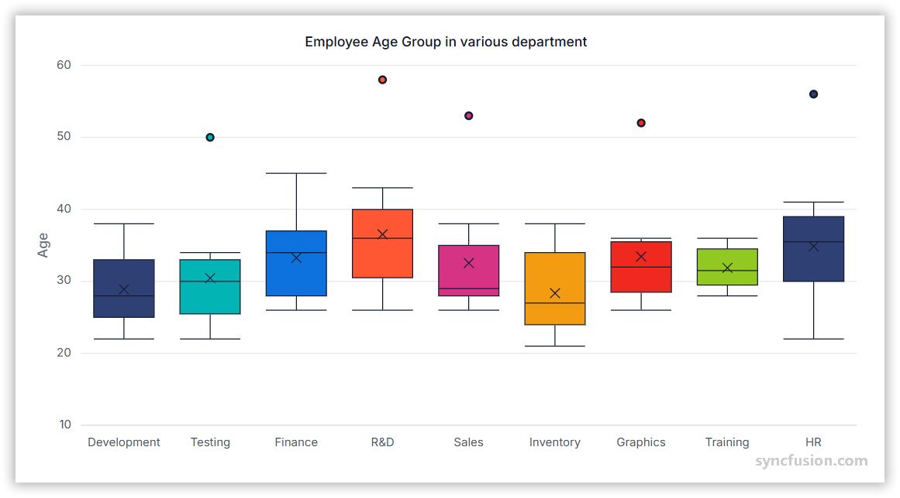

# Box and Whisker Chart in Angular Charts

## Box and Whisker

The box and whisker chart is a statistical visualization tool that displays the distribution of numerical data through quartiles. It shows the median, quartiles, and outliers of a dataset, making it ideal for comparing distributions across different categories or identifying data variability and outliers.

To render a `box and whisker` series in your chart, you need to follow a few steps to configure it correctly. Here's a concise guide on how to do this:

1. **Set the series type**: Define the series [type](https://ej2.syncfusion.com/angular/documentation/api/chart/seriesDirective#type) as `BoxAndWhisker` in your chart configuration. This indicates that the data should be represented as a box and whisker chart, which will plot segments to illustrate the statistical distribution of the data.

2. **Inject the BoxAndWhiskerSeries module**: Use the `@NgModule.providers` method to inject the `BoxAndWhiskerSeriesService` module into your chart. This step is essential, as it ensures that the necessary functionalities for rendering box and whisker series are available in your chart.

3. **Data requirements**: The y field of the Box and Whisker series requires a minimum of five numerical values per data point to calculate the statistical quartiles (minimum, first quartile, median, third quartile, and maximum). Each array of values represents one box plot segment.














  


### Understanding Box Plot components

The box and whisker chart displays several key statistical components:

- **Box**: Represents the interquartile range (IQR) from the first quartile (Q1) to the third quartile (Q3).
- **Median line**: Shows the middle value of the dataset (Q2).
- **Whiskers**: Extend from the box to show the range of data within 1.5 times the IQR.
- **Outliers**: Individual points that fall outside the whisker range.

## Data binding for BoxAndWhisker series

Connect your data to the chart using the [`dataSource`](https://ej2.syncfusion.com/angular/documentation/api/chart/seriesDirective#datasource) property within the series configuration. This property supports JSON datasets and remote data sources. Map the data fields to the chart series using [`xName`](https://ej2.syncfusion.com/angular/documentation/api/chart/seriesDirective#xname) and [`yName`](https://ej2.syncfusion.com/angular/documentation/api/chart/seriesDirective#yname) properties to ensure proper data visualization.














  


## Box plot mode

The [`boxPlotMode`](https://ej2.syncfusion.com/angular/documentation/api/chart/seriesDirective#boxplotmode) property determines how the quartiles are calculated for the box and whisker series. The default value is `Exclusive`. The available options are:

- **Exclusive**: Excludes the median when calculating quartiles (default method).
- **Inclusive**: Includes the median in quartile calculations.
- **Normal**: Uses the standard quartile calculation method.














  


## Show mean

The [`showMean`](https://ej2.syncfusion.com/angular/documentation/api/chart/seriesDirective#showmean) property displays the average value of the dataset as a marker within each box plot. The default value is **false**. When enabled, the mean appears as a distinct symbol, helping users compare both median and mean values.














  


## Series customization

Customize the appearance of `box and whisker` series using various styling properties to match your application's design requirements.

**Fill**

The [fill](https://ej2.syncfusion.com/angular/documentation/api/chart/seriesDirective#fill) property determines the color applied to the series.














  


**Gradient fill**

Apply gradient colors to create visually appealing box and whisker series with smooth color transitions by configuring the [fill](https://ej2.syncfusion.com/angular/documentation/api/chart/seriesDirective#fill) property with gradient values.














  


**Opacity**

Control the transparency level of the box and whisker fill using the [opacity](https://ej2.syncfusion.com/angular/documentation/api/chart/seriesDirective#opacity) property. Values range from 0 (completely transparent) to 1 (completely opaque).














  


**Border**

Customize the box and whisker series border using the [`border`](https://ej2.syncfusion.com/angular/documentation/api/chart/seriesDirective#border) property to adjust width, color, and dash pattern.














  


## Events

### Series render

The [`seriesRender`](https://ej2.syncfusion.com/angular/documentation/api/chart/iSeriesRenderEventArgs) event allows customization of series properties, such as data, fill, and name, before rendering on the chart.














  


### Point render

The [`pointRender`](https://ej2.syncfusion.com/angular/documentation/api/chart/iPointRenderEventArgs) event allows customization of each data point before rendering on the chart.














  


## See Also

* [Data label](../../chart-elements/data-labels)
* [Tooltip](../../chart-interactive/tool-tip)