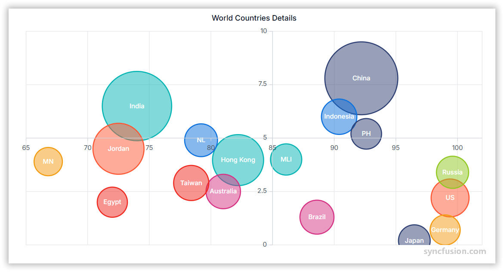

# Bubble Chart in Angular Charts

## Bubble

A bubble series renders data as bubbles whose size is proportional to a third value (the z-value), with the position determined by the x and y values.



Configure a bubble series as follows:

1. **Set the series type**: Set the series [`type`](https://ej2.syncfusion.com/angular/documentation/api/chart/seriesDirective#type) to `Bubble`.
2. **Register the service**: Register `BubbleSeriesService` in the module `providers` array, or in `ApplicationConfig.providers` for standalone applications. Confirm that `ChartModule` is imported.
3. **Map the data fields**: Bind the data with [`dataSource`](https://ej2.syncfusion.com/angular/documentation/api/chart/seriesDirective#datasource), and map the x, y, and bubble-size fields with [`xName`](https://ej2.syncfusion.com/angular/documentation/api/chart/seriesDirective#xname), [`yName`](https://ej2.syncfusion.com/angular/documentation/api/chart/seriesDirective#yname), and [`size`](https://ej2.syncfusion.com/angular/documentation/api/chart/seriesDirective#size).














  


## Series customization

Customize a bubble series using the following properties.

### Fill

Use the [`fill`](https://ej2.syncfusion.com/angular/documentation/api/chart/seriesDirective#fill) property to set a single solid bubble color. Accepted values are CSS color names (for example, `blue`), hexadecimal strings (for example, `#1A75FF`), and `rgba(...)` strings.














  


### Opacity

Use the [`opacity`](https://ej2.syncfusion.com/angular/documentation/api/chart/seriesDirective#opacity) property to control bubble transparency. Set a value from `0` (fully transparent) to `1` (fully opaque).














  


### Size mapping

Use the [`size`](https://ej2.syncfusion.com/angular/documentation/api/chart/seriesDirective#size) property to map each bubble radius to a numeric value from the data source.














  


## Empty points

A data point whose mapped value is `null` or `undefined` is empty. Configure its behavior with [`emptyPointSettings.mode`](https://ej2.syncfusion.com/angular/documentation/api/chart/emptyPointSettingsModel#mode).

### Mode

Use [`mode`](https://ej2.syncfusion.com/angular/documentation/api/chart/emptyPointSettingsModel#mode) to control empty-point rendering. The default is `Gap`.

| Mode      | Visual behavior |
|-----------|-----------------|
| `Gap`     | Skip the empty point; subsequent bubbles are still rendered. |
| `Zero`    | Treat the empty point as `0` and render the bubble at the origin. |
| `Drop`    | Drop the empty bubble; subsequent points are still rendered. |
| `Average` | Replace the empty value with the average of the surrounding points. |














  


### Empty-point fill

Use the [`emptyPointSettings.fill`](https://ej2.syncfusion.com/angular/documentation/api/chart/emptyPointSettingsModel#fill) property to customize the fill color of empty-point bubbles.














  


### Empty-point border

Use the [`emptyPointSettings.border`](https://ej2.syncfusion.com/angular/documentation/api/chart/emptyPointSettingsModel#border) property to customize the width and color of an empty-point bubble's stroke.














  


## Events

### Series render

The [`seriesRender`](https://ej2.syncfusion.com/angular/documentation/api/chart#seriesrender) event allows you to customize series properties, such as `data`, `fill`, and `name`, before they are rendered on the chart. The callback receives an `ISeriesRenderEventArgs` argument that exposes mutable `series` and `data` properties.

```html
<ejs-chart (seriesRender)="onSeriesRender($event)"></ejs-chart>
```














  


### Point render

The [`pointRender`](https://ej2.syncfusion.com/angular/documentation/api/chart#pointrender) event allows you to customize each data point before it is rendered on the chart. The callback receives an `IPointRenderEventArgs` argument that exposes the current `point`, `series`, `fill`, and `border`, plus a `cancel` flag.

```html
<ejs-chart (pointRender)="onPointRender($event)"></ejs-chart>
```














  


## Troubleshooting

The following symptoms map to the most common configuration issues.

- **Bubbles are not rendered**: Confirm that `BubbleSeriesService` is registered, the series [`type`](https://ej2.syncfusion.com/angular/documentation/api/chart/seriesDirective#type) is `Bubble`, and that `xName`, `yName`, and `size` map to numeric fields in the data source.
- **All bubbles are the same size**: The `size` field is missing or non-numeric. Verify the data type and clamp values.
- **An empty point renders as a zero-radius bubble**: Review `emptyPointSettings.mode`. Use `Gap` to skip rendering or `Drop` to keep subsequent bubbles.
- **`pointRender` does not fire**: Confirm you bind the event on the `<ejs-chart>` element with `(pointRender)="..."`, not on the series.

## See also

* [Data labels](../../chart-elements/data-labels)
* [Tooltip](../../chart-interactive/tool-tip)
* [Axis customization](../../axis/axis-customization)
* [Data binding](../../data-binding/working-with-data)
* [Legend](../../chart-elements/legend)
