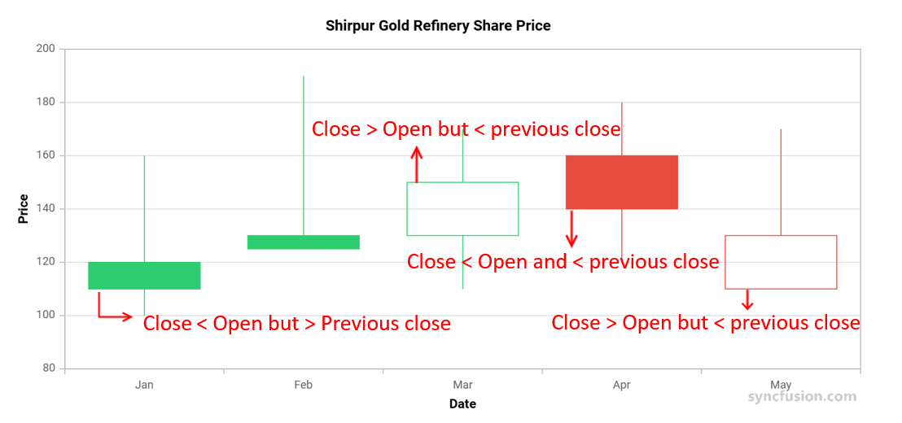

# Candle Chart in Angular Charts

## Candle

A Candle series represents the low, high, open, and closing prices over time. It is commonly used in financial charts to visualize stock price movements.



The default styling uses the following conventions:

* **Green Hollow Candle** - The closing price is higher than both the opening price and the previous candle's closing price. Signals strong bullish momentum.
* **Green Filled Candle** - The closing price is lower than the opening price but still higher than the previous candle's closing price. Suggests an overall upward trend with short-term weakness.
* **Red Hollow Candle** - The closing price is higher than the opening price but lower than the previous candle's closing price. Indicates a downward trend with short-term strength.
* **Red Filled Candle** - The closing price is lower than both the opening price and the previous candle's closing price. Signals strong bearish momentum.

Configure a Candle series as follows:

1. **Set the series type**: Set the series [`type`](https://ej2.syncfusion.com/angular/documentation/api/chart/seriesDirective#type) to `Candle`.
2. **Register the service**: Register `CandleSeriesService` (and any required axis services) in the module `providers` array, or in `ApplicationConfig.providers` for standalone applications. Confirm that `ChartModule` is imported.
3. **Map the OHLC fields**: Bind the data with [`dataSource`](https://ej2.syncfusion.com/angular/documentation/api/chart/seriesDirective#datasource), and map the date and price fields with [`xName`](https://ej2.syncfusion.com/angular/documentation/api/chart/seriesDirective#xname), [`high`](https://ej2.syncfusion.com/angular/documentation/api/chart/seriesDirective#high), [`low`](https://ej2.syncfusion.com/angular/documentation/api/chart/seriesDirective#low), [`open`](https://ej2.syncfusion.com/angular/documentation/api/chart/seriesDirective#open), and [`close`](https://ej2.syncfusion.com/angular/documentation/api/chart/seriesDirective#close).














  


## Series customization

Customize a Candle series using the following properties.

### Hollow candles

Hollow candles let you visually compare the current price with the previous price by coloring them differently. The candles are filled or left hollow based on the following criteria:

| State      | Behavior |
|------------|----------|
| `Filled`   | Candlesticks are filled when the close value is lesser than the open value. |
| `Unfilled` | Candlesticks are unfilled when the close value is greater than the open value. |

By default, [`bullFillColor`](https://ej2.syncfusion.com/angular/documentation/api/chart/seriesDirective#bullfillcolor) is **red** and [`bearFillColor`](https://ej2.syncfusion.com/angular/documentation/api/chart/seriesDirective#bearfillcolor) is **green**. Override these values on the series to match your market convention.

### Solid candles

The [`enableSolidCandles`](https://ej2.syncfusion.com/angular/documentation/api/chart/seriesDirective#enablesolidcandles) property is used to enable or disable solid candles. By default, it is set to **false**. When solid candles are enabled, the fill color of the candle is determined solely by its opening and closing values:

* The [`bearFillColor`](https://ej2.syncfusion.com/angular/documentation/api/chart/seriesDirective#bearfillcolor) is applied when the opening value is less than the closing value.
* The [`bullFillColor`](https://ej2.syncfusion.com/angular/documentation/api/chart/seriesDirective#bullfillcolor) is applied when the opening value is greater than the closing value.














  


## Empty points

A data point whose mapped value is `null` or `undefined` is empty. Configure its behavior with [`emptyPointSettings.mode`](https://ej2.syncfusion.com/angular/documentation/api/chart/emptyPointSettingsModel#mode).

### Mode

Use [`mode`](https://ej2.syncfusion.com/angular/documentation/api/chart/emptyPointSettingsModel#mode) to control empty-point rendering. The default is `Gap`.

| Mode      | Visual behavior |
|-----------|-----------------|
| `Gap`     | Skip the empty point; subsequent candles are still rendered. |
| `Zero`    | Treat the empty point as `0` and render a flat candle. |
| `Drop`    | Drop the empty candle; subsequent points are still rendered. |
| `Average` | Replace the empty value with the average of the surrounding points. |














  


### Empty-point fill

Use the [`emptyPointSettings.fill`](https://ej2.syncfusion.com/angular/documentation/api/chart/emptyPointSettingsModel#fill) property to customize the fill color of empty-point candles.














  


## Events

### Series render

The [`seriesRender`](https://ej2.syncfusion.com/angular/documentation/api/chart#seriesrender) event allows you to customize series properties, such as `data`, `fill`, and `name`, before they are rendered on the chart. The callback receives an `ISeriesRenderEventArgs` argument that exposes mutable `series` and `data` properties.

```html
<ejs-chart (seriesRender)="onSeriesRender($event)"></ejs-chart>
```














  


### Point render

The [`pointRender`](https://ej2.syncfusion.com/angular/documentation/api/chart#pointrender) event allows you to customize each data point before it is rendered on the chart. The callback receives an `IPointRenderEventArgs` argument that exposes the current `point`, `series`, `fill`, and `border`, plus a `cancel` flag.

```html
<ejs-chart (pointRender)="onPointRender($event)"></ejs-chart>
```














  


## Troubleshooting

The following symptoms map to the most common configuration issues.

- **Candles are not rendered**: Confirm that `CandleSeriesService` is registered, the series [`type`](https://ej2.syncfusion.com/angular/documentation/api/chart/seriesDirective#type) is `Candle`, and that `xName`, `high`, `low`, `open`, and `close` map to fields in the data source.
- **All candles use the same color**: Verify that `bullFillColor` and `bearFillColor` are set, and that `enableSolidCandles` is configured as required.
- **An empty point renders as a flat zero candle**: Review `emptyPointSettings.mode`. Use `Gap` to skip rendering or `Drop` to keep subsequent candles.

## See also

* [Data labels](../../../chart-elements/data-labels)
* [Tooltip](../../../chart-interactive/tool-tip)
* [Axis customization](../../axis/axis-customization)
* [Data binding](../../data-binding/working-with-data)
* [Legend](../../../chart-elements/legend)