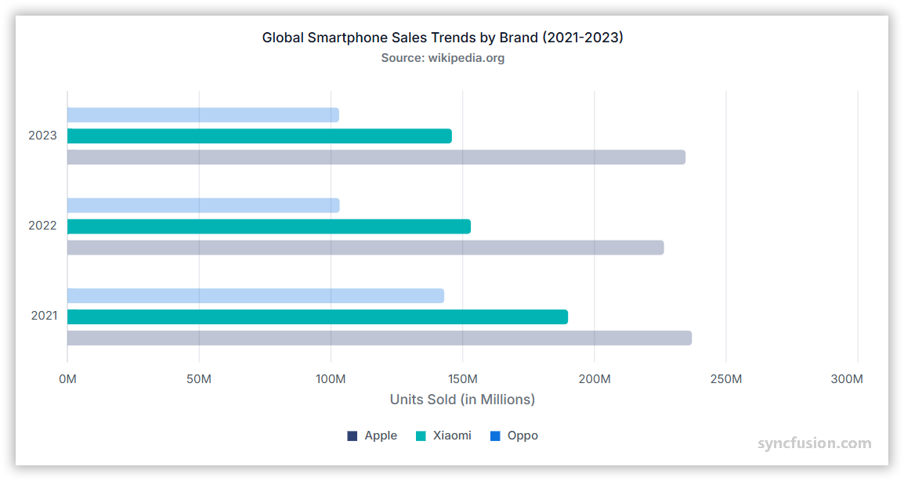

# Bar Chart in Angular Charts

A bar chart is ideal for comparing values across different categories, where the data is displayed horizontally and the length of each bar represents the value.



## Creating a bar chart

To render a [bar](https://www.syncfusion.com/angular-components/angular-charts/chart-types/bar-chart) series in your chart:

1. **Set the series type**: Define the series [`type`](https://ej2.syncfusion.com/angular/documentation/api/chart/seriesdirective#type) as `Bar` in your chart configuration.

2. **Provide BarSeriesService**: Add `BarSeriesService` to your module's `providers` array so the chart can render the bar series.

The following sample renders three Bar series — Apple, Xiaomi, and a third vendor — from separate JSON datasets, showing global smart phone sales trends for 2022–2024.














  


## Binding data with series

You can bind data to the chart using the [`dataSource`](https://ej2.syncfusion.com/angular/documentation/api/chart/seriesdirective#datasource) property within the series configuration. To display the data correctly, map the fields from the data to the chart series [`xName`](https://ej2.syncfusion.com/angular/documentation/api/chart/seriesdirective#xname) and [`yName`](https://ej2.syncfusion.com/angular/documentation/api/chart/seriesdirective#yname) properties. The following sample binds each of the three Bar series (Apple, Xiaomi, and a third vendor) to its own array from `datasource.ts`, mapping `year` to `xName` and `count` to `yName`.














  


## Series customization

The following properties can be used to customize the appearance of the `bar` series.

### Solid fill

The [`fill`](https://ej2.syncfusion.com/angular/documentation/api/chart/seriesDirective#fill) property determines the color applied to the series. The following sample assigns a different solid color to each of the three Bar series — `#1f77b4` for Apple, `#ff7f0e` for Xiaomi, and `#2ca02c` for the third series.














  


### Gradient fill

The [`fill`](https://ej2.syncfusion.com/angular/documentation/api/chart/seriesdirective#fill) property can apply an SVG gradient to a bar series. Define the gradient within an SVG `<defs>` element using a unique ID, and assign it to the series in the `url(#gradientId)` format. Place the following SVG element in your application's `index.html` file, inside the `<body>` element and outside the `<app-container>` element.


```html
<svg>
    <defs>
        <linearGradient id="appleGradient" x1="0%" y1="0%" x2="0%" y2="100%">
            <stop offset="0%" style="stop-color:#E8E8E8;stop-opacity:0.9" />
            <stop offset="25%" style="stop-color:#D1D1D6;stop-opacity:0.85" />
            <stop offset="50%" style="stop-color:#8E8E93;stop-opacity:0.8" />
            <stop offset="75%" style="stop-color:#48484A;stop-opacity:0.85" />
            <stop offset="100%" style="stop-color:#1C1C1E;stop-opacity:0.9" />
        </linearGradient>

        <linearGradient id="xiaomiGradient" x1="0%" y1="0%" x2="0%" y2="100%">
            <stop offset="0%" style="stop-color:#FFE0B2;stop-opacity:0.9" />
            <stop offset="25%" style="stop-color:#FFCC80;stop-opacity:0.85" />
            <stop offset="50%" style="stop-color:#FF9800;stop-opacity:0.8" />
            <stop offset="75%" style="stop-color:#F57C00;stop-opacity:0.85" />
            <stop offset="100%" style="stop-color:#E65100;stop-opacity:0.9" />
        </linearGradient>

        <linearGradient id="oppoGradient" x1="0%" y1="0%" x2="0%" y2="100%">
            <stop offset="0%" style="stop-color:#E8F5E8;stop-opacity:0.9" />
            <stop offset="25%" style="stop-color:#C8E6C9;stop-opacity:0.85" />
            <stop offset="50%" style="stop-color:#4CAF50;stop-opacity:0.8" />
            <stop offset="75%" style="stop-color:#2E7D32;stop-opacity:0.85" />
            <stop offset="100%" style="stop-color:#1B5E20;stop-opacity:0.9" />
        </linearGradient>
    </defs>
</svg>
```













  


### Opacity

Control the transparency level of the bar fill using the [`opacity`](https://ej2.syncfusion.com/angular/documentation/api/chart/seriesDirective#opacity) property. Values range from 0 (completely transparent) to 1 (completely opaque).














  


### Border

Use the [`border`](https://ej2.syncfusion.com/angular/documentation/api/chart/seriesdirective#border) property to customize the width, color, and `dashArray` (for dashed borders) of the series border. The following sample applies a 2-pixel-wide, dashed red border (`color: '#ff4251'`, `dashArray: '2,5'`) to every Bar series via a shared `border` object.














  


## Bar spacing and dimensions

### Bar spacing

Use the [`columnSpacing`](https://ej2.syncfusion.com/angular/documentation/api/chart/seriesDirective#columnspacing) property in the series to adjust the space between bars.














  


### Bar width

Use the [`columnWidth`](https://ej2.syncfusion.com/angular/documentation/api/chart/seriesDirective#columnwidth) property in the series to adjust the width of the bars.














  


### Bar width in pixels

Use the [`columnWidthInPixel`](https://ej2.syncfusion.com/angular/documentation/api/chart/seriesdirective#columnwidthinpixel) property in the series to define the exact width of the bars in pixels. This property ensures that each bar maintains the specified width, providing a uniform appearance throughout the chart.














  


## Grouped bar charts

Use the [`groupName`](https://ej2.syncfusion.com/angular/documentation/api/chart/seriesdirective#groupname) property to group the data points in bar type charts. Series that share the same `groupName` are rendered side by side for each category, making it easy to compare different sets of data.














  


## Cylindrical bar chart

To render a cylindrical bar chart, set the [`columnFacet`](https://ej2.syncfusion.com/angular/documentation/api/chart/seriesdirective#columnfacet) property to `Cylinder` in the chart series. The default value is `Rectangle`. This property transforms the regular bars into cylindrical shapes, enhancing the visual representation of the data. The following sample sets `columnFacet='Cylinder'` on all three Bar series so every bar in the chart is drawn as a cylinder.














  


## Empty points

Data points with `null` or `undefined` values are considered empty points. Use the [`emptyPointSettings`](https://ej2.syncfusion.com/angular/documentation/api/chart/seriesdirective#emptypointsettings) configuration on the series to control how empty points are rendered. Configure the [`emptyPointSettings`](https://ej2.syncfusion.com/angular/documentation/api/chart/seriesdirective#emptypointsettings) as a sibling of the series `dataSource` inside the `<e-series>` tag.

### Mode

Use the [`mode`](https://ej2.syncfusion.com/angular/documentation/api/chart/emptyPointSettings#mode) property to define how empty points are handled. Available modes are `Gap` (default — empty point is left as a gap), `Zero` (rendered as 0), `Average` (rendered using the series average), and `Drop` (the connected line is dropped at the empty point).














  


### Fill

Use the [`fill`](https://ej2.syncfusion.com/angular/documentation/api/chart/emptyPointSettings#fill) property to customize the fill color of empty points in the series. The following sample uses `mode: 'Average'` with `fill: 'red'` on the third series so the empty-point bar is rendered in red, contrasting with the normal series color.














  


### Border

Use the [`border`](https://ej2.syncfusion.com/angular/documentation/api/chart/emptyPointSettings#border) property to customize the width and color of the border for empty points. The following sample sets `border: { width: 2, color: 'green' }` on the third series' empty-point settings so the empty-point bar is outlined in green.














  


## Corner radius customization

### Series corner radius

The [`cornerRadius`](https://ej2.syncfusion.com/angular/documentation/api/chart/seriesdirective#cornerradius) property on the chart series is used to customize the corner radius for bar series. This allows you to create bars with rounded corners, giving your chart a more polished appearance. You can customize each corner of the bars using the [`topLeft`](https://ej2.syncfusion.com/angular/documentation/api/chart/cornerradius#topleft), [`topRight`](https://ej2.syncfusion.com/angular/documentation/api/chart/cornerradius#topright), [`bottomLeft`](https://ej2.syncfusion.com/angular/documentation/api/chart/cornerradius#bottomleft), and [`bottomRight`](https://ej2.syncfusion.com/angular/documentation/api/chart/cornerradius#bottomright) properties of the [`CornerRadius`](https://ej2.syncfusion.com/angular/documentation/api/chart/cornerradius) model. The following sample sets `cornerRadius = { topRight: 4, bottomRight: 4 }` on every Bar series so the end of each bar (away from the axis) is slightly rounded.














  


### Individual point corner radius

The corner radius can be customized for individual points in the chart series by binding the [`pointRender`](https://ej2.syncfusion.com/angular/documentation/api/chart/iPointRenderEventArgs) event on the `<ejs-chart>` component and setting the [`cornerRadius`](https://ej2.syncfusion.com/angular/documentation/api/chart/ipointrendereventargs#cornerradius) property in its event argument.














  


## Events

Use the events below on the `<ejs-chart>` component to customize the bar series or each data point before it is rendered.

### Series render

The [`seriesRender`](https://ej2.syncfusion.com/angular/documentation/api/chart/iSeriesRenderEventArgs) event fires once per series before it is rendered, and allows you to customize series properties such as data, fill, and name. Bind it on the `<ejs-chart>` component (for example, `(seriesRender)="onSeriesRender($event)"`).














  


### Point render

The [`pointRender`](https://ej2.syncfusion.com/angular/documentation/api/chart/iPointRenderEventArgs) event fires for every data point before it is rendered, allowing per-point customization such as color or corner radius. Bind it on the `<ejs-chart>` component (for example, `(pointRender)="onPointRender($event)"`). The following sample recolors individual points during render.














  


## Troubleshooting

* If the bar series does not render, ensure `BarSeriesService` is registered in the `providers` array of the component or module.
* If a property such as `cornerRadius` or `columnWidthInPixel` has no effect, verify that you are using a compatible version of `@syncfusion/ej2-angular-charts` and that the property is placed on the `<e-series>` element.

## See Also

* [Data label](../../../chart-elements/data-labels)
* [Tooltip](../../../chart-interactive/tool-tip)
* [Legend](../../../chart-elements/legend)
* [Axis customization](../../../axis/axis-customization)
