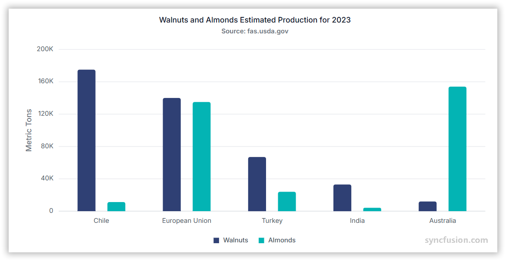

# Column Chart in Angular Charts

A column chart is ideal for comparing values across different categories, where the data is displayed vertically and the height of each column represents the value.



## Creating a column chart

To render a [column](https://www.syncfusion.com/angular-components/angular-charts/chart-types/column-chart) series in your chart:

1. **Set the series type**: Define the series [`type`](https://ej2.syncfusion.com/angular/documentation/api/chart/seriesdirective#type) as `Column` in your chart configuration.
2. **Provide ColumnSeriesService**: Add `ColumnSeriesService` to your module's `providers` array so the chart can render the column series.














  


## Binding data with series

You can bind data to the chart using the [`dataSource`](https://ej2.syncfusion.com/angular/documentation/api/chart/seriesdirective#datasource) property within the series configuration. To display the data correctly, map the fields from the data to the chart series [`xName`](https://ej2.syncfusion.com/angular/documentation/api/chart/seriesdirective#xname) and [`yName`](https://ej2.syncfusion.com/angular/documentation/api/chart/seriesdirective#yname) properties.














  


## Series customization

The following properties can be used to customize the appearance of the `Column` series.

### Solid fill

The [`fill`](https://ej2.syncfusion.com/angular/documentation/api/chart/seriesdirective#fill) property determines the color applied to the series.














  


### Gradient fill

The [`fill`](https://ej2.syncfusion.com/angular/documentation/api/chart/seriesdirective#fill) property can apply an SVG gradient to a column series. Define the gradient within an SVG `<defs>` element using a unique ID, and assign it to the series in the `url(#gradientId)` format. Place the following SVG element in your application's `index.html` file, inside the `<body>` element and outside the `<app-container>` element.

```html
<svg>
    <defs>
        <linearGradient id="gradient">
            <stop offset="0%" style="stop-color:blue;stop-opacity:5" />
            <stop offset="50%" style="stop-color:violet;stop-opacity:5" />
        </linearGradient>
    </defs>
</svg>
```














  


### Opacity

Control the transparency level of the column fill using the [`opacity`](https://ej2.syncfusion.com/angular/documentation/api/chart/seriesdirective#opacity) property. Values range from 0 (completely transparent) to 1 (completely opaque).














  


### Border

Use the [`border`](https://ej2.syncfusion.com/angular/documentation/api/chart/seriesdirective#border) property to customize the `width`, `color`, and `dashArray` of the series border.














  


## Column spacing and width

### Column spacing

Use the [`columnSpacing`](https://ej2.syncfusion.com/angular/documentation/api/chart/seriesdirective#columnspacing) property in the series to adjust the space between columns.

















### Column width

Use the [`columnWidth`](https://ej2.syncfusion.com/angular/documentation/api/chart/seriesdirective#columnwidth) property in the series to adjust the width of the columns.














  


### Column width in pixels

Use the [`columnWidthInPixel`](https://ej2.syncfusion.com/angular/documentation/api/chart/seriesdirective#columnwidthinpixel) property in the series to define the exact width of the columns in pixels. This property ensures that each column maintains the specified width, providing a uniform appearance throughout the chart.














  


## Grouped column charts

Use the [`groupName`](https://ej2.syncfusion.com/angular/documentation/api/chart/seriesdirective#groupname) property to group data points in column charts. Series that share the same `groupName` are rendered side by side for each category, making it easy to compare different datasets.














  


## Cylindrical column chart

To render a cylindrical column chart, set the [`columnFacet`](https://ej2.syncfusion.com/angular/documentation/api/chart/seriesdirective#columnfacet) property to `Cylinder` in the chart series. The default value is `Rectangle`. This property transforms regular columns into cylindrical shapes.














  


## Empty points

Data points with `null` or `undefined` values are considered empty points. Use the [`emptyPointSettings`](https://ej2.syncfusion.com/angular/documentation/api/chart/seriesdirective#emptypointsettings) configuration on the series to control how empty points are rendered.

### Mode

Use the [`mode`](https://ej2.syncfusion.com/angular/documentation/api/chart/emptypointsettings#mode) property to define how empty points are handled. Available modes are `Gap` (default), `Zero`, `Average`, and `Drop`.














  


### Fill

Use the [`fill`](https://ej2.syncfusion.com/angular/documentation/api/chart/emptypointsettings#fill) property to customize the fill color of empty points in the series.














  


### Border

Use the [`border`](https://ej2.syncfusion.com/angular/documentation/api/chart/emptypointsettings#border) property to customize the width and color of the border for empty points.














  


## Corner radius customization

### Series corner radius

The [`cornerRadius`](https://ej2.syncfusion.com/angular/documentation/api/chart/seriesdirective#cornerradius) property on the chart series customizes the corner radius for column series. You can customize each corner using the [`topLeft`](https://ej2.syncfusion.com/angular/documentation/api/chart/cornerradius#topleft), [`topRight`](https://ej2.syncfusion.com/angular/documentation/api/chart/cornerradius#topright), [`bottomLeft`](https://ej2.syncfusion.com/angular/documentation/api/chart/cornerradius#bottomleft), and [`bottomRight`](https://ej2.syncfusion.com/angular/documentation/api/chart/cornerradius#bottomright) properties of the [`CornerRadius`](https://ej2.syncfusion.com/angular/documentation/api/chart/cornerradius) model.














  


### Individual point corner radius

The corner radius can be customized for individual points by binding the [`pointRender`](https://ej2.syncfusion.com/angular/documentation/api/chart/ipointrendereventargs) event on the chart component and setting the [`cornerRadius`](https://ej2.syncfusion.com/angular/documentation/api/chart/ipointrendereventargs#cornerradius) property in its event argument.














  


## Events

Use the following events on the chart component to customize the column series or individual data points before they are rendered.

### Series render

The [`seriesRender`](https://ej2.syncfusion.com/angular/documentation/api/chart/iseriesrendereventargs) event fires once per series before it is rendered and allows you to customize series properties such as data, fill, and name.














  


### Point render

The [`pointRender`](https://ej2.syncfusion.com/angular/documentation/api/chart/ipointrendereventargs) event fires for every data point before it is rendered, allowing per-point customization such as color or corner radius.














  


## Troubleshooting

* If the column series does not render, ensure `ColumnSeriesService` is registered in the `providers` array of the component or module.
* If a property such as `cornerRadius` or `columnWidthInPixel` has no effect, verify that you are using a compatible version of `@syncfusion/ej2-angular-charts` and that the property is placed on the chart series element.

## See Also

* [Data label](../../../chart-elements/data-labels)
* [Tooltip](../../../chart-interactive/tool-tip)
* [Legend](../../../chart-elements/legend)
* [Axis customization](../../../axis/axis-customization)
* [Apply Corner Radius to Specific Points in Column Series](https://support.syncfusion.com/kb/article/21476/how-to-apply-rounded-corners-to-column-series-points-in-angular-chart)
