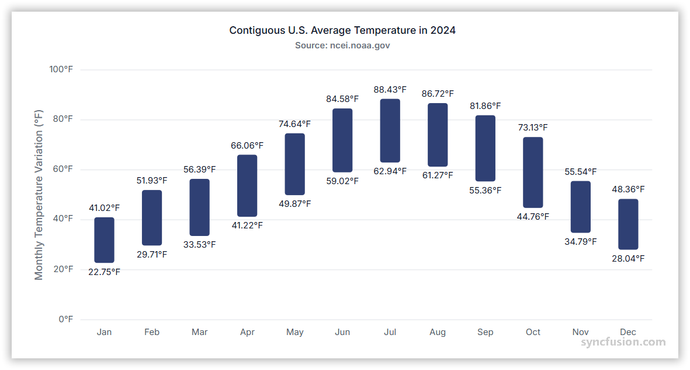

# Range Column Chart in Angular Charts

## Range Column

A range column chart displays vertical columns whose lower and upper boundaries represent the low and high values of each data point. Use it to visualize ranges such as temperature variation or price movement.



To render a range column series:

1. **Set the series type**: Define the series [`type`](https://ej2.syncfusion.com/angular/documentation/api/chart/seriesdirective#type) as `RangeColumn` in your chart configuration.

2. **Provide RangeColumnSeriesService**: Add `RangeColumnSeriesService` to your module's `providers` array so the chart can render the RangeColumn series.

3. **Provide high and low values**: The `RangeColumn` series requires two y-values for each data point. Specify the `high` value as the upper boundary and the `low` value as the lower boundary of each column.

















## Binding data to a series

Bind a local JSON array to the series with the [`dataSource`](https://ej2.syncfusion.com/angular/documentation/api/chart/seriesDirective#datasource) property. Map the data fields with [`xName`](https://ej2.syncfusion.com/angular/documentation/api/chart/seriesDirective#xname), [`high`](https://ej2.syncfusion.com/angular/documentation/api/chart/seriesDirective#high), and [`low`](https://ej2.syncfusion.com/angular/documentation/api/chart/seriesDirective#low), as shown in the preceding example.

When data is loaded asynchronously, assign the resolved array to the bound property. Handle loading and request failures in the application's data service before updating the chart data source.

















## Series customization

The following properties can be used to customize the appearance of the `RangeColumn` series.

### Solid fill

Use the [`fill`](https://ej2.syncfusion.com/angular/documentation/api/chart/seriesDirective#fill) property to set a solid fill color for the series.















### Gradient fill

The [`fill`](https://ej2.syncfusion.com/angular/documentation/api/chart/seriesdirective#fill) property can apply an SVG gradient to a range column series. Define the gradient within an SVG `<defs>` element using a unique ID, and assign it to the series in the `url(#gradientId)` format. Place the following SVG elements in your application's `index.html` file, inside the `<body>` element and outside the `<app-container>` element.

```html
<svg>
    <defs>
        <linearGradient id="gradient1">
            <stop offset="0%" style="stop-color:blue;stop-opacity:5" />
            <stop offset="50%" style="stop-color:violet;stop-opacity:5" />
        </linearGradient>
    </defs>
</svg>
<svg>
    <defs>
        <linearGradient id="gradient2">
            <stop offset="0%" style="stop-color:darkred;stop-opacity:5" />
            <stop offset="50%" style="stop-color:darkorange;stop-opacity:5" />
        </linearGradient>
    </defs>
</svg>
```
Apply the gradients to the series by setting `fill` to `url(#gradient1)` and `url(#gradient2)`, respectively.















### Opacity

Use the [`opacity`](https://ej2.syncfusion.com/angular/documentation/api/chart/seriesDirective#opacity) property to set the transparency of the series. Values range from `0` (fully transparent) to `1` (fully opaque).

















### Border

Use the [`border`](https://ej2.syncfusion.com/angular/documentation/api/chart/seriesDirective#border) property to customize the series border color, width, and dash pattern.

















## Empty points

A range point is empty when a mapped `high` or `low` value is `null` or `undefined`. Configure its behavior with [`emptyPointSettings.mode`](https://ej2.syncfusion.com/angular/documentation/api/chart/emptyPointSettingsModel#mode). The supported modes are:

- `Gap`: Leaves a gap at the empty point. This is the default mode.
- `Zero`: Replaces the missing value with zero.
- `Average`: Replaces the missing value with an average derived from neighboring points.
- `Drop`: Omits the empty point from rendering.

### Mode

















### Empty-point fill

Use [`emptyPointSettings.fill`](https://ej2.syncfusion.com/angular/documentation/api/chart/emptyPointSettingsModel#fill) to set the fill color of an empty point rendered by a mode such as `Zero` or `Average`. This setting has no visible effect when the mode is `Gap` or `Drop`.

















### Empty-point border

Use [`emptyPointSettings.border`](https://ej2.syncfusion.com/angular/documentation/api/chart/emptyPointSettingsModel#border) to set the width and color of an empty point's border. This setting has no visible effect when the mode is `Gap` or `Drop`.

















## Corner radius

### Series corner radius

Use [`cornerRadius`](https://ej2.syncfusion.com/angular/documentation/api/chart/seriesDirective#cornerradius) to round the corners of every column in the series. Configure individual corners with `topLeft`, `topRight`, `bottomLeft`, and `bottomRight`.

















### Point corner radius

Handle the [`pointRender`](https://ej2.syncfusion.com/angular/documentation/api/chart/iPointRenderEventArgs) event and set the event argument's [`cornerRadius`](https://ej2.syncfusion.com/angular/documentation/api/chart/iPointRenderEventArgs#cornerradius) property to customize a specific point before it is rendered.

















## Events

### Series render

The [`seriesRender`](https://ej2.syncfusion.com/angular/documentation/api/chart/iSeriesRenderEventArgs) event runs before a series is rendered. Use its event arguments to customize supported series properties such as data, fill, and name.

















### Point render

The [`pointRender`](https://ej2.syncfusion.com/angular/documentation/api/chart/iPointRenderEventArgs) event runs before each point is rendered. Use its event arguments to customize supported point properties. The [point corner radius](#point-corner-radius) section shows how to use this event for per-point corner styling.

















## Troubleshooting

- **The chart renders without columns:** Confirm that `RangeColumnSeriesService` is registered and the series `type` is `RangeColumn`.
- **Categories do not appear correctly:** Register the axis service required by the configured axis value type, such as `CategoryService`, and verify `xName` matches the data field.
- **A point does not render:** Verify that both mapped `high` and `low` values are numeric. If either value is `null` or `undefined`, review `emptyPointSettings.mode`.
- **The range is inverted:** Verify that each point's `high` value is greater than or equal to its `low` value.

## See also

- [Data labels](../../../chart-elements/data-labels)
- [Tooltip](../../../chart-interactive/tool-tip)
- [Avoid duplicate labels for equal values](https://support.syncfusion.com/kb/article/21242/how-to-avoid-duplicate-labels-for-equal-values-in-angular-chart)